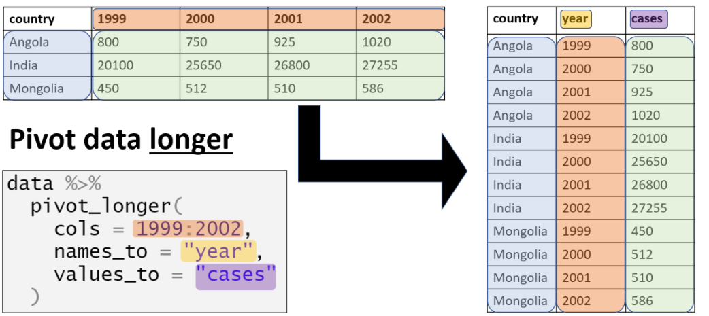

<!-- Add JavaScript code for making the exercise code larger -->
<script language="JavaScript" src="js/exercise-font-size.js"></script>

```{r setup, include=FALSE}
# load packages ----------------------------------------------------------------
library(learnr)
library(gradethis)
library(tidyverse)
library(here)
library(rio)
library(basket) # not sure if we need this
library(etude) # helper functions for gradethis

library(submitr) # also needed?
# set options for exercises and checking ---------------------------------------
gradethis_setup()

learnr::tutorial_options(exercise.timelimit = 60) 
  #exercise.checker = gradethis::grade_learnr) 
    # alternatively, submitr::null_code_checker


# event recorder ---------------------------------------------------------------
# see https://github.com/dtkaplan/submitr/blob/master/R/make_a_recorder.R
tutorial_options(exercise.eval = FALSE)  # pre-evaluate exercises

vfun <- submitr::make_basic_validator(NULL, "hello") #basket::check_valid

new_recorder <- function(tutorial_id, tutorial_version, user_id, event, data) {
    cat(
      tutorial_id, 
      " (v", tutorial_version, "); ",
      format(Sys.time(), "%Y-%M%-%D %H:%M:%S %Z"), "; ",
      user_id, "; ",
      event, "; ",
      data$label, "; ",
      data$answers, "; ",
      data$code, "; ",
      data$correct, "\n", sep = "",
      
      file = here::here("event_records", "learnr_basics.txt"),
      append = TRUE)
}

options(tutorial.event_recorder = new_recorder)


# hide non-exercise code chunks ------------------------------------------------
knitr::opts_chunk$set(echo = FALSE, fig.align = "center", message = F, warning = F)


# data prep --------------------------------------------------------------------
linelist_raw <- rio::import(here::here("data", "linelist_raw.xlsx"))
linelist <- rio::import(here::here("data", "linelist_cleaned.rds"))
malaria_counts <- rio::import(here::here("data", "malaria_facility_count_data.rds"))

# Package preloads
pacman::p_load(
  rio,        # importing data  
  here,       # relative file pathways  
  skimr,      # review data
  DT,         # visualize data frame
  janitor,    # data cleaning and tables
  epikit,     # age categories
  lubridate,  # working with dates
  incidence2, # epidemic curves
  ggrepel,    # smart labels
  ggExtra,    # extras
  esquisse,   # point-and-click for simple ggplots
  apyramid,   # age pyramids
  scales,     # formatting of scales
  plotly,     # interactive plots
  cowplot,    # combine plots
  tidyverse,   # ggplot2 & data management
  ggpubr,
  gghighlight,
  RColorBrewer, # now built in to ggplot but need to load to see the palettes
  Hmisc,
  datasets
  )


```


```{r}
submitr::login_controls() # show login and password with "Submit" button.
```


```{r context = "server", echo = FALSE}
# see https://rdrr.io/github/dtkaplan/submitr/f/vignettes/using.Rmd
options(tutorial.storage = "none")
vfun <- submitr::make_basic_validator(NULL, "hello")       #basket::check_valid
storage_actions <- submitr::record_local("./minimal_submissions.csv")
submitr::shiny_logic(input, output, session, vfun,
                     storage_actions)
```


## Introduction to R for Applied Epidemiology and Public Health
### Data visualisation

```{r appliedepi-banner, fig.margin = TRUE, echo = FALSE, fig.width = 3, out.width = "100%", fig.cap = ""}
knitr::include_graphics("images/moz-banner.png")
```


### Welcome


Welcome to the course "Introduction to R for applied epidemiologists", offered for free by [Applied Epi](www.appliedepi.org) - a non-profit organisation that offers open-source tools, training, and support to frontline public health practitioners.  

This interactive tutorial focuses on **visualisation of data with the ggplot2 R package**, for example into figures such as epidemic curves, demographic pyramids, and many varieties of bar, line, and scatter plots.  

This tutorial draws from chapters of our free [Epidemiologist R handbook](https://epirhandbook.com/en/) such as [ggplot basics](https://www.epirhandbook.com/en/ggplot-basics.html), [ggplot tips](https://www.epirhandbook.com/en/ggplot-tips.html), [epidemic curves](https://www.epirhandbook.com/en/epidemic-curves.html). The Epi R Handbook has over 50 chapters, has helped over 110,000 people learn R, and is also available for offline use.

#### Target Audience  

This course is designed with the following objectives: 

* To be friendly to people who have never used a programming language before
* To teach R emphasizing examples, datasets, and challenges commonly faced by applied epidemiologists
* To be modular - so that you can skip to section most relevant to you


We expect that you know how to do ... TO DO


#### Other languages
This course is available...


#### Offline / Online

You can access this tutorial offline by downloading our R package ... 
If viewing offline, you can view the videos by doing ...


#### Learning goals

In this tutorial you will learn:  

* The basics of data visualization in R with **ggplot2** (Part 1)
* The "grammar of graphics" approach to data visualization (Part 1)
* How to customize and edit plots to achieve the look you want (Part 1)
* Methods to produce some common epidemiological plots with **ggplot2** and other helper functions (Part 2)
* How to combine and overlay your plots (Part 2)
* Getting used to reading documentation and applying new functions to your data (Part 2)
* The very basics of interactive plotting with **plotly** (Part 2)


#### Data consent

We continually improve these tutorials by collecting your entries and submitted answers to the quiz questions. By continuing, you consent to this collection and use.

To continue anonymously... do XYZ.


#### Who made this course  

This course is designed by epidemiologists with decades of ground-level experience in outbreak response and local public health work. 


```{r appliedepi-hexes, fig.margin = TRUE, echo = FALSE, fig.width = 3, out.width = "50%", fig.cap = ""}
knitr::include_graphics("images/hex-sidebyside.png")
```


## Data used and directory structure

In this tutorial we will use the following dataset. Please take a few minutes to review the structure and content of the before continuing.

Use the arrows on the right to scroll through hidden columns. Note that there are "raw" (messy) datasets that mimic problems commonly found in real-life epidemiological datasets availble. As we are focusing on visualization here we will use pre-cleaned data. The data cleaning tutorials cover the processing of raw data to get to this point and we recommend looking through these first


### **A "linelist" of cases in a fictional (not real) Ebola outbreak**

A "linelist" is a term used in applied epidemiology to refer to a table that contains key information about each case or suspect case in an outbreak. Each row represents one case, and the columns contain variables such as age, sex, date of symptom onset, outcomes, etc.

This dataset contains `r nrow(linelist)` rows and `r ncol(linelist)` columns. Below are the first 5 rows:  

```{r}
head(linelist)
```

Click to [download the **clean** dataset as an **.rds file**](https://github.com/appliedepi/epirhandbook_eng/raw/master/data/case_linelists/linelist_cleaned.rds) for your own practice. A *.rds file* is an R-specific file type that preserves column classes. This ensures you will have only minimal cleaning to do after importing the data into R.


### Directory structure


Photo or GIF of directory structure

### Accessing example data
The example data used in this exercise is available from the link below. This data is in the rds format, an R-specific format which preserves data formatting.
Click to [download the **clean** dataset as an **.rds file**](https://github.com/appliedepi/epirhandbook_eng/raw/master/data/case_linelists/linelist_cleaned.rds) for your own practice. A *.rds file* is an R-specific file type that preserves column classes. This ensures you will have only minimal cleaning to do after importing the data into R.

### Tidy Data

We highly recommend doing our tutorial on Tidy Data in Applied Epidemiology. Collecting, formatting, and preparing your dataset *before* importing it into R is a critical step!

We also recommend following the tutorials in order and first learning the process of data cleaning which gives the example data above from a raw excel dataset.

LINK


## Install and Load R packages {#packages}

To use basic functions with public health data, the tidyverse metapackage is very useful. Tidyverse loads the dplyr, ggplot2, and other packages that are useful in epi data analysis. 

We've preloaded the below packages for now. Installation and loading of these packages is described on the EpiRHandbook [_Suggested Packages_](https://epirhandbook.com/en/suggested-packages-1.html) page. 


```{r load-package-solution, echo=T, eval = FALSE}
pacman::p_load(
  rio,        # importing data  
  here,       # relative file pathways  
  skimr,      # review data
  DT,         # visualize data frame
  janitor,    # data cleaning and tables
  epikit,     # age categories
  lubridate,  # working with dates
  incidence2, # epidemic curves
  ggrepel,    # smart labels
  ggExtra,    # extras
  esquisse,   # point-and-click for simple ggplots
  apyramid,   # age pyramids
  scales,     # formatting of scales
  plotly,     # interactive plots
  cowplot,    # combine plots
  tidyverse,  # ggplot2 & data management
  gghighlight # nice highlighting features for ggplot
)
```

### Recommended R packages for public health

See this Epi R Handbook LINK for our recommended packages.


## Import data {#import} 
In this example code we will work with the *cleaned* fictional Ebola data linked in the "Data used and directory structure" section. Import that data into R. If you are interested in the process of cleaning data have a look at the data cleaning tutorial.

To import data from a sub-folder, the `import()` command should be modified so that it correctly tells R where to search for this file. This is done using the here() function. In the example below we expect your data to be stored in a sub-directory (folder) named *data* within your R project. In your own use you will need to modify this code for your own directory structure.

```{r import-demo-subfolder, echo=T, eval=T}
linelist <- import(here("data", "linelist_cleaned.rds"))   # import data and save as named object
```


## Data vizualisation part 2

Now that we have introduced the **ggplot2** package and the basic structure of a `ggplot()` we will go on to look at some common epidemiological plots that you are likely to encounter on a regular basis. For some of these plots we introduce additional packages which help you to deal with certain types of data more efficiently than using `ggplot()` directly. These all build on the **ggplot2** code, allowing you to use what you have learned in part 1 to edit and improve the plots you get from these functions by default.

We will also cover some useful functions which allow you to make more advanced changes to your `ggplot()` such as labeling, combining multiple plots, and simle interactive plots.

## Common epidemiological plots
We will cover some common epidemiological plots in more detail as these are the most likely types of plots you will come across or want to recreate in your work.

## Bar plots
We have already introduced and presented bar plots throughout this tutorial using `geom_bar()`. There is an additional bar plotting `geom_*()`, `geom_col()`. These are both used to make general bar plots from different formats of data. We will also introduce a package to produce epicurves (another bar plot you will likely be familiar with) in the next section.

Use `geom_bar()` if bar height should reflect the **number of rows** in the data (e.g. a case linelist) as we have seen in previous examples:

```{r, eval=F, echo=T}
ggplot(
  data = linelist,                  # standard linelist data   
  mapping = aes(x = hospital)) + # no y = argument                                    
geom_bar()   
```

Use `geom_col()` if there is a numeric column containing the desired **bar height** (e.g. aggregated count data):

```{r, eval=F, echo=T}
ggplot(
  data = linelist_agg,  # begin with aggregated count data   
  mapping = aes(
    x = eth_race,
    y = n)) +           # bar height is value in column "n"                                     
geom_col()   
```

### Bar plot - count rows

With `geom_bar()`, the height reflects the number of rows per x-axis group. This works well for linelist data.  

```{r, echo=T, eval=T}
ggplot(
  data = linelist,                  # standard linelist data
  mapping = aes(x = hospital)) +    # No y= argument
geom_bar() +
theme_classic() + 
theme(axis.text.x = element_text(angle = 45,
                                 vjust = 1,
                                 hjust = 1))
```

*note: here we use theme adjustments introduced in the previous section. As 45 degree rotated labels rotate around the center of the text we then need to adjust the vertical and horizontal positioning hence `vjust` and `hjust`*

### `geom_bar()` - show groupings

To achieve "stacked" bars with `geom_bar()`, assign the grouping column to `fill=`, within `aes()` e.g. if we want to group by outcome:

```{r, eval=T, echo=F}
linelist %>% 
  select(
    date_onset,
    hospital,
    outcome) %>% 
  head(6) %>% 
  knitr::kable()
```

```{r, echo=T, eval=T}
ggplot(
  data = linelist,
  mapping = aes(
      x = hospital,   
     fill = outcome)) +             
geom_bar() + 
theme(axis.text.x = element_text(angle = 45,
                                 vjust = 1,
                                 hjust = 1))
```

To have adjacent rather than stacked bars we use `position = "dodge"` inside the `geom_bar()` call. Try adding this to the code for the plot above:

```{r dodge, exercise = TRUE, warning=F, message=F}
ggplot(
  data = linelist,
  mapping = aes(
      x = hospital,   
     fill = outcome)) +             
geom_bar() + 
theme(axis.text.x = element_text(angle = 45,
                                 vjust = 1,
                                 hjust = 1))
```

```{r dodge-check}
grade_this_code("Perfect, you should now see adjacent bars in the plot")
```

```{r dodge-solution, eval= FALSE}
ggplot(
  data = linelist,
  mapping = aes(
      x = hospital,   
     fill = outcome)) +             
geom_bar(position = "dodge") + 
theme(axis.text.x = element_text(angle = 45, 
                                 vjust = 1,
                                 hjust = 1))
```


### Bar plot - Aggregated counts

In contrast, `geom_col()` uses a column of counts, such as column `n` in this `linelist_hospital` dataset:

```{r, eval=T, echo=F}
linelist_hospital <- linelist %>% 
  count(hospital)
linelist_hospital %>% 
  head(6) %>% 
  knitr::kable()
```

Column `n` provides the counts for each hospital which are the bar heights we want in our plot. These need to be assigned as the y-axis for `geom_col()` unlike in `geom_bar()` where counting is by row in the data.    

```{r, echo=T, eval=T}
ggplot(linelist_hospital) +             
  geom_col(           
    mapping = aes(   
      x = hospital,    
      y = n)) +
theme(axis.text.x = element_text(angle = 45,
                                 vjust = 1,
                                 hjust = 1))

```

As you can see this gives the same result as the previous section but allows us to work with aggregated count data which is a common format, especially for secondary data.

### `geom_col()` show groupings

To have "stacked" bars using `geom_col()`, each plotting group must have its own rows in the data. Use "long"-style data like below:  

```{r, echo = F, eval=T}
linelist_hospital_outcome <- linelist %>% 
  count(hospital, outcome)
linelist_hospital_outcome %>% 
  head(6) %>% 
  knitr::kable()
```

```{r, echo=T, eval=T}
ggplot(linelist_hospital_outcome) +               
geom_col(                 
  mapping = aes(
    x = hospital,          
    y = n,                
   fill = outcome)) +
theme(axis.text.x = element_text(angle = 45,
                                 vjust = 1,
                                 hjust = 1))
```

*For more information on pivoting data to "long" and "short" formats see our tidy data tutorial*

### Bar plot - a common error 

If your data look like below (counts) and your plot looks like the one below (bars of same height), ensure you are using `geom_col()` and not `geom_bar()`!  

```{r, eval=T, echo=F}
linelist_hospital <- linelist %>% 
  count(hospital)
linelist_hospital %>% 
  head(6) %>% 
  knitr::kable()
```
```{r eval=T, echo=T}
ggplot(linelist_hospital) +             
geom_bar(mapping = aes(x = hospital)) +
theme(axis.text.x = element_text(angle = 45,
                                 vjust = 1,
                                 hjust = 1))
```

This plot shows that there is one row per hospital!  

### Flip axes

It is simple to flip the axes on any ggplot by adding `coord_flip()`. This is useful for bar plots to improve readability with long bar names.

```{r, echo=T, eval=T}
ggplot(linelist) +        
geom_bar(              
  mapping = aes(
    x = hospital,            
    fill = outcome)) +
theme(legend.position = "top") +  
coord_flip()           
```

### Adjust bar order

If we convert any column in our data to class factor we can adjust the order of the "levels" using the names present. Here we use `fct_relevel()` from the **forcats** package to convert the hospital names to factor and manually adjust the level order.

```{r, echo=T, eval=T}
linelist$hosp_fac <- fct_relevel(linelist$hospital,
                                 "Missing",
                                 "Other",
                                 "Central Hospital",
                                 "Military Hospital",
                                 "Port Hospital",
                                 "St. Mark's Maternity Hospital (SMMH)")
 
linelist$hosp_fac 


ggplot(linelist) +        
geom_bar(              
  mapping = aes(
    x = hosp_fac,            
    fill = outcome)) +
theme(legend.position = "top") +  
coord_flip() 

```

[See the Epi R Handbook page on [factors](https://epirhandbook.com/factors.html#within-a-plot).] 

 
**Forcats** also has functions to automatically adjust factor levels. `fct_infreq()` orders x-axis position and stacks (fill) by frequency:

```{r, eval=T, echo=T}
ggplot(linelist) +             
geom_bar(              
  mapping = aes(
    x = fct_infreq(hosp_fac),   
    fill = fct_infreq(outcome))) +  
theme(legend.position = "top") +
coord_flip() 

```

The Y-axis and legend titles will now be renamed to the command used to assign them. See the section on plot labels for how to change this.

*NOTE: here the Missing bar is stacked in order along with the others by frequency, if missing values were assigned to NA they would appear at the end of the barplot*


#### Reverse order

To *reverse* order, use `fct_rev()`, which can be wrapped around other functions. 

```{r, eval=T, echo=T}
ggplot(linelist) +             
geom_bar(             
  mapping = aes(
    x = fct_rev(fct_infreq(hospital)),            
    fill = fct_rev(fct_infreq(outcome)))) +     
theme(legend.position = "top") +
coord_flip()
```

### Bar width

The width of bars can be adjusted with the `width =` argument in both `geom_col()` and `geom_bar()`

```{r barwidth, eval = T, echo = F}
ggplot(linelist_hospital_outcome) +             
  geom_col(           
    mapping = aes(   
      x = hospital,
      y = n),
    width = 0.5) +
  theme_classic() +
theme(axis.text.x = element_text(angle = 45,
                                 vjust = 1,
                                 hjust = 1))
```

Be wary of adjusting width for date bars (e.g. month) - use `geom_histogram()` instead and change the bin breaks to the breaks you want between bars.


Try going back through the previous sections and adjust the code for the `geom_col()` plot above to show:
1. Bars with fill color determined by outcome
2. Bars dodged so different outcomes are next to each-other, not stacked

```{r bartest, exercise = TRUE, warning=F, message=F}
ggplot(linelist_hospital_outcome) +             
  geom_col(           
    mapping = aes(   
      x = hospital,    
      y = n)
    , width = 0.5) +
  theme_classic() +
theme(axis.text.x = element_text(angle = 45,
                                 vjust = 1,
                                 hjust = 1))
```

```{r bartest-check}
grade_this_code("Good! Building the elements of your plot will take practice, don't be afraid to search the internet for specific problems you are having with your own data.")
```

```{r bartest-solution, eval= FALSE}
ggplot(linelist_hospital_outcome) +             
  geom_col(           
    mapping = aes(   
      x = hospital,    
     y = n,
     fill = outcome),
    width = 0.5,
    position = "dodge") +
  theme_classic() +
theme(axis.text.x = element_text(angle = 45,
                                 vjust = 1,
                                 hjust = 1))
```

### Display counts

Often you will want to display the counts for each group shown on your `geom_col()` or `geom_bar()` plots as with stacked bars these can be hard to interpret visually. 

To display the count, use `geom_col()` with `geom_text()`. Assign `aes(label=)` to the height values (here this is `n` from our dataset). To get this to work the label aesthetic needs to be assigned in the `ggplot()` function call not the `geom_col()` call. The `position=` arg in `geom_text()` can specify the position on the bar to display the value, here we chose the middle, 0.5. 

```{r, echo = T, eval=T}
ggplot(
  data = linelist_hospital_outcome,
  mapping = aes(
    x = hospital,
    y = n,
    fill = outcome,
   label = n)) +             
geom_col() +
geom_text(
 size = 3,
 position = position_stack(vjust = 0.5)) +
theme(axis.text.x = element_text(angle = 45,
                                 vjust = 1,
                                 hjust = 1))
```

For a `geom_bar()` plot we need to specify the x aesthetic in the `ggplot()` rather than `geom_bar()` function call so it can be picked up by `geom_text()`. Here as the counts are calculated within the plotting function rather than in the input table we need to use unfamiliar syntax to say that we want to take the count (`stat = 'count'`) and label with this count data (`aes(label = ..count..)`).

```{r, eval=T, echo=T}
ggplot(linelist, mapping = aes(
    x = fct_rev(fct_infreq(hospital)),            
    fill = fct_rev(fct_infreq(outcome)))) +             
geom_bar() + 
  geom_text(stat = 'count',
            aes(label = ..count..),
            position = position_stack(vjust = 0.5)) +
theme(legend.position = "top") +
coord_flip()
```

Below is a quick quiz on bar plots with **ggplot2**
```{r bars-quiz}
quiz(
  question("Which bar plotting function would we use if data already has aggregated counts in our dataset?",
    answer("geom_bar()"),
    answer("geom_col()", correct = TRUE)
  ),
  question("What argument to geom_bar or geom_col lets us convert stacked bars to adjavcent bars?",
    answer("aes(position = 'dodge')"),
    answer("aes(position = 'adjacent')"),
    answer("position = 'adjacent'"),
    answer("position = 'dodge'", correct = TRUE)
  ),
  question_text("In geom_col() how does the data need to be formatted to create colored groups?",
    answer("Each plotting group must have its own rows in the data", correct = T), incorrect  = "As this is a free-text answer you won't have the same wording as me. For geom_col() each plotting group must have its own rows in the data."
    ),
  question_text("What command is used to flip the axes in ggplot?",
    answer("coord_flip()", correct = T), incorrect  = "coord_flip()"
    ),
  question_text("Why might we want to display counts on a stacked bar plot?",
    answer("It is hard to estimate the height of the individual sections of a stacked barplot", correct = T), incorrect  = "It is hard to estimate the height of the individual sections of a stacked barplot"
    )


)
```

## Epidemic cuves

An epidemic curve or epicurve is a specialized histogram showing the progression of illness in an outbreak over time. 
There are two approaches that we suggest:  

1. Use the **incidence2** package  
    * Fast, simple, and modifiable with ggplot additions  
  
2. Use ggplot's `geom_histogram()`  
    * Most customizeability  
    * Most complex code  

Here we will focus on **incidence2** a specialized R package developed for outbreak analysis with convenient functions to help you with plotting epicurves. See the Epi R handbook's [Epicurves page](https://epirhandbook.com/en/epidemic-curves.html) for detailed examples using **incidence2** and building histograms from scratch with **geom_histogram()**. Full documentation for incidence2 is available [here](https://www.reconverse.org/incidence2).

### Incidence object

**Create** an incidence object from your linelist data, the interval and date index can be customised for different reporting periods and to plot based on onset or infection for example.

```{r, echo=T, eval=T}
weekly <- incidence(
  x = linelist,            # dataset
  date_index = date_onset, # date column
  interval = "week")       # time bin interval    
```

**Plot** the incidence object  

```{r , echo = TRUE, eval = FALSE, tidy = FALSE}
plot(weekly)
```

Try changing the time interval in the plot by editing this code. You can use numbers and time periods such as "6 weeks" or "2 months". For Sunday weeks we can use "Sunday weeks" or "MMWR week" as often used in weekly reporting.

```{r epicurve-intro, exercise = TRUE, warning=F, message=F}
time_int <- incidence(
  x = linelist,            # dataset
  date_index = date_onset, # date column
  interval = "Sunday weeks")   

plot(time_int)

```

### Groups
To show groups, we need to specify them with `groups = ` in the `incidence()` command:  

```{r, echo=T, eval=T}
weekly <- incidence(
  x = linelist,              
  date_index = date_onset,  
  interval = "week",       
  groups = hospital)      
```

**AND** with `fill = ` in the `plot()` command:

```{r , echo = TRUE, eval = T}
plot(weekly, fill = hospital)
```

If grouping by multiple columns, nest them in both places within `c()`:  

```{r, eval=F, echo=T}
groups = c(hospital, gender)
```

### **ggplot2** additions

As the epicurves package is built on **ggplot2** we can add themes, scales, labels etc. from **ggplot2** to our epicurve plot with `+`

```{r, echo=T, eval=T}
plot(weekly, fill = hospital) +
scale_y_continuous(
  expand = c(0,0),
  breaks = seq(0,300,50)) + 
theme_classic() +
theme(legend.position = "top") +
labs(fill = "Primary care \n location")
```

### Dates

Do not adjust **incidence2** epicurves with `scale_x_date()`, Instead, use custom **incidence2** arguments in `plot()`. `centre_dates = ` which is set to `TRUE` by default must be set to `FALSE` for custom date formats to be used. See the [handbook pages on working with dates](https://epirhandbook.com/en/working-with-dates.html#working-with-dates-1) to learn more about the strptime syntax used to display dates.

```{r, echo=T, eval=T}
plot(weekly,
  fill = hospital,
  centre_dates = FALSE,      # This must be false for custom date formats
  date_format = "%Y-%m-%d",  # set date format inside the plot() command
  angle = 30)+                          
scale_y_continuous(
  expand = c(0,0),
  breaks = seq(0,300,50)) + 
theme(legend.position = "top") +
labs(fill = "Primary care \n location")
```

When we call `plot()` on an `incidence()` object R detects the class and runs the function `plot.incidence2()` in the background so look fo r this function in documentation to find additional arguments and defaults.

### Show cases

For small outbreaks, the style `show_cases = TRUE` may be helpful. This splits out individual cases as square blocks on the epicurve:

```{r, echo=T, eval=T}
small_outbreak <- linelist %>% 
  filter(
    hospital == "Central Hospital",
    date_onset >= as.Date("2015-03-01")) %>% 
  incidence(
    date_index = date_onset,               
    interval = "Sunday weeks",             
    groups = gender)

plot(small_outbreak,
  fill = gender,
 show_cases = TRUE)+
theme(legend.position = "bottom")+
labs(
  title = "Central hospital by gender")

```

This example also shows how we can pipe data directly into the incidence function if we are filtering or making changes with dplyr.

### Color palettes

As we mentioned in the scales section of this document we can use `scale_fill_viridis_d()` for palettes that are color-blind friendly. Here we use the inferno option from this palette. As the incidence plot is built on **ggplot2** we can directly add this color scale to the plot as with any other ggplot.

```{r, echo=F, eval=T}
plot(weekly, fill = hospital)+
scale_fill_viridis_d(
    option = "inferno",           
    name = "Hospital",  
    na.value = "grey")          
```

Try changing the fill scale to brewer as we learned earlier
```{r epicurve-colors, exercise = TRUE, warning=F, message=F}
plot(weekly, fill = hospital)+
theme(legend.position = "top") +
scale_fill_viridis_d(
    option = "inferno",           
    name = "Hospital",  
    na.value = "grey") 
```

```{r epicurve-colors-hint}
An example solution:

plot(weekly, fill = hospital) +
theme(legend.position = "top") +
scale_fill_brewer(palette = "Set1")
```

### Aggregated counts

You can also use **incidence2** on data that are aggregated counts. Here we create some aggregated data from our linelist dataset but you are also likely to come across this format of data for larger outbreaks. To learn more about aggregating and dis-aggregating data see our tidy data and data cleaning tutorials.

```{r, eval=T, echo=F}
# For demo: aggregate linelist
linelist_day_counts <- linelist %>% 
  count(
    day = floor_date(date_onset, "day"),
    outcome) %>% 
  drop_na(day)
```
```{r, eval=T, echo=F}
linelist_day_counts %>% 
  tail(10) %>% 
  knitr::kable(row.names = F)
```

We can plot this data with the **incidence2** package in the same way as we did for the linelist data, first creating an `incidence()` object and then using `plot()` to visualize. In the same way as `geom_bar()` and `geom_col()` in the barplots section, aggregated counts require us to specify which column contains count data. Here we do this with `count = ` inside the `incidence()` function.

```{r, eval=T, echo=T}
died_curve <- incidence(   
  linelist_day_counts,   # dataset with counts aggregated by day
  date_index = day,      # column with dates
  count = n,             # column with counts
  interval = "week",     # aggregate daily counts up to weeks
  groups = outcome          # group by outcome
  )

# plot the weekly incidence epi curve, with stacked bars by outcome
plot(died_curve,         # incidence object
     fill = outcome) +   # color the bars by outcome
labs(x = "Week of onset", y = "Incidence") # edit labels with standard ggplot function
```


Below is a short quiz on plotting epicurves with **incidence2**. See the [handbook section on epicurves](https://epirhandbook.com/en/epidemic-curves.html) for more details, including how to build your own more customisable epicurves using the **ggplot2** function `geom_histogram()`
```{r epicurves-quiz}
quiz(
  question("Where do we need to specify groups when making an epicurve with incidence2?",
    answer("in incidence()", correct = TRUE),
    answer("in plot()", correct = TRUE),
    answer("in theme()"),
    answer("in scale()")
  ),
  question("How do we add ggplot elements to our epicurve plot?",
    answer("replace plot() with ggplot()"),
    answer("just add (+) them to the plot()", correct = TRUE),
    answer("we can't"),
    answer("ggplot(plot())")
  ),
  question("How do we edit the date axis of our epicurve plot?",
    answer("with the custom incidence2 commands in plot()", correct = TRUE),
    answer("with scale_x_date()"),
    answer("only by specifying different date bins in incidence()")
  ),
  question_text("When can it be useful to use show_cases = TRUE?",
    answer("small outbreaks", correct = T), incorrect  = "In small outbreaks with small numbers of cases this can be useful to determine exactly how many cases fall into each category quickly and efficiently"
    )

)
```


## Demographic pyramids

We suggest two ways to make age pyramids:  

1) Use the **apyramid** package - simple, easy  

2) Use **ggplot2** - more customizable, but opportunity for error  

We will focus on **apyramid** here as this is the most intuitive way to construct most age pyramids, for details on other plotting methods and the complete documentation for **apyramid** see the Epi R Handbook [page on demographic pyramids](https://epirhandbook.com/demographic-pyramids-and-likert-scales.html) and the [package vignette](https://cran.r-project.org/web/packages/apyramid/vignettes/intro.html) for more information.  

The function `age_pyramid()` from **apyramid** offers an easy interface to produce age pyramids. Here we split by gender and the function will drop `NA` values automatically, showing only `M` and `F` on either side of the pyramid. We use the `age_cat` column from our data to specify the age groupings we wish to show: 

```{r, echo=T, eval=T}
age_pyramid(
  data = linelist,
  age_group = "age_cat",
  split_by = "gender")
```

### Customizing the plot

We can edit some of the key elements of this plot within the function. Some key changes you are likely to want to make are:

1. Percentages instead of raw counts on the x-axis
2. No mid-point shown
3. Specify our own colors

We can also add **ggplot2** themes and other elements to these plots, in a similar way to the **incidence2** package.

```{r, eval=T, echo=T}
age_pyramid(
  data = linelist,
  age_group = "age_cat",
  split_by = "gender",
  proportional = TRUE,              # 1.
  show_midpoint = FALSE,            # 2.
  pal = c("darkgreen", "brown")) +   # 3.
theme_minimal(base_size = 10) +
labs(
  title = "Age and Gender",
  subtitle = "Fictional Ebola data",
  x = "Percent of total",
  y = "Age group",
  fill = "Gender",
  caption = "Caption here")
```

### Showing other groupings

We can show stacked bars on the age pyramid to represent other columns in the data with `stack_by = `. The color palette will now be used for this data rather than the sides of the pyramid so adjust the colors as desired / required for columns with larger numbers of categories.

```{r, eval=T, echo=T}
age_pyramid(
  data = linelist,
  age_group = "age_cat",
  split_by = "gender",
  stack_by = "outcome",
  proportional = TRUE,              
  show_midpoint = FALSE,
  pal = c("slateblue4", "dodgerblue", "grey"))+   
theme_minimal(base_size = 10)
```

Note that again any NA outcomes are not shown in this plot by default, we can show `NA` with `na.rm = FALSE` inside the `age_pyramid()` function to show NA values for age, gender and outcome or adjust our dataset to assign NA to a different value for outcome if we want to visualize only this

```{r apyramid-quiz}
quiz(
  question("Which function do we use to create and plot our age pyramid?",
    answer("apyramid()"),
    answer("ggplot()"),
    answer("incidence()"),
    answer("age_pyramid()", correct = TRUE)
  ),
  question("How do we add ggplot elements to our age pyramid plot?",
    answer("replace age_pyramid() with ggplot()"),
    answer("just add (+) them to the plot()", correct = TRUE),
    answer("we can't"),
    answer("ggplot() + age_pyramid()")
  ),
  question("Which argument allows us to specify an extra variable to show on the bars?",
    answer("split_by = ", correct = TRUE),
    answer("group_by = "),
    answer("stack_by = ")
  )
)
```


## Dynamic labels - example

Here we will combine the age pyramids in the previous section with the dynamic labels we mentioned in the scales section. These labels show useful statistics from the data and will update as the dataset is changed. For this we use the `str_glue()` function from the package **stringr**. `str_glue` allows us to run R code within the caption label within curly brackets (`{}`). A simple example is creating something such as a number of individuals to add to a plot:

```{r, eval=T, echo=T}
str_glue("n = {nrow(linelist)}")
```

For complicated `str_glue()` scenarios, define the dynamic components outside the quotation marks.  

`fmt_count()` from **epikit** is useful to count and display rows:  

```{r, eval=T, echo=T}
str_glue("{missing} missing age or gender; not shown.",
        missing = fmt_count(linelist, is.na(gender) | is.na(age_cat))
        )
```

Max/Min dates can be wrapped in `format()` from **base** to adjust the display. See the epiRhandbook section on [strptime syntax](https://epirhandbook.com/working-with-dates.html?q=strptime#format).  

```{r, eval=T, echo=T}
str_glue("reported cases {min_date} - {max_date}",
    min_date = format(min(linelist$date_onset, na.rm=T), "%B %d %Y"),
    max_date = format(max(linelist$date_onset, na.rm=T), "%B %d %Y")
    )
```

We can apply these `str_glue()` captions to our plots within `labs()` as with other labels:


```{r, eval=T, echo=F}
age_pyramid(
  data = linelist,
  age_group = "age_cat",
  split_by = "gender",
  proportional = TRUE,              
  show_midpoint = FALSE,            
  pal = c("darkgreen", "brown")) +   
theme_minimal(base_size = 10) +
labs(
  title = "Age and Gender",
  subtitle = str_glue("reported cases {min_date} - {max_date}",
    min_date = format(min(linelist$date_onset, na.rm=T), "%B %d %Y"),
    max_date = format(max(linelist$date_onset, na.rm=T), "%B %d %Y")
    ),
  x = "Percent of total",
  y = "Age group",
  fill = "Gender",
  caption = str_glue("{missing} missing age or gender; not shown.",
        missing = fmt_count(linelist, is.na(gender) | is.na(age_cat))
        ))
```

## Point labels
Another useful aspect of **ggplot2** is the ability to label specific points. To demonstrate labeling points, we create a new dataset that summarizes CFR and median age by hospital.

```{r, echo=T, eval=T}
hosp_CFR_age <- linelist %>% 
  group_by(hospital) %>% 
  summarise(
    cases = n(),
    deaths = sum(outcome == "Death",
                 na.rm=T),
    CFR = deaths/cases,
    med_age = median(age, na.rm=T)  )
```

```{r, echo=F, eval=T}
head(hosp_CFR_age, 5) %>% 
  knitr::kable()
```

We can plot these data as points, and label them with `geom_text()`... but it does not look very good. As before to set labels `label = ` must be within the `aes()` of `ggplot()` not within the `geom_*()` so that it can be passed to the `geom_text()` labeling function.

```{r, echo=T, eval=T}
ggplot(
  data = hosp_CFR_age,
  mapping = aes(
    x = med_age,
    y = CFR,
    label = hospital)) +
  geom_point() +
  geom_text()
```

Labels usually look much improved by using `geom_label_repel()` from the **ggrepel** package.

```{r, echo=T, eval=T}
ggplot(
  data = hosp_CFR_age,
  mapping = aes(
    x = med_age,
    y = CFR,
    label = hospital)) +
  geom_point() +
  geom_label_repel()
```

In the example below we are trying to scale the size of our points to show the number of cases but if you run this code you will see that the labels are also scaled by size. There are two ways we can fix this code to have equally sized labels, we can move `size = cases` to the `mappping = aes()` argument of `geom_point()` rather than in `ggplot()`. Can you think of a way to change the size of the labels to a fixed value of 5 inside `geom_label_repel()`?

```{r labtest, exercise = TRUE, warning=F, message=F}
ggplot(
  data = hosp_CFR_age,
  mapping = aes(
    x = med_age,
    y = CFR,
    size = cases,
    label = hospital)) +
  geom_point() +
  geom_label_repel()
```

```{r labtest-hint}
We learnt how to assign an aesthetic to a fixed value in the aesthetics section. 
```

```{r labtest-check}
grade_this_code("Good! We replace the geom_text() used above with geom_label_repel(size = 5). As the label is set in aes()")
```

```{r labtest-solution, eval= FALSE}
ggplot(
  data = hosp_CFR_age,
  mapping = aes(
    x = med_age,
    y = CFR,
    size = cases,
    label = hospital)) +
  geom_point() +
  geom_label_repel(size = 3)
```

### Dynamic labels

`label =` can also be assigned complex values with `str_glue()`:  

```{r labels-glue, echo = T, eval= T}
ggplot(
  data = hosp_CFR_age,
  mapping = aes(
    x = med_age,
    y = CFR,
    size = cases,
    label = str_glue(
      "{hospital}\n{cases} cases"))) +
  geom_point() +
  geom_label_repel(size = 3)
```

Another good tip is to use `comma()` from the **scales** package to make numbers display with comma separators every three digits:
```{r comma, echo=T, eval=T}
ggplot(
  data = hosp_CFR_age,
  mapping = aes(
    x = med_age,
    y = CFR,
    size = cases,
    label = str_glue(
      "{hospital}\n{comma(cases)} cases"))) +
  geom_point() +
  geom_label_repel(size = 5)
```

See the many other useful functions in [**scales**](https://scales.r-lib.org/).  

```{r labels-quiz}
quiz(
  question("Which functions can we use to label points in ggplot2?",
    answer("geom_text()", correct = TRUE),
    answer("labs()"),
    answer("geom_label_repel()", correct = TRUE),
    answer("glabels()")
  ),
  question_text("What else do we need to specify to see labels on our plot?",
    answer("We need to specify what data to use for the label using label = within the aes() of the ggplot() function", correct = T), incorrect  = "We need to specify what data to use for the label using label = within the aes() of the ggplot() function"
    )
)
```

## Combining plots

### cowplot
The **cowplot** package allows us to combine multiple plots, while aligning elements such as axes. For date axes, ensure the same limits in both plots.   

Define two plots and save as objects in R. In this example the first will be a histogram of reported cases by date of onset. 

```{r, echo=T, eval=T, warning=F, message=F}
plot1 <- linelist %>% 
  ggplot(
    mapping = aes(
      x = date_onset),
    binwidth = 7)+
  geom_histogram()+
  theme_minimal()+
  scale_y_continuous(expand = c(0,0))+
 scale_x_date(
   limits = c(
     as.Date("2014-05-01"),
     max(linelist$date_onset, na.rm=T)),
    date_breaks = "months",
    labels = scales::label_date_short(),
    expand = c(0,0))
```

```{r plt_hist1, echo = F, message=F, warning=F}
plot1
```

Here we adjust the date axis to start at the binning of May and end with the max onset date from the dataset so we can enxure this matches across our two plots

Our second plot shows the mean age of cases with onset in each week over the same time period. Here we use a line plot (`geom_line()`) to link the mean values and a ribbon plot (`geom_ribbon()`) to show the 95% confidence interval around the mean.

Data is summarized from the larger linelist by first grouping by date of onset and then calculating a confidence interval and mean age using the **Hmisc** function `mean_cl_normal()` which assumes a normal distribution of the underlying data.

```{r, echo = T, eval=T}

plot2 <- linelist %>% 
group_by(week = floor_date(date_onset, "week")) %>% 
summarise(ci = list(mean_cl_normal(age) %>% rename(mean=y, lwr=ymin, upr=ymax))) %>% 
unnest(c(ci)) %>%  
  
ggplot(
  mapping = aes(
    x = week,
    y = mean,
    ymin = lwr,
    ymax = upr))+
geom_ribbon(alpha = 0.5, fill = "green", color = "green")+
geom_line(size = 2, color = "darkgreen")+
scale_x_date(
  limits = c(
     as.Date("2014-05-01"),
     max(linelist$date_onset, na.rm=T)),
  date_breaks = "months",
  labels = scales::label_date_short(),
  expand = c(0,0))+
coord_cartesian(ylim = c(0, 60))+
theme_minimal()+
labs(
  y = "Weekly mean age (95%CI)",
  x = "Month")
```
```{r plt_2, echo = F, message=F, warning=F}
plot2
```

We then use the **cowplot** function `plot_grid()` to align and plot the two plots together:
```{r, echo = TRUE, fig.height=6, fig.width=9, warning=F, message=F}
plot_grid(plot1, plot2, rel_heights = c(1, 1), ncol = 1, align = "hv", labels = "auto")
```

Here `align = "hv"` specifies that we wish to horizontally and vertically align the plots, Options are `"none"` (default), `"hv"` (as here), `"h"` (horizontal), and `"v"` (vertical)
We can also adjust the relative heights and widths of the plots (`rel_heights = ` and `rel_widths = `) if we want one to be taller or wider etc.
`labels = "auto"` automatically generates the a and b labels shown in lower case, `"AUTO"` will give upper case labels and if we want to specify our own labels we can do this with a vector (`c()`). The default is to have no labels so if we remove `labels = ` no labels will be shown.

A full list of available options for this function is available in the [cowplot documentation](https://www.rdocumentation.org/packages/cowplot/versions/1.1.1/topics/plot_grid). 

Have a go applying some of these options to the plot:

```{r plot-grid-ex,exercise = TRUE, echo = TRUE, fig.height=6, fig.width=9, warning=F, message=F}
plot_grid(plot1,
          plot2,
          rel_heights = c(1, 1),
          ncol = 1,
          align = "hv",
          labels = "auto")
```
```{r plot-grid-ex-setup}
## need to remake these plots in a setup chunk for the exercise

plot1 <- linelist %>% 
  ggplot(
    mapping = aes(
      x = date_onset),
    binwidth = 7)+
  geom_histogram()+
  theme_minimal()+
  scale_y_continuous(expand = c(0,0))+
 scale_x_date(
   limits = c(
     as.Date("2014-05-01"),
     max(linelist$date_onset, na.rm=T)),
    date_breaks = "months",
    labels = scales::label_date_short(),
    expand = c(0,0))

plot2 <- linelist %>% 
group_by(week = floor_date(date_onset, "week")) %>% 
summarise(ci = list(mean_cl_normal(age) %>% rename(mean=y, lwr=ymin, upr=ymax))) %>% 
unnest(c(ci)) %>%  
  
ggplot(
  mapping = aes(
    x = week,
    y = mean,
    ymin = lwr,
    ymax = upr))+
geom_ribbon(alpha = 0.5, fill = "green", color = "green")+
geom_line(size = 2, color = "darkgreen")+
scale_x_date(
  limits = c(
     as.Date("2014-05-01"),
     max(linelist$date_onset, na.rm=T)),
  date_breaks = "months",
  labels = scales::label_date_short(),
  expand = c(0,0))+
coord_cartesian(ylim = c(0, 60))+
theme_minimal()+
labs(
  y = "Weekly mean age (95%CI)",
  x = "Month")
```


`plot_grid()` calls can also be recursively placed inside each-other to generate more complex plot layouts:

```{r, echo = TRUE, fig.height=7, fig.width=10, warning=F, message=F}
plot_grid(plot1,
          plot_grid(plot1,
                    plot2,
                    rel_heights = c(1, 1),
                    ncol = 1,
                    align = "hv",
                    labels = c("B", "C")),
          rel_heights = c(1, 1),
          ncol = 2,
          align = "hv",
          labels = c("A", NA))
```

### Dual axes

You can also use **cowplot** to overlap two plots and create a "dual-axis" plot.  Here we want to use the cowplot default theme (`theme_cowplot()`) which helps us to produce plots with transparent backgrounds.

First let us clean up the onset date plot with nicer axis labels and the **cowplot** theme:

```{r, echo=T, eval=T, warning=F, message=F}
plot1 <- linelist %>% 
  ggplot(
    mapping = aes(
      x = date_onset),
    binwidth = 7) +
  geom_histogram(color = "darkblue", fill = "cornflowerblue", alpha = 0.5) +
  theme_cowplot() +
  scale_y_continuous(expand = c(0,0)) +
 scale_x_date(
   limits = c(
     as.Date("2014-05-01"),
     max(linelist$date_onset, na.rm=T)),
    date_breaks = "months",
    labels = scales::label_date_short(),
    expand = c(0,0)) +
  labs(x = "",
       y = "Weekly incidence")+
    theme(axis.text.y = element_text(color = "darkblue", face = "bold"),
        axis.title.y = element_text(color = "darkblue", face = "bold"))
```

```{r plt_hist12, echo = F, message=F, warning=F}
plot1
```

And create a second plot of CFR over time by week. For this plot we want to move the continuous Y-axis to the right with `position = "right"` so we don't get overlapping axes on the combined plot.

```{r, eval=T, echo=F}
plot2 <- linelist %>% 
group_by(week = floor_date(date_onset, "week")) %>% 
  summarise(CFR = sum(outcome == "Death", na.rm=T) / n() ) %>% 
  
ggplot(
  mapping = aes(
    x = week,
    y = CFR))+
    geom_line(size = 1.5, color = "orange")+
  theme_cowplot()+
  scale_y_continuous(
    position = "right",
    limits = c(0,1),
    expand = c(0,0))+
  scale_x_date(
    limits = c(as.Date("2014-05-01"), max(linelist$date_onset, na.rm=T)),  
    date_breaks = "months",
    labels = scales::label_date_short(),
    expand = c(0,0))+ 
  labs(x = "Epiweek",
       y = "Weekly CFR") +
  theme(axis.text.y = element_text(color = "orange", face = "bold"),
        axis.title.y = element_text(color = "orange", face = "bold"))

```
```{r plt_22, echo = F, message=F, warning=F}
plot2
```

We can then align the two plots with `align_plots()` and plot with `ggdraw()`:

```{r echo = TRUE, fig.width=9, fig.height=6}
aligned  <- align_plots(plot1, plot2, align = "hv")
combined <- ggdraw(aligned[[1]]) + draw_plot(aligned[[2]])
combined
```

## Challenge 2
Now that you have been introduced to a number of different plot types and methods in **ggplot2** we have a second challenge for you. In this challenge we want you to create a heatmap with `geom_tile()`, a fucntion which we haven't introduced in this tutorial.

You can use `?geom_tile` to load the [function documentation](https://www.rdocumentation.org/packages/ggplot2/versions/0.9.1/topics/geom_tile) by running it in the code chunk below to get an idea of how the function works and the aesthetics that can be mapped to it. You can also check the [heat plots section of the epiRhandbook](https://epirhandbook.com/en/heat-plots.html). 
We will first make a who-infected-whom matrix from our linelist data for patients at the Port Hospital, this is covered in detail in the handbook.

First we want to extract cases, their age category and their infector from the linelist data:

```{r echo = T, eval = T}
case_ages <- linelist %>% 
  filter(hospital == "Port Hospital") %>%
  select(case_id, infector, age_cat) %>% 
  rename("case_age_cat" = "age_cat")

```
```{r echo = F, eval = T}
head(case_ages, 25)
```

Next, we create a data frame of infectors, these are the infector ids from the linelist, dropping any NA values where the infector of a case is not known.

```{r echo = T, eval = T}
infectors <- linelist %>% 
  select(infector) %>% 
  drop_na(infector)

```
```{r echo = F, eval = T}
head(infectors, 25)
```

Then, we want to get information on the age of the infector. This is more complex than it seems as the age of the infector is not listed in the dataset. We need to match these infector id labels with the row in the table representing the infector as a case. We do this with "joins", covered in more detail in the data cleaning tutorial. As the infectors can be anyone in the population, not necessarily from the sam e hospital as the cases we use the full linelist to do this matching, not our newly created `case_ages` object.

```{r echo = T, eval = T}
infector_ages <- infectors %>%             # begin with infectors
  left_join(                               # add the linelist data to each infector  
    linelist,
    by = c("infector" = "case_id")) %>%    # match infector to their information as a case
  select(infector, age_cat) %>%            # keep only columns of interest
  rename("infector_age_cat" = "age_cat")   # rename for clarity
```
```{r echo = F, eval = T}
head(infector_ages, 25)
```

Now finally, we can combine the cases and their ages with the infectors and their ages. The column `infector` is used to join as this is present in both data frames.

```{r echo = T, eval = T}
ages_complete <- case_ages %>%  
  left_join(
    infector_ages,
    by = "infector") %>%        # each has the column infector
  drop_na()                     # drop rows with any missing data
```
```{r echo = F, eval = T}
head(ages_complete, 25)
```

We can cross-tabulate this data to get an idea of what we want to show in our heatmap.

```{r echo=T, eval=T}
table(cases = ages_complete$case_age_cat,
      infectors = ages_complete$infector_age_cat)
```

We then convert this to a `data_frame()` in long format for plotting with `ggplot()`.

```{r echo=T, eval=T}
long_counts <- data.frame(table(
    cases     = ages_complete$case_age_cat,
    infectors = ages_complete$infector_age_cat))
```
```{r echo = F, eval = T}
head(long_counts, 25)
```

*NOTE: Here we leave the data as count data but you can easily transform the table to show frequency as it is common to show the proportion of all events in this type of heat plot. We can achieve this by wrapping `prop_table()` around the `table()` command in the above code.*

Try making a heat plot with this new data using the `geom_tile()` function. Some hints are provided in the hints section but try looking at the documentation to learn how the function works. `?geom_tile` is pre-loaded in the exercise chunk below, running this code will bring up the function documentation. Customize your plot colors, background, themes etc. as before to practice producing a finished product. an example solution is given as the solution to the exercise. 

```{r challenge2, exercise = TRUE, warning=F, message=F}
?geom_tile
```


```{r challenge2-hint-1}
1. In the aesthetics aes() of geom_tile() set the x and y as the case age and infector age

```
```{r challenge2-hint-2}
2. Also in aes() set the argument fill = to the Freq column - this is the value that will be converted to a tile color
```
```{r challenge2-hint-3}
3. Set a scale color with scale_fill_gradient() - you can specify the high/low colors. See the documnetation for this function for more details.
```
```{r challenge2-hint-4}
4. Because the color is made via fill, you can use the fill = argument in labs() to change the legend title
```

```{r challenge2-setup}
case_ages <- linelist %>% 
  filter(hospital == "Port Hospital") %>%
  select(case_id, infector, age_cat) %>% 
  rename("case_age_cat" = "age_cat")

infectors <- linelist %>% 
  select(infector) %>% 
  drop_na(infector)

infector_ages <- infectors %>%             # begin with infectors
  left_join(                               # add the linelist data to each infector  
    linelist,
    by = c("infector" = "case_id")) %>%    # match infector to their information as a case
  select(infector, age_cat) %>%            # keep only columns of interest
  rename("infector_age_cat" = "age_cat")   # rename for clarity

ages_complete <- case_ages %>%  
  left_join(
    infector_ages,
    by = "infector") %>%        # each has the column infector
  drop_na()                     # drop rows with any missing data

long_counts <- data.frame(table(
    cases     = ages_complete$case_age_cat,
    infectors = ages_complete$infector_age_cat))

```

```{r challenge2-solution, eval= FALSE}
ggplot(data = long_counts)+     # use long data, with proportions as Freq
  geom_tile(                    # visualize it in tiles
    aes(
      x = cases,                # x-axis is case age
      y = infectors,            # y-axis is infector age
      fill = Freq))+            # color of the tile is the Freq column in the data
  scale_fill_gradient(          # adjust the fill color of the tiles
    low = "tan2",
    high = "firebrick")+
  geom_text(                    # label with the count data
    aes(
      x = cases,
      y = infectors,
      label = Freq))+ 
  theme_minimal() +             # minimal theme
  theme(legend.position = "bottom",
        panel.grid.major = element_blank()) +  # remove remaining grid lines
  labs(                         # labels
    x = "Case age",
    y = "Infector age",
    title = "Who infected whom, Port Hospital",
    subtitle = "Count matrix of transmission events",
    fill = "Number of\ntranmsission events"     # legend title
  )
```


```{r challenge2-quiz}
quiz(
  question("Did you manage to produce a heat plot by checking the function documentation",
    answer("Yes", correct = TRUE),
    answer("No")
  ),
    question_text("How do you think this plot could be improved?",
    answer("Heat plots are effective visualisations for cross-tabulated data such as this. Some things to be careful of are the color scales you choose as these can influence the way the plot is interpreted, usually high values are represented with 'hotter' colors and lower values with cooler ones. In some cases it can also be useful to overlay the numbers used to produce the plot so that people viewing the plot do not have to try to interpret the colours from the continuous scale which can be difficult to do accurately. This is shown in the example solution.", correct = T), incorrect  = "Heat plots are effective visualisations for cross-tabulated data such as this. Some things to be careful of are the color scales you choose as these can influence the way the plot is interpreted, usually high values are represented with 'hotter' colors and lower values with cooler ones. In some cases it can also be useful to overlay the numbers used to produce the plot so that people viewing the plot do not have to try to interpret the colours from the continuous scale which can be difficult to do accurately. This is shown in the example solution."
    ),
    question_text("What do you learn from this heat plot?",
    answer("In our example data there a few cases in older age groups, leading to very few transmission events to and from over 50s. The highest intensity transmission appears to be from 5-9 year-olds to 20-29 year olds. This is likely to be transmission from children to their parents, teachers or healthcare workers but we would need more metadata to correctly assign these transmission events to a certain setting.", correct = T), incorrect  = "In our example data there a few cases in older age groups, leading to very few transmission events to and from over 50s. The highest intensity transmission appears to be from 5-9 year-olds to 20-29 year olds. This is likely to be transmission from children to their parents, teachers or healthcare workers but we would need more metadata to correctly assign these transmission events to a certain setting."
    )
)
```


## Simple interactive plots

Use `ggplotly()` from the **plotly** package to easily make most ggplots interactive. The best way to do this is to first save your ggplot to an **R** object and then call this within `ggplotly()` 

```{r echo = F, eval=T, fig.width=9, fig.height=6}
bar_plot <- ggplot(
  data = linelist,
  mapping = aes(x = hospital, fill = outcome)) +             
geom_bar() + 
theme(axis.text.x = element_text(angle=45, hjust = 1, vjust = 1))
```

```{r echo = T, eval=T, fig.width=9, fig.height=6}
# Provide the name of a defined plot into ggplotly()  
plotly::ggplotly(bar_plot)
```

This allows you to view tooltips with the data used to create the plot, zoom, screenshot and other basic interactive functions by default but can be built up to produce robust interactive plots for use in reports, dashboards etc. See the handboo [pages on interactive plotting](https://epirhandbook.com/en/interactive-plots.html) for more information.

Try wrapping your heat plot from challenge 2 with `ggplotly()`, you should get a hover-over tooltip showing the number of transmission events between age groups and be able to zoom the plot by click and dragging over areas of the plot.


## Point-and-click ggplot2
Now that you've learned the basic syntax the [**esquisse**](https://cran.r-project.org/web/packages/esquisse/vignettes/get-started.html]) package allows point-and-click creation of (simple) ggplots!

```{r, eval = TRUE, echo = FALSE,out.width = "70%"}
knitr::include_graphics("./images/data_viz/esquisse1.gif")
```

## Data structure  

**ggplot2** works best when the dataset is in "long" format, where each variable has its own column. We recommend that you become familiar with `pivot_longer()` from **dplyr** (see the [Epi R Handbook pivoting page](https://epirhandbook.com/pivoting-data.html)). And the tutorials on data cleaning and tidy data.
   

```{r, eval = TRUE, echo = FALSE, out.width = "70%"}

```

## Next steps

Much more detailed breakdowns of all the arguments and functions of ggplot and associated packages covered in this tutorial are included in the data visualization sections of the handbook. Specifically the [ggplot basics](https://epirhandbook.com/en/ggplot-basics.html), [ggplot tips](https://epirhandbook.com/en/ggplot-tips.html), [epidemic curves](https://epirhandbook.com/en/epidemic-curves.html) [demographic pyramid](https://epirhandbook.com/en/demographic-pyramids-and-likert-scales.html) and [interactive plotting](https://epirhandbook.com/en/interactive-plots.html) chapters. The handbook also covers further plotting methods in **R** and **ggplot2** such as [heatmaps](https://epirhandbook.com/en/heat-plots.html), [diagrams](https://epirhandbook.com/en/diagrams-and-charts.html), [combinations analysis](https://epirhandbook.com/en/combinations-analysis.html), [transmission chains](https://epirhandbook.com/en/transmission-chains.html), [phylogenetic trees](https://epirhandbook.com/en/phylogenetic-trees-1.html) and [GIS mapping](https://epirhandbook.com/en/gis-basics.html) techniques and links to further resources for these types of visualization.

Some good example plots with accompanying code can be found on the [R graph gallery](r-graph-gallery.com) to use for inspiration with your own plotting goals and projects.


