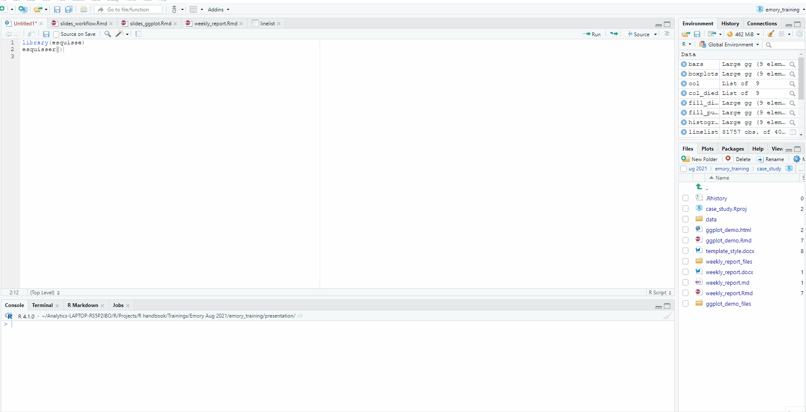

<!-- Add JavaScript code for making the exercise code larger -->
<script language="JavaScript" src="js/exercise-font-size.js"></script>

```{r setup, include=FALSE}
# load packages ----------------------------------------------------------------
library(learnr)
library(gradethis)
library(tidyverse)
library(here)
library(rio)
library(basket) # not sure if we need this
library(etude) # helper functions for gradethis

library(submitr) # also needed?
# set options for exercises and checking ---------------------------------------
gradethis_setup()

learnr::tutorial_options(exercise.timelimit = 60) 
  #exercise.checker = gradethis::grade_learnr) 
    # alternatively, submitr::null_code_checker


# event recorder ---------------------------------------------------------------
# see https://github.com/dtkaplan/submitr/blob/master/R/make_a_recorder.R
tutorial_options(exercise.eval = FALSE)  # pre-evaluate exercises

vfun <- submitr::make_basic_validator(NULL, "hello") #basket::check_valid

new_recorder <- function(tutorial_id, tutorial_version, user_id, event, data) {
    cat(
      tutorial_id, 
      " (v", tutorial_version, "); ",
      format(Sys.time(), "%Y-%M%-%D %H:%M:%S %Z"), "; ",
      user_id, "; ",
      event, "; ",
      data$label, "; ",
      data$answers, "; ",
      data$code, "; ",
      data$correct, "\n", sep = "",
      
      file = here::here("event_records", "learnr_basics.txt"),
      append = TRUE)
}

options(tutorial.event_recorder = new_recorder)


# hide non-exercise code chunks ------------------------------------------------
knitr::opts_chunk$set(echo = FALSE, fig.align = "center", message = F, warning = F)


# data prep --------------------------------------------------------------------
linelist_raw <- rio::import(here::here("data", "linelist_raw.xlsx"))
linelist <- rio::import(here::here("data", "linelist_cleaned.rds"))
malaria_counts <- rio::import(here::here("data", "malaria_facility_count_data.rds"))

# Package preloads
pacman::p_load(
  rio,        # importing data  
  here,       # relative file pathways  
  skimr,      # review data
  DT,         # visualize data frame
  janitor,    # data cleaning and tables
  epikit,     # age categories
  lubridate,  # working with dates
  incidence2, # epidemic curves
  ggrepel,    # smart labels
  ggExtra,    # extras
  esquisse,   # point-and-click for simple ggplots
  apyramid,   # age pyramids
  scales,     # formatting of scales
  plotly,     # interactive plots
  cowplot,    # combine plots
  tidyverse,   # ggplot2 & data management
  ggpubr,
  gghighlight,
  RColorBrewer, # now built in to ggplot but need to load to see the palettes
  Hmisc,
  datasets
  )


```


```{r}
submitr::login_controls() # show login and password with "Submit" button.
```


```{r context = "server", echo = FALSE}
# see https://rdrr.io/github/dtkaplan/submitr/f/vignettes/using.Rmd
options(tutorial.storage = "none")
vfun <- submitr::make_basic_validator(NULL, "hello")       #basket::check_valid
storage_actions <- submitr::record_local("./minimal_submissions.csv")
submitr::shiny_logic(input, output, session, vfun,
                     storage_actions)
```


## Introduction to R for Applied Epidemiology and Public Health
### Data visualisation

```{r appliedepi-banner, fig.margin = TRUE, echo = FALSE, fig.width = 3, out.width = "100%", fig.cap = ""}
knitr::include_graphics("images/moz-banner.png")
```


### Welcome


Welcome to the course "Introduction to R for applied epidemiologists", offered for free by [Applied Epi](www.appliedepi.org) - a non-profit organisation that offers open-source tools, training, and support to frontline public health practitioners.  

This interactive tutorial focuses on **visualisation of data with the ggplot2 R package**, for example into figures such as epidemic curves, demographic pyramids, and many varieties of bar, line, and scatter plots.  

This tutorial draws from chapters of our free [Epidemiologist R handbook](https://epirhandbook.com/en/) such as [ggplot basics](https://www.epirhandbook.com/en/ggplot-basics.html), [ggplot tips](https://www.epirhandbook.com/en/ggplot-tips.html), [epidemic curves](https://www.epirhandbook.com/en/epidemic-curves.html). The Epi R Handbook has over 50 chapters, has helped over 110,000 people learn R, and is also available for offline use.

#### Target Audience  

This course is designed with the following objectives: 

* To be friendly to people who have never used a programming language before
* To teach R emphasizing examples, datasets, and challenges commonly faced by applied epidemiologists
* To be modular - so that you can skip to section most relevant to you


We expect that you know how to do ... TO DO


#### Other languages
This course is available...


#### Offline / Online

You can access this tutorial offline by downloading our R package ... 
If viewing offline, you can view the videos by doing ...


#### Learning goals

In this tutorial you will learn:  

* The basics of data visualization in R with **ggplot2**
* The "grammar of graphics" approach to data visualization
* How to customize and edit plots to achieve the look you want
* Methods to produce some common epidemiological plots with **ggplot2** and other helper functions
* How to combine and overlay your plots


#### Data consent

This tutorial is anonymously collecting your entries, for purposes of improvement... by Continuing you consent to this collection and use. 


#### Who made this course  

This course is designed by epidemiologists with decades of ground-level experience in outbreak response and local public health work. 


```{r appliedepi-hexes, fig.margin = TRUE, echo = FALSE, fig.width = 3, out.width = "50%", fig.cap = ""}
knitr::include_graphics("images/hex-sidebyside.png")
```


## Data used and directory structure

In this tutorial we will use the following dataset. Please take a few minutes to review the structure and content of the before continuing.

Use the arrows on the right to scroll through hidden columns. Note that there are "raw" (messy) datasets that mimic problems commonly found in real-life epidemiological datasets availble. As we are focusing on visualization here we will use pre-cleaned data. The data cleaning tutorials cover the processing of raw data to get to this point and we recommend looking through these first


### **A "linelist" of cases in a fictional (not real) Ebola outbreak**

A "linelist" is a term used in applied epidemiology to refer to a table that contains key information about each case or suspect case in an outbreak. Each row represents one case, and the columns contain variables such as age, sex, date of symptom onset, outcomes, etc.

This dataset contains `r nrow(linelist)` rows and `r ncol(linelist)` columns. Below are the first 5 rows:  

```{r}
head(linelist)
```

Click to [download the **clean** dataset as an **.rds file**](https://github.com/appliedepi/epirhandbook_eng/raw/master/data/case_linelists/linelist_cleaned.rds) for your own practice. A *.rds file* is an R-specific file type that preserves column classes. This ensures you will have only minimal cleaning to do after importing the data into R.


### Directory structure


Photo or GIF of directory structure

### Accessing example data
The example data used in this exercise is available from the link below. This data is in the rds format, an R-specific format which preserves data formatting.
Click to [download the **clean** dataset as an **.rds file**](https://github.com/appliedepi/epirhandbook_eng/raw/master/data/case_linelists/linelist_cleaned.rds) for your own practice. A *.rds file* is an R-specific file type that preserves column classes. This ensures you will have only minimal cleaning to do after importing the data into R.

### Tidy Data

We highly recommend doing our tutorial on Tidy Data in Applied Epidemiology. Collecting, formatting, and preparing your dataset *before* importing it into R is a critical step!

We also recommend following the tutorials in order and first learning the process of data cleaning which gives the example data above from a raw excel dataset.

LINK


## Install and Load R packages {#packages}

To use basic functions with public health data, the tidyverse metapackage is very useful. Tidyverse loads the dplyr, ggplot2, and other packages that are useful in epi data analysis. 

We've preloaded the below packages for now. Installation and loading of these packages is described on the EpiRHandbook [_Suggested Packages_](https://epirhandbook.com/en/suggested-packages-1.html) page. 


```{r load-package-solution, echo=T, eval = FALSE}
pacman::p_load(
  rio,        # importing data  
  here,       # relative file pathways  
  skimr,      # review data
  DT,         # visualize data frame
  janitor,    # data cleaning and tables
  epikit,     # age categories
  lubridate,  # working with dates
  incidence2, # epidemic curves
  ggrepel,    # smart labels
  ggExtra,    # extras
  esquisse,   # point-and-click for simple ggplots
  apyramid,   # age pyramids
  scales,     # formatting of scales
  plotly,     # interactive plots
  cowplot,    # combine plots
  tidyverse,  # ggplot2 & data management
  gghighlight # nice highlighting features for ggplot
)
```

### Recommended R packages for public health

See this Epi R Handbook LINK for our recommended packages.


## Import data {#import} 
In this example code we will work with the *cleaned* fictional Ebola data linked in the "Data used and directory structure" section. Import that data into R. If you are interested in the process of cleaning data have a look at the data cleaning tutorial.

To import data from a sub-folder, the `import()` command should be modified so that it correctly tells R where to search for this file. This is done using the here() function. In the example below we expect your data to be stored in a sub-directory (folder) named *data* within your R project. In your own use you will need to modify this code for your own directory structure.

```{r import-demo-subfolder, echo=T, eval=T}
linelist <- import(here("data", "linelist_cleaned.rds"))   # import data and save as named object
```


## ggplot basics

There are a number of visualization options within the R software but in this tutorial and the handbook we focus on the **ggplot2** package available within the tidyverse. This is the visualization package of choice for may epidemiologists and other R users as it has a number of benefits over the basic `plot()` function built in to R.

**ggplot2**:

* Is good for fast data exploration (especially with large numbers of parameters)
* Produces very high quality final outputs which can often be used directly in publications or reports
* has well structured and consistent inputs, once you learn the basics you can apply the same techniques to many data and plot types
* Is actively updated and built on with additional packages to extend functionality


### Grammar of graphics
Visualizing multi-dimensional data *well* is a balance of art and science. Visualization is one of the most important parts of a statistical analysis as it allows you to share what you have achieved and, when done correctly, can help to explain complex work and concepts to a wider audience of stakeholders or the general public. Visualization can also be a key step when getting to grips with new data or with analyses you are working on.

```{r anscombe, fig.height=8, message = F, warning = F}
p1 <- ggplot(anscombe) +
  geom_point(aes(x1, y1), color = "darkorange", size = 1.5) +
  scale_x_continuous(breaks = seq(0,20,2)) +
  scale_y_continuous(breaks = seq(0,12,2)) +
  expand_limits(x = 0, y = 0) +
  labs(x = "x1", y = "y1",
       title = "Dataset 1" ) +
  theme_classic()

p2 <- ggplot(anscombe) +
  geom_point(aes(x2, y2), color = "darkorange", size = 1.5) +
  scale_x_continuous(breaks = seq(0,20,2)) +
  scale_y_continuous(breaks = seq(0,12,2)) +
  expand_limits(x = 0, y = 0) +
  labs(x = "x2", y = "y2",
       title = "Dataset 2" ) +
  theme_classic()

p3 <- ggplot(anscombe) +
  geom_point(aes(x3, y3), color = "darkorange", size = 1.5) +
  scale_x_continuous(breaks = seq(0,20,2)) +
  scale_y_continuous(breaks = seq(0,12,2)) +
  expand_limits(x = 0, y = 0) +
  labs(x = "x3", y = "y3",
       title = "Dataset 3" ) +
  theme_classic()

p4 <- ggplot(anscombe) +
  geom_point(aes(x4, y4), color = "darkorange", size = 1.5) +
  scale_x_continuous(breaks = seq(0,20,2)) +
  scale_y_continuous(breaks = seq(0,12,2)) +
  expand_limits(x = 0, y = 0) +
  labs(x = "x4", y = "y4",
       title = "Dataset 4" ) +
  theme_classic()


p1_fitted <- p1 + geom_abline(intercept = 3.0001, slope = 0.5001, color = "blue")+ labs(caption = str_glue("mean x = {mean(anscombe$x1)} \n mean y = {round(mean(anscombe$y1),2)}"))+   theme(plot.caption = element_text(color = "blue", size = 12, face = "italic")) + lims(y = c(0,15), x = c(0,20))
p2_fitted <- p2 + geom_abline(intercept = 3.001, slope = 0.500, color = "blue")+ labs(caption = str_glue("mean x = {mean(anscombe$x2)} \n mean y = {round(mean(anscombe$y2),2)}"))+   theme(plot.caption = element_text(color = "blue", size = 12, face = "italic"))+ lims(y = c(0,15), x = c(0,20))
p3_fitted <- p3 + geom_abline(intercept = 3.0025, slope = 0.4997, color = "blue")+ labs(caption = str_glue("mean x = {mean(anscombe$x3)} \n mean y = {round(mean(anscombe$y3),2)}"))+   theme(plot.caption = element_text(color = "blue", size = 12, face = "italic"))+ lims(y = c(0,15), x = c(0,20))
p4_fitted <- p4 + geom_abline(intercept = 3.0017, slope = 0.499, color = "blue") + labs(caption = str_glue("mean x = {mean(anscombe$x4)} \n mean y = {round(mean(anscombe$y4),2)}"))+   theme(plot.caption = element_text(color = "blue", size = 12, face = "italic"))+ lims(y = c(0,15), x = c(0,20))


joint <- plot_grid(p1_fitted, p2_fitted,
                          p3_fitted, p4_fitted,
             ncol = 2)

title <- ggdraw() + 
  draw_label(
    "Anscombe's Quartet",
    fontface = 'bold',
    x = 0,
    hjust = 0
  ) +
  theme(
    # add margin on the left of the drawing canvas,
    # so title is aligned with left edge of first plot
    plot.margin = margin(0, 0, 0, 7)
  )
plot_grid(
  title, joint,
  ncol = 1,
  # rel_heights values control vertical title margins
  rel_heights = c(0.1, 1)
)

```

*Visualization of Anscombe's quartet, a famous set of 4 very different datasets which resolve to the same set of summary statistics and same linear line of best fit. This highlights the importance of visualization when dealing with new or unknown data. Figure adapted from [Debosruti Dutta](https://rpubs.com/debosruti007/anscombeQuartet)*

The grammar of graphics refers to the basic structure generally followed in **ggplot2** where different building blocks of the plot are manipulated in individual lines of code. These range from data, the basic requirement of all data visualization, up to individual design tweaks specific to your own needs or liking.

```{r grammar-graphics-pyramid, fig.margin = TRUE, echo = FALSE, fig.width = 3, out.width = "50%", fig.cap = ""}
knitr::include_graphics("images/data_viz/gg_pyramid.png")
```


In **ggplot2** we build a plot by "adding" commands on top of one another which specify plot layers and design elements.
For a standard plot your order will follow this process:

1. **"Open" the plot** with the `ggplot()` command and specify the dataset
2. **"Map" data columns** to "aesthetic" features of the plot such as axes, colour, size, shape fill, transparency etc. 
3. **Add "geom" layers** to visualise your data in the desired way
4. **Modify "scales"** such as colour choices, axis breaks
5. **Add "theme" design elements** to your plot such as axis labels, title, captions, fonts, text sizes, background themes and the orientation of different elemnets

"Adding" layers to your plot is done literally, by ending a ggplot line with the `+` symbol you can indicate that you wish to add further details on the following line. This can be repeated until your complete plot is built. Using this line-by-line syntax allows your code to be more readable, both for you to make changes in the future and to others trying to understand your work. Additionally we can add line breaks within lines of ggplot code, this is useful to highlight when you are specifying a different argument of the plot and leads to more readable plots, you will see examples of this throughout the tutorial. These line breaks are not necessary for the code to run but are useful to help yourself and others disect the code.

```{r quiz1}
quiz(
  question("What is the most basic building block of data vizualisation?",
    answer("Statistics"),
    answer("Scale"),
    answer("Data", correct = TRUE),
    answer("Visualisation type")
  ),
  question("Which of the R packages listed below are used to create plots?",
    answer("ggplot2", correct = TRUE),
    answer("here"),
    answer("dplyr"),
    answer("incidence2", correct = TRUE)
  )
)
```

In the following sections we will put this into practice step-by-step.

## **ggplot2** in **RStudio**
In this tutorial we code within chunks inside of this tutorial module. In reality you will likely be running your R code with the popular **R** coding environment **RStudio**.

When we run a plotting command in RStudio the code will run in the console (as with any other R code) but you will not see the output here. The output will be passed to the "Plots" tab. By default this is in the bottom right quadrant of RStudio alongside the "Files", "Packages", "Help" and "Viewer" tabs:

```{r, fig.margin = TRUE, echo = FALSE, fig.width = 3, out.width = "70%", fig.cap = ""}
knitr::include_graphics("images/data_viz/RStudioplottab.PNG")
```

If we save our plot in or R environment by assigning it to a name it will not plot when we run the code, only when we run the name of the plot:
```{r, eval = TRUE, echo = FALSE,out.width = "90%"}
knitr::include_graphics("./images/data_viz/plotvis.gif")
```


```{r, fig.margin = TRUE, echo = FALSE, fig.width = 3, out.width = "70%", fig.cap = ""}
knitr::include_graphics("images/data_viz/plotopts.png")
```

To see your plot in a larger window you can click on "Zoom" **(1)**

We can also remove plots from the plot tab using the red X button to remove the current plot **(2)** or the little brush to remove all previous plots **(3)**. 

The "Export" button **(4)** allows us to save plots to a file or copy to our clipboard to paste elsewhere. To save a `ggplot()` with a function we can use `ggsave()`. This gives more options than exporting via the RStudio window and is also useful to save multiple plots from the same code.


`ggsave()` can work in two ways:
* Specify the name of the plot object, then the file path and name with extension
    * For example: ggsave(plot_name, here("plots", "plot_name.png"))
* Run the command with only a file path, to save the last plot that was printed
    * For example: ggsave(here("plots", "plot_name.png"))

You can export as png, pdf, jpeg, tiff, bmp, svg, or several other file types, by specifying the file extension in the file path.

You can also specify the arguments `width =`, `height =`, and `units =` (either “in”, “cm”, or “mm”). You can also specify `dpi =` with a number for plot resolution (e.g. 300). See the function details by entering `?ggsave` or reading the [documentation online](https://ggplot2.tidyverse.org/reference/ggsave.html)

## "Open" the plot
The **ggplot2** package is built around the **R** function `ggplot()` which is the first command for any ggplot. 
Running `ggplot()` in your R console should generate a blank canvas:

```{r blank-plot, exercise = TRUE}
ggplot()
```

```{r blank-plot-check}
grade_this_code("correct, you should see a blank canvas loaded by ggplot2")
```

```{r blank-plot-solution, eval= FALSE}
ggplot()
```


We assign the dataframe we wish to use with the `data = ` argument of this function. In our example this dataframe is called `linelist`:
```{r ggplot data, echo=T, eval=F}
ggplot(data = linelist)
```


If you are familiar with the pipe operator (`%>%`) from our data cleaning tutorial, data can also be passed into a ggplot command using a pipe:
```{r pipe, eval=F, echo=T}
linelist %>%
  ggplot()
```


## Mapping columns
```{r aes, echo=T, eval=T}
ggplot(
  data = linelist,
  mapping = aes(x = age,
                y = bmi))


```


"Aesthetics" are features whose display could vary or each data point. An obvious example are the X and Y co-ordinates but these can also include the color, shape and other properties of the plot which depend on columns in your data. We will get into other aesthetics further into the tutorial.

`mapping = aes()` assigns plot aesthetics to columns from your data. Any arguments to be input must be placed *within* the `aes()` command to be interpreted as dependent on the data.

Here we have set the axes X and Y to the age and bmi columns from the linelist data. You can see this represented on the axes above.

The first 25 rows of the linelist data are reproduced below. Try changing the Y axis to weight rather than BMI in the **R** window below. You can use the arrows to scroll left and right through the table and find the correct column. 

```{r linelist-data}
head(linelist,25)
```

Below is an R exercise where you can edit and write your own code. Using "Run code" will run what you have entered and produce an output, to check your answer against the solution click "Submit Answer". If you get stuck be sure to click the "Hints" button above the code chunk to get a hint to the solution.

```{r axes-plot, exercise = TRUE}
ggplot(
  data = linelist,
  mapping = aes(x = age,
                y = bmi))
```

```{r axes-plot-check}
grade_this_code("correct, you should now see weight on the y axis")
```

```{r axes-plot-hint}
The weight column is labeled wt_kg
```

```{r axes-plot-solution, eval= FALSE}
ggplot(
  data = linelist,
  mapping = aes(x = age,
                y = wt_kg))
```

*Note: You may see `aes()` called in ggplot code without the `mapping = ` argument being specified, as with any R function the arguments do not need to be specifically named as long as they are passed in the order expected by the function. For clarity here we include `mapping = ` but if you see code elsewhere without this it achieves the same result.*

## Add geoms
As we have seen above, running our `ggplot()` command with the data attached and X and Y coordinates determined does not give us a completed plot. 
To do this we need to add geometry with "geom" commands. These all follow a common format of `geom_XXXX()` where XXXX is replaced with a plot type such as `geom_line()` or `geom_bar()` or more general objects to be plotted such as text: `geom_text()` or a horizontal line: `geom_hline()`. A full list of available **ggplot2** geoms can be found in the [ggplot reference document](ggplot2.tidyverse.org/reference/) and many more can be added by loading additional packages.
Some common "geoms" for epidemiology are listed below:

* Histograms `geom_histogram()`
* Bar charts `geom_bar()` or `geom_col()` (These are covered later in the tutorial)
* Box plots `geom_boxplot()`
* Points (eg. scatter plots) `geom_point()`
* Line graphs `geom_line()` (points joined in order of the x-axis variable) or `geom_path()` (points joined in the order given in the data)
* Trend lines `geom_smooth()`

Adding (`+`) `geom_point()` to our previous `ggplot()` call will plot points using the X and Y variables we defined:
```{r simple plot, echo=T, message = T, warning = T}
ggplot(
  data = linelist,
  mapping = aes(
    x = age,
    y = wt_kg))+
  geom_point()
```

You will see a warning when running this code reproduced above. This is due to missing data in the linelist. **ggplot2** will automatically drop rows with missing values from simple plots.


We can also plot other simple plots with the same data by switching out the `geom_point()` for another geom. Below we plot a histogram  of ages included in the linelist. This type of plot only requires a single variable. Can you spot what is missing from the code below?

```{r axis-plot, exercise = TRUE, warning=F, message=F}
ggplot(
  data = linelist,
  mapping = aes(x = age))
geom_histogram()
```

```{r axis-plot-check}
grade_this_code("correct, we need to link the commands together with a '+'")
```

```{r axis-plot-hint}
remember we need to add layers to our ggplot
```

```{r axis-plot-solution, eval= FALSE}
ggplot(
  data = linelist, 
  mapping = aes(x = age)) +
geom_histogram()
```

## Other aesthetics

In the previous section we saw examples of plots that assigned columns in the data to both the x-axis and y-axis (e.g. scatterplots) and plots that used only an x-axis (e.g. histograms). As well as these simple aesthetics, we can also adjust elements specific to the type of plot we are using (the `geom_*()`):

* shape = Display a point with geom_point() as a dot, star, triangle etc.
* fill = The interior color (e.g. of a bar or boxplot)
* color = The exterior line of a bar, boxplot, etc., or the point color if using geom_point()
* size = Size (e.g. line thickness, point size)
* alpha = Transparency (1 = opaque, 0 = invisible)
* binwidth = Width of histogram bins
* width = Width of “bar plot” columns
* linetype = Line type (e.g. solid, dashed, dotted)

These plot object aesthetics can be assigned values in two ways:

1. Static values (e.g. fill = "orange") to apply across all plotted observations
    * Assigned _outside_ `aes()`
    * same display for all data

```{r plot-color, echo=T, warning=F, message=F}
ggplot(
  data = linelist,
  mapping = aes(x = age)) +
geom_histogram(
  fill = "orange")
```
*NOTE: when we assign a character value such as the fixed color orange, we need to use quotation marks (`"orange"`) whereas when we are mapping an aesthetic to a column name we do not use quotation marks*


2. A data column (e.g. color = gender) such that display of each observation depends on its value in that column
    * Assigned _inside_ `aes()`
    * Dispalys data grouped by selected column
  
```{r dynamic-aes, warning=F, message=F, echo=T}
ggplot(
  data = linelist,
  mapping = aes(
    x = age,
    y = wt_kg)) +
geom_point(
    mapping = aes(color = gender))
```

Try changing the histogram plot code below to have the bar fill determined by gender.

```{r gender-plot, exercise = TRUE, warning=F, message=F}
ggplot(
  data = linelist,
  mapping = aes(x = age)) +
geom_histogram(fill = "orange")
```

```{r gender-plot-check}
grade_this_code("correct, we need to put the fill inside aes()")
```

```{r gender-plot-hint}
aes(fill = gender)
```

```{r gender-plot-solution, eval= FALSE}
ggplot(
  data = linelist,
  mapping = aes(x = age)) +
geom_histogram(
  mapping = aes(fill = gender))
```

### More examples
For dot and line plots we assign the color using *color* rather than *fill* as they are outlines rather than filled objects. Here we also adjust the size (`size = `) of the points and the opacity (`alpha = `)(make them more see through; useful for overlaid plots)
```{r static-col, warning=F, message=F, echo=T}
ggplot(
  data = linelist,
  mapping = aes(
    x = age,
    y = wt_kg)) +
geom_point(
  mapping = aes(color = outcome),
  size = 2,
  alpha = 0.5)
```

*NOTE: here we assign size and alpha to fixed values outside of the `mapping = aes()` argument, these can also be mapped to columns in our data by placing them inside the argument and specifying a column name to map them to.*

We will cover different color options later and how to change the colors assigned to your data. Basic colors for static mapping are built-in with **ggplot2**:

```{r ggplot-default-cols, fig.height=15, fig.with=12}
d=data.frame(c=colors(), y=seq(0, length(colors())-1)%%66, x=seq(0, length(colors())-1)%/%66)
ggplot() +
scale_x_continuous(name="", breaks=NULL, expand=c(0, 0)) +
scale_y_continuous(name="", breaks=NULL, expand=c(0, 0)) +
scale_fill_identity() +
geom_rect(data=d, mapping=aes(xmin=x, xmax=x+1, ymin=y, ymax=y+1), fill="white") +
geom_rect(data=d, mapping=aes(xmin=x+0.05, xmax=x+0.95, ymin=y+0.5, ymax=y+1, fill=c)) +
geom_text(data=d, mapping=aes(x=x+0.5, y=y+0.5, label=c), colour="black", hjust=0.5, vjust=1, size=3)
```

A range of point shapes are also available in R, these can be used to set point shapes. The ones with blue centers below have a fill and so can be filled with a different argument to their colour (outline)

```{r shapes}
ggpubr::show_point_shapes()

```

As with the other aesthetics we have seen shape can be dynamic:

```{r dynamic-shape, warning=F, message=F, echo=T}
ggplot(
  data = linelist,
  mapping = aes(
    x = age,
    y = wt_kg)) +
geom_point(
  mapping = aes(
    shape = gender,
    color = age_cat), 
  size = 3, 
  alpha = 0.3)
```

or static:

```{r static-shape, warning=F, message=F, echo=T}
ggplot(
  data = linelist,
  mapping = aes(
    x = age,
    y = wt_kg)) +
geom_point(
  mapping = aes(fill = age_cat),
  color = "black",
  shape = 21,
  size = 3,
  alpha = 0.3)
```

Here we use a shape with fill to allow each point to have a black outline with categorical fill.

### Static aesthetics
An aesthetic is static if it applies the same display to all data points in the geom or plot. Static aesthetics are defined *outside* `aes()` to a *number or character value*.
egs.
`color = seagreen`
`size = 3`
`alpha = 0.5`

```{r plot-with-those-aes, warning=F, message=F}
ggplot(
  data = linelist,
  mapping = aes(
    x = age,
    y = wt_kg)) +
geom_point(color = "seagreen",
           size = 3,
           alpha = 0.5)
```

### Assigned (dynamic) aesthetics
*Dynamic* aesthetics are mapped to a column name, and defined *inside* `aes()`. This creates "groups" in the plot and generates a legend. The display varies for each data point.

### Combining both types
As we have shown in the examples, both types of aesthetic can be combined in one plot to generate the desired outcome.

### Placement of `aes()`
1. Dynamic mappings in the initial `ggplot()` call will apply to subsequent geoms, *unless otherwise indicated*
2. Static aesthetics (e.g. color = "blue") are not inherited by subsequent geoms
3. Mappings written within one geom apply only to that geom


It is good practice to add global option sin the initial `ggplot()` call such as the coordinates used in the plot. This makes reading the code more easy for others and yourself. The data is also usually global but in some cases you may load different data for individual geoms inside those geoms

```{r quiz_aes}
quiz(
  question("Where are dynamic aesthetics placed in ggplot code?",
    answer("inside aes()", correct = T),
    answer("outside aes()")
  ),
  question("Are static aesthetics in the initial ggplot() call inherited by subsequent geoms?",
    answer("No", correct = TRUE),
    answer("Yes")
  ),
  question("Are dynamic aesthetics in the initial ggplot() call inherited by subsequent geoms?",
    answer("No"),
    answer("Yes", correct = TRUE)
  )
)
```


## Facets
Aesthetics are a good way of showing groups in your data, another way is by *faceting*. `facet_wrap()` can be used to produce an individual plot for each unique value of the column passed to it. Put a "~" before the column name in the command

```{r facet-wrap, echo=T, warning=F, message=F}
ggplot(
  data = linelist,
  mapping = aes(x = date_onset)) +
geom_histogram() +
facet_wrap(~source)
```

Here we split out the linelist data by source of infection. A key thing to see here is that we must put a "~" before the column name we want to facet by otherwise we will get an error message. 

You will also notice that the date axes in these facet plots look terrible by default! We will address this in the scales section of the tutorial.

By default `facet_wrap()` automatically matches scales between plots. This can be turned off with "free" options passed to `scales =` 

1. "free_y"
2. "free_x"
3. "free" (both x and y)

```{r facet-wrap-free, echo=T, warning=F, message=F}
ggplot(
  data = linelist,
  mapping = aes(x = date_onset)) +
geom_histogram() +
facet_wrap(
  ~source,
  scales = "free_y")
```

**Free axes are generally not recommended as they can mislead an audience not carefully checking your plots**

you can also set the number of columns or rows of plots produced with `ncol = ` and `nrow = `

Try fixing the below code splitting cases by reporting hospital to plot a facet:

1. Without a free y axis
2. With 2 columns of plots
3. With fill set by the source of infection (calls back to aesthetic mapping section)

```{r facet-test, exercise = TRUE, warning=F, message=F}
ggplot(
  data = linelist,
  mapping = aes(x = date_onset)) +
geom_histogram() +
facet_wrap(
  ~hospital,
  scales = "free_y",
  ncol = 4)
```

```{r facet-test-check}
grade_this_code("correct, we remove the scales argument, change ncol to 2 and add fill = source to the mapping = aes() of the histogram")
```

```{r facet-test-hint}
1. We can remove the scales argument completely as we want to use the default.
2. adust ncol = 
3. we want to specify fill = source inside the aes mapping for the histogram
```

```{r facet-test-solution, eval= FALSE}
ggplot(
  data = linelist,
  mapping = aes(x = date_onset)) +
geom_histogram(mapping = aes(fill = source)) +
facet_wrap(
  ~hospital,
  ncol = 2)
```

 We will fix the date (x) axis label overlap later in the tutorial.
 
### Facet by two variables

The "~" signifies "by". You can place columns on either side.
With `facet_wrap()`, levels are combined into facet titles, appearing alphabetically/by factor level.

```{r multidimension facet wrap, echo=T, warning=F, message=F, fig.height=7}
ggplot(
  data = linelist,
  mapping = aes(x = date_onset)) +
geom_histogram(mapping = aes(fill = source)) +
facet_wrap(hospital ~ gender)
```

To improve on this layout we can instead use the `facet_grid()` command:
```{r multidimension facet grid, echo=T, warning=F, message=F, fig.height=7}
ggplot(
  data = linelist,
  mapping = aes(x = date_onset)) +
geom_histogram(mapping = aes(fill = source)) +
facet_grid(hospital ~ gender)
```

### Drop levels from facets

The easiest way to drop unwanted levels from your facet plot is to remove them in advance with `filter()` or `drop_na()`, functions you will have seen in the data cleaning tutorial.

For ease we can also pipe this amended data straight into `ggplot()` rather than saving the changes as a new object for plotting.

```{r dropping, echo=T, warning=F, message=F, fig.height=7}
linelist %>% 
   drop_na(gender, hospital) %>% 
   filter(hospital != "Missing") %>% 
  
ggplot(
  mapping = aes(x = date_onset)) +
geom_histogram(mapping = aes(fill = source)) +
facet_grid(hospital ~ gender)
```
*NOTE: here we are piping (`%>%`) into our plotting function after filtering with `dplyr`. *

### `gghighlight()`

It can be useful to show facets in context of other data for comparison. `gghighlight()` from the package **gghighlight** can be used in combination with facets to have this effect.

```{r gghighlight, echo=T, warning=F, message=F}
ggplot(
  data = linelist,
  mapping = aes(x = date_onset)) +
geom_histogram(mapping = aes(fill = hospital)) +
facet_wrap(~hospital) +
gghighlight()

```

gghighlight can also be added to other types of ggplot. Here we specify we want to highlight the 15-19 year olds in some data grouped from the linelist in this tutorial.


```{r gghighlight-other, echo=T, warning=F, message=F}
linelist %>% 
  # get daily counts by age group
  group_by(age_cat, date_onset) %>%
  count() %>% 

  ggplot(
    mapping = aes(
      x = date_onset,
      y = n,
      color = age_cat)) +
  geom_line() +
  gghighlight::gghighlight(
    age_cat %in% c("15-19"))+
  theme(legend.position = "none")
```

Check the handbook for [more information on grouping data](https://epirhandbook.com/en/grouping-data.html)

Editing the facet title strips is touched on in the themes section of this tutorial, see [This short tutorial](https://www.datanovia.com/en/blog/how-to-change-ggplot-facet-labels/) for more information on this. 
The order of the facets can be adjusted by faceting by a factor and [reordering the levels](https://forcats.tidyverse.org/reference/fct_relevel.html). This is covered for barplots in the barplot section of the tutorial.

facet quiz - ways to group data - aesthetic and facet
can you think of situations where facets are preferred?
facet_wrap vs facet_grid

Below is a short quiz on facets, these are free text questions so there are no wrong answers, let us know what you think! 
```{r facet-quiz}
quiz(
  question_text("When would you use a facet rather than an aesthetic?",
    answer("Facets are useful to contrast and compare subsets of the data, sometimes this cannot be done efficiently with aesthetics alone as there is a large amount of overlap between different datasets. Sometimes we are already using multiple aesthetics to show different properties of the data and a facet gives us an additional diffentiation without further cluttering the plot.", correct = T), incorrect  = "Facets are useful to contrast and compare subsets of the data, sometimes this cannot be done efficiently with aesthetics alone as there is a large amount of overlap between different datasets. Sometimes we are already using multiple aesthetics to show different properties of the data and a facet gives us an additional diffentiation without further cluttering the plot."
    ),
    question_text("When would we use facet_wrap rather than facet_grid?",
    answer("Facet grid is most useful for 2 discrete variables, where you are seeall or most combinations of these two variables in your data. To split by one variable with a lot of levels or just to provide an additional aesthetic without cluttering the plot facet_wrap may be more useful.", correct = T), incorrect  = "Facet grid is most useful for 2 discrete variables, where you are seeall or most combinations of these two variables in your data. To split by one variable with a lot of levels or just to provide an additional aesthetic without cluttering the plot facet_wrap may be more useful. "
    )
  
)
```


## Scales
Scale commands replace defaults of how the aesthetic mappings manifest, such as:

* Which colors or shapes to display
* The min/max of point sizes
* The min/max and frequency of axes breaks

As a generic formula, these commands are written as: `scale_AESTHETIC_METHOD()`.

1. `scale_` : this prefix never changes
2. AESTHETIC: `_fill_` , `_color_` , `_x_` , `_y_` , etc.
3. METHOD: `_continuous()`, `_discrete()`, `_manual()`, `_date()`, etc.

Some examples of scale commands:  

You want to adjust  |Scale command
--------------------|-------------------
continuous y-axis   |`scale_y_continuous()`
date x-axis         |`scale_x_date()`  
categorical x-axis  |`scale_x_discrete()`  
fill, continuous    |`scale_fill_continuous()`
fill, continuous    |`scale_fill_gradient()`  
color, manual assign|`scale_color_manual()`  

here we show two different ways to create a continuous color gradient. `scale_*_continuous` works with pre-built gradient palettes, `scale_*_gradient()` creates a 2 color gradient, `scale_*_gradient2` allows you to also set a midpoint color between these two and `scale_gradientn()` allows you to create more complex palettes. More information on these functions is [available here](r-graphics.org/recipe-colors-palette-continuous).


### Default scales

```{r, eval=T, echo=T, warning = F, message = F}
ggplot(
  data = linelist,
  mapping = aes(
    x = outcome,
    fill = gender)) +
geom_bar()
```

Above, the fill of a bar plot uses the **default colors and axis breaks**. We can adjust the elements of this plot with a `scale_AESTHETIC_METHOD()` function added (`+`) to the end of our `ggplot()`

### Adjust fill

Here we adjust the *fill* color of the bars *manually* (`scale_fill_manual()`). We provide assingments to the values in our dataset ("m" and "f") within a vector (`c()`). To assign a colour to the na values we need to specify this with the seperate argument `na.value = `

```{r, eval=T, echo=T, warning = F, message = F}
ggplot(
  data = linelist,
  mapping = aes(
    x = outcome,
    fill = gender)) +
geom_bar() +
scale_fill_manual(        
  values = c(
   "m" = "violetred", 
   "f" = "aquamarine"),
   na.value = "green")
```

Here we have chosen some ugly colors to highlight what we are changing! Try changing the color for "m" to "dodgerblue" and "f" to "tomato" for a nicer color combination in the code below. Also set NA to be "grey", a common standard plot color.

```{r manual-color, exercise = TRUE, warning=F, message=F}
ggplot(
  data = linelist,
  mapping = aes(
    x = outcome,
    fill = gender)) +
geom_bar() +
scale_fill_manual(        
  values = c(
   "m" = "violetred", 
   "f" = "aquamarine"),
   na.value = "green")
```

```{r manual-color-check}
grade_this_code("Correct! We can edit the values to specify any manual color combination we want")
```

```{r manual-color-solution, eval= FALSE}
ggplot(
  data = linelist,
  mapping = aes(
    x = outcome,
    fill = gender)) +
geom_bar() +
scale_fill_manual(        
  values = c(
    "m" = "dodgerblue",
    "f" = "tomato"),
  na.value = "grey")
```

#### Built-in palettes

**R** and **ggplot2** come with a number of built-in palettes. As we are working here with discrete data we can use `scale_fill_brewer()` to access the following palettes rather than specifying our own colors:

```{R brewerpal, fig.height=6}
RColorBrewer::display.brewer.all()

```

As we are working with a discrete scale the middle group of color palettes are most appropriate.

```{r brewer_eg, eval= T, echo=T, warning = F, message = F}
ggplot(
  data = linelist,
  mapping = aes(
    x = outcome,
    fill = gender)) +
geom_bar() +
scale_fill_brewer(palette = "Pastel2",
                  na.value = "grey")
```

A color-blind friendly palette is also available known as `viridis`. This comes in discrete and continuous forms `scale_fill_viridis_d()` and `scale_fill_viridis_c()`:

```{r viridis_eg, eval= T, echo=T, warning = F, message = F}
ggplot(
  data = linelist,
  mapping = aes(
    x = outcome,
    fill = gender)) +
geom_bar() +
scale_fill_viridis_d(na.value = "grey")
```

Try applying what you have learned to add a continuous viridis palette to the following plot. Be aware that here we are dealing with a *color* rather than *fill* aesthetic. It is best practice to also specify an `na.value = `

```{r pal-color, exercise = TRUE, warning=F, message=F}
ggplot(
  data = linelist,
  mapping = aes(
    x = age,
    y = wt_kg,
    color = temp)) +
geom_point() 
```

```{r pal-color-check}
grade_this_code("Correct! we need to specify we want a color scale, viridis palette and have continuous data (scale_color_viridis_c)")
```

```{r pal-color-hint}
+ scale_color_viridis_c(na.value = "grey")

```

```{r pal-color-solution, eval= FALSE}
ggplot(
  data = linelist,
  mapping = aes(
    x = age,
    y = wt_kg,
    color = temp)) +
geom_point() +
scale_color_viridis_c(na.value = "grey")
```

[Viridis](https://cran.r-project.org/web/packages/viridis/vignettes/intro-to-viridis.html) (try with `option = "plasma"` or "inferno"), and [colorbrewer](https://www.r-graph-gallery.com/38-rcolorbrewers-palettes.html) palette functions can be added to any ggplot.  


### Adjusting y-axis

We can edit axes in a similar way. In a barplot such as this one we have a continuous y-axis and discrete x-axis. Here we might decide that the counts on the y-axis are not descriptive enough so we wish to supply our own break points. In `scale_y_continuous()` we adjust the y-axis breaks using `seq()` to define a numeric sequence:   

```{r axis-breaks, eval= T, echo=T, warning = F, message = F}
ggplot(
  data = linelist,
  mapping = aes(
    x = outcome,
    fill = gender)) +
geom_bar() +
scale_fill_viridis_d(na.value = "grey") +
scale_y_continuous(breaks = seq(from = 0,
                                to = 3000,
                                by = 500))
```

### Starting scales at 0 

You may have noticed that **ggplot2** has a behaviour of expanding your axis beyond the data, with a gap between the values and the axis at the bottom. This can be fixed with the axes scales using the `expand = ` argument.

```{r axis-end, eval= T, echo=T, warning = F, message = F}
ggplot(
  data = linelist,
  mapping = aes(
    x = outcome,
    fill = gender)) +
geom_bar() +
scale_fill_viridis_d(na.value = "grey") +
scale_y_continuous(breaks = seq(from = 0,
                                to = 3000,
                                by = 500),
                   expand = c(0,0))
```

Try applying the same `expand = c(0,0)` to the *discrete* x-axis:

```{r expand, exercise = TRUE, warning=F, message=F}
ggplot(
  data = linelist,
  mapping = aes(
    x = outcome,
    fill = gender)) +
geom_bar() +
scale_fill_viridis_d(na.value = "grey") +
scale_y_continuous(breaks = seq(from = 0,
                                to = 3000,
                                by = 500),
                   expand = c(0,0))
```

```{r expand-check}
grade_this_code("Correct! we follow the same syntax with scale_x_discrete()")
```

```{r expand-solution, eval= FALSE}
ggplot(
  data = linelist,
  mapping = aes(
    x = outcome,
    fill = gender)) +
geom_bar() +
scale_fill_viridis_d(na.value = "grey") +
scale_y_continuous(breaks = seq(from = 0,
                                to = 3000,
                                by = 500),
                   expand = c(0,0)) +
scale_x_discrete(expand = c(0,0))
```

### Date axis labels

The default scale for date axis labels will vary by the range of your data. Here is an example plot:
```{r date-x, eval= T, echo=T, warning = F, message = F}
ggplot(
  data = linelist,
  mapping = aes(x = date_onset)) +
geom_histogram()
```

Adjust axis labels with `scale_x_date()`.  

Use `date_breaks=` values like "1 week", "2 weeks", or "3 months". 

Note: these are the *axis* label breaks, the don't affect the bins of the histogram (bar widths), for tips on geom_histogram() bins, see Epi R Handbook epicurves page


Try setting the date axis breaks to 2 months on the plot from above:

```{r date-break, exercise = TRUE, warning=F, message=F}
ggplot(
  data = linelist,
  mapping = aes(x = date_onset)) +
geom_histogram()
```

```{r date-break-check}
grade_this_code("Good, we should be getting used to the syntax by now!")
```

```{r date-break-solution, eval= FALSE}
ggplot(
  data = linelist,
  mapping = aes(x = date_onset)) +
geom_histogram() +
scale_x_date(date_breaks = "2 months")
```

### Date axis labels

We can specify the date labels format with `date_labels = ` using ["strptime" syntax - see R documentation for more information on this](https://www.rdocumentation.org/packages/base/versions/3.6.2/topics/strptime)  

`"%d %b %Y"` for DD MMM YYYY. Below we also include a new line with `\n` to move the year below the day and month.

```{r date-labs, eval= T, echo = T, warning = F, message = F}
ggplot(
  data = linelist,
  mapping = aes(x = date_onset)) +
geom_histogram() +
scale_x_date(date_breaks = "2 months",
             date_labels = "%d %b \n %Y" )
```

See Epi R Handbook [Epicurves](https://epirhandbook.com/epidemic-curves.html) and [Strings](https://epirhandbook.com/characters-and-strings.html) pages for more tips

There is also a built-in simplification for date labels using the scales package. Confusingly this is applied using the `labels = ` rather than `date_labels = ` argument. Assigning `labels=` to `label_date_short()` from [**the scales package**](https://scales.r-lib.org/) means the year is not repeated on each label anymore.  

```{r date-short-labs, eval= T, echo = T, warning = F, message = F}
ggplot(
  data = linelist,
  mapping = aes(x = date_onset)) +
geom_histogram() +
scale_x_date(date_breaks = "2 months",
             labels = scales::label_date_short() )
```

### Display percentages
We can easily display proportions as percents with `percent()` from **scales** within `scale_y_continuous()`. 

Here we plot some case fatality data adapted from the linelist:

```{r CFR, echo = F, eval = T}
CFR_data <- linelist %>% 
  group_by(month = floor_date(
    date_outcome,
    "month")) %>% 
  summarise(
    cases = n(),
    deaths = sum(
      outcome == "Death",
      na.rm=T),
    CFR = deaths / cases)
```

```{r, echo = F, eval = T}
CFR_data %>% 
  head(4) %>%
  knitr::kable()
```

```{r , echo = TRUE, eval = T, warning = F, message = F}
ggplot(
  data = CFR_data,
  mapping = aes(
    x = month,
   y = CFR)) +
geom_line(
  size = 2,
  color = "brown") +
scale_y_continuous(labels = percent)
```

## Plot labels

```{r, echo = TRUE, eval = T, warning = F, message = F}
linelist$hosp_time <- linelist$date_outcome - linelist$date_hospitalisation

ggplot(data = linelist) +
geom_point(
  mapping = aes(
    x = age,
    y = hosp_time,
    color = outcome),    
  alpha = 0.7) +
scale_color_brewer(
  palette = "Pastel2",
  na.value = "grey") +
ylim(c(0, 70)) +
labs(
  title = "Duration of admission",
  subtitle = "All hospitals",
  x = "Age (years)",
  y = "Duration (days)",
  caption = "Fictional Ebola data",
  color = "Outcome"
)
```


Use `labs()` as above to edit the labels on the plot
Note: to edit legend title, use the aesthetic that created the legend (e.g. `color = `).  

Here we also use `ylim()` to set the limits of the y-axis. The same terminology can be applied for the x-axis. 

We can also use `"\n"` to break lines within labels for longer names.

### Dynamic labels

We can embed code in `str_glue()` that updates with the data  

```{r, eval=T, echo=T}
str_glue("Data as of {Sys.Date()}")
```

Here we extract the current date (`Sys.Date()`) in the time zone of our computer to add to the plot.

```{r, eval=T, echo=T}
str_glue("{fmt_count(linelist, is.na(date_onset))} cases missing onset and not shown")
```

Anything wrapped in curly brackets (`{__}`) will be run as **R** code allowing us to produce labels which will update with values from our data as the data is updated.

## Theme elements

Themes are non-data design features (background, text size/color, etc).  

### Complete themes

[These "complete themes"](https://ggplot2.tidyverse.org/reference/ggtheme.html) are easy to add.  

```{r, eval=F, echo=T}
# Try one of these...
+ theme_bw()
+ theme_classic()
+ theme_dark()
+ theme_gray()
+ theme_minimal()
+ theme_light()
+ theme_void()
```

Try adding the default themes above to this plot to see the changes:

```{r theme_trial, exercise = TRUE, warning=F, message=F}
linelist$hosp_time <- linelist$date_outcome - linelist$date_hospitalisation

ggplot(data = linelist) +
geom_point(
  mapping = aes(
    x = age,
    y = hosp_time,
    color = outcome),    
  alpha = 0.7) +
scale_color_brewer(
  palette = "Pastel2",
  na.value = "grey") +
ylim(c(0, 70)) +
labs(
  title = "Duration of admission",
  subtitle = "All hospitals",
  x = "Age (years)",
  y = "Duration (days)",
  caption = "Fictional Ebola data",
  color = "Outcome"
)
```

Try the argument `base_size = 16` inside the theme to quickly increase text size.  

```{r themes, echo=F, eval=T, warning=F, message=F, fig.height = 6}
linelist$hosp_time <- linelist$date_outcome - linelist$date_hospitalisation

plt_base <- ggplot(data = linelist) +
geom_point(
  mapping = aes(
    x = age,
    y = hosp_time,
    color = outcome),    
  alpha = 0.7) +
scale_color_brewer(
  palette = "Pastel2",
  na.value = "grey") +
ylim(c(0, 70))

bw <- plt_base + theme_bw() + ggtitle("theme_bw()")
classic <- plt_base + theme_classic() + ggtitle("theme_classic()")
dark <- plt_base + theme_dark() + ggtitle("theme_dark()")
gray <- plt_base + theme_gray() + ggtitle("theme_gray()")
minimal <- plt_base + theme_minimal() + ggtitle("theme_minimal()")
light <- plt_base + theme_light() + ggtitle("theme_light()")
void <- plt_base + theme_void() + ggtitle("theme_void()")


themes_plots <- cowplot::plot_grid( classic,
  bw, dark,
  gray, minimal,
  light, void,
  nrow = 3, rel_widths = c(2,2))
themes_plots

```

### Themes

Micro-adjustments to the theme can be made with `theme()` as these are mostly small layout and visual details we won't go into much detail here. More information is available [in the handbook](https://www.epirhandbook.com/en/ggplot-basics.html#ggplot_basics_themes). The syntax for themes taxes time to learn and is not used often enough to commit to memory for most R users. See [this list](https://ggplot2.tidyverse.org/reference/theme.html) of feature-specific arguments. or running `theme_get()` in your R window to get a list of all theme arguments in the console.
```{r theme-adjustment, echo = T, message = F, warning = F}
ggplot(data = linelist) +
geom_point(
  mapping = aes(
    x = age,
    y = hosp_time,
    color = outcome),    
  alpha = 0.7) +
scale_color_brewer(
  palette = "Pastel2",
  na.value = "grey") +
ylim(c(0, 70)) +
labs(
  title = "Duration of admission",
  subtitle = "All hospitals",
  x = "Age (years)",
  y = "Duration (days)",
  caption = "Fictional Ebola data",
  color = "Outcome"
) +
theme_classic(base_size = 16) +
theme(
  legend.position = "bottom",                # move legend to bottom
  plot.title = element_text(color = "red",   # title color
                            size = 20,       # title font size
                            face = "bold"),  # title typeface
  axis.title.y = element_text(angle = 0))    # rotate y axis title to be horizontal
```

These theme elements follow a similar 2-part syntax much like `mapping = aes()` where we pass a function to an argument of a higher level function (here `theme()`).

**Remember to add any adjustments after any pre-built themes**

some useful theme options are presented below:

`theme()` argument                  |	What it adjusts
------------------------------------|-------------------
`plot.title = element_text()`       |	The title
`plot.subtitle = element_text()`    |	The subtitle
`plot.caption = element_text()`     |	The caption (family, face, color, size, angle, vjust, hjust…)
`axis.title = element_text()`       |	Axis titles (both x and y) (size, face, angle, color…)
`axis.title.x = element_text()`     |	Axis title x-axis only (use .y for y-axis only)
`axis.text = element_text()`        |	Axis text (both x and y)
`axis.text.x = element_text()`      |	Axis text x-axis only (use .y for y-axis only)
`axis.ticks = element_blank()`      |	Remove axis ticks
`axis.line = element_line()`        |	Axis lines (colour, size, linetype: solid dashed dotted etc)
`strip.text = element_text()`       |	Facet strip text (colour, face, size, angle…)
`strip.background = element_rect()` |	facet strip (fill, colour, size…)


The main adjustments you are likely to make regularly are to do with the plot `legend.position = `. Default options are `"top"`, `"bottom"`, `"left"`, `"right"` and `"none"` (to hide the legend completely). The legend position can also be set more specifically with `c(x,y)` where x and y refer to the position along the x or y axis as a proportion of the total length (ie. bottom right is c(1,0))

Most other theme elements can also be turned off using `element_blank()` eg turn off minor y-axis grid lines and legend title:


Check your understanding of the basics of themes below:

```{r themes-quiz}
quiz(
  question("Should adjustments to the theme be made before or after setting one of the default themes?",
    answer("before"),
    answer("after", correct = TRUE)
  ),
  question("Which of the following are prebuilt themes in ggplot",
    answer("theme_bw()", correct = TRUE),
    answer("theme_classic()", correct = TRUE),
    answer("theme_red()"),
    answer("scale_color_brewer()")
  ),
  question("How would you hide a legend in ggplot?",
    answer("theme(legend.title = 'element.blank()')"),
    answer("theme(legend.position = 'right')"),
    answer("theme(legend.position(`none`))"),
    answer("theme(legend.position = 'none')", correct = TRUE)
  ),
  question("How would you set your legend to appear in the centre of your graph?",
    answer("theme(legend.position = 'middle')"),
    answer("theme(legend.position =  c(0.5,0.5))", correct = TRUE)
  )
)
```

## Challenge 1

Now that you have seen all of the basic building blocks of a `ggplot()` we would like you to attempt to build your own visualisation from scratch using the information in the previous sections. Feel free to use any of the aesthetics, geoms, facets and scales in the previous sections and go back to these sections to refresh as you work on this, your code should remain in the window.

We would like you to produce a plot with the same fictional Ebola linelist data as in the previous sections, a section of this data is reproduced again below:

```{r linelist-data-2}
head(linelist,25)
```

Can you think of a good way to represent the date of onset for infections by the source of infection and gender, be sure to try customizing your axis labels, title etc. to get a plot you are happy with. An example plot is provided as the answer with some comments but have a go at producing one for yourself. Once you have something you are happy with consider the questions below the exercise. If you want to know more about a certain `geom_*()` and how to use it, try using a question mark before the name of the geom to pull up the documentation for the function, e.g. `?geom_point`

```{r your_plot, exercise = TRUE, warning=F, message=F, fig.height=8}

```


```{r your_plot-solution, eval= F}
ggplot(
  data = linelist,
  mapping = aes(x = date_onset,            # X-axis is date 
                fill = gender)) +          # fill is gender
geom_histogram(binwidth = 7) +             # plot a histogram with binwidth of 7 (= 1 week)
scale_fill_brewer(palette = "Set2",        # pick a preset color palette
                  na.value = "grey",
                  labels = c("Female", "Male")) +   # Adjust labels to make them clearer  
scale_x_date(date_breaks = "3 months",     # fix overlapping date labels
             expand = c(0,0)) +            # no whit space around the plotted area
scale_y_continuous(expand = c(0,0),           
                   limits = c(0,200)) +    # set limits for the y-axis scale
facet_wrap(~source,                        # wrap by source as we have already used color for gender
           ncol = 1) +                     # one column as we are dealing with wide rather than tall plots
labs(
  title = "Cases by source of infection",
  subtitle = str_glue(
  "Weekly cases from {min(linelist$date_onset, na.rm = TRUE)}
  to {max(linelist$date_onset, na.rm = TRUE)}"),  # use str_glue to extract information ot add to the plot
  x = "Date of onset",
  y = "Number of cases",
  fill = "Gender"
) +
theme_light() +                            # pick a theme which allows the data to be clearly seen
theme(legend.position = "bottom",          # move legend to bottom so there is more width for plotting
      strip.background = element_rect(fill = "lightgrey",  # change colors of the facet strip elements
                                      color = "darkgrey"), # to make this clearer to read
      strip.text = element_text(color = "black")
)
```


```{r your_plot_quiz}
quiz(
  question_text("Do you think your plot would be easily understandable at a quick glance?",
    answer("Good graphics are usually interpretable within a few seconds for those familiar with standard plotting methods. This interpretation can be aided by including descriptive titles, axis labels, legends and captions as well as by not over-cluttering your plot. Do not be afraid to use facets if you feel that a plot is becoming too complex.", correct = T), incorrect  = "Good graphics are usually interpretable within a few seconds for those familiar with standard plotting methods. This interpretation can be aided by including descriptive titles, axis labels, legends and captions as well as by not over-cluttering your plot. Do not be afraid to use facets if you feel that a plot is becoming too complex."
    ),
    question_text("Do you think your visualization is showing something too complex to explain with words?",
    answer("This is a good way to consider data visualization, if something can easily be explained with words it likely doesn't need to be plotted unless to support other information. If a plot is explaining something which you would struggle to explain succinctly with words this means that it is an effective and valuable visualization.", correct = T), incorrect  = "This is a good way to consider data visualization, if something can easily be explained with words it likely doesn't need to be plotted unless to support other information. If a plot is explaining something which you would struggle to explain succinctly with words this means that it is an effective and valuable visualization."
    ),
    question_text("What do you think about the contrast in your plot? is it highlighting what you want to show?",
    answer("Don't be afraid to play with colors and the different background themes in ggplot to create an effective and visually appealing visualization. It is important that associations you are trying to highlight are easily visible and noticed without further prompting.", correct = T), incorrect  = "Don't be afraid to play with colors and the different background themes in ggplot to create an effective and visually appealing visualization. It is important that associations you are trying to highlight are easily visible and noticed without further prompting."
    ),
    question_text("How would you improve on the example plot in the answer (reproduced below)?",
    answer("This is up to you to decide! One thing which jumps out is that it doesn't mention that we are using Ebola data anywhere on the plot. This would be ok if it was to form part of a report on a certain dataset or a presentation on the progress of an Ebola outbreak but may be an issue if it is a plot to be viewed by the public or wider level stakeholders and collaborators.", correct = T), incorrect  = "This is up to you to decide! One thing which jumps out is that it doesn't mention that we are using Ebola data anywhere on the plot. This would be ok if it was to form part of a report on a certain dataset or a presentation on the progress of an Ebola outbreak but may be an issue if it is a plot to be viewed by the public or wider level stakeholders and collaborators."
    )

)

```
```{r your_plot-plot, eval= T, echo = F, fig.height = 8}
ggplot(
  data = linelist,
  mapping = aes(x = date_onset,            # X-axis is date 
                fill = gender)) +          # fill is gender
geom_histogram(binwidth = 7) +             # plot a histogram with binwidth of 7 (= 1 week)
scale_fill_brewer(palette = "Set2",        # pick a preset color palette
                  na.value = "grey",
                  labels = c("Female", "Male")) +   # Adjust labels to make them clearer  
scale_x_date(date_breaks = "3 months",     # fix overlapping date labels
             expand = c(0,0)) +            # no whit space around the plotted area
scale_y_continuous(expand = c(0,0),           
                   limits = c(0,200)) +    # set limits for the y-axis scale
facet_wrap(~source,                        # wrap by source as we have already used color for gender
           ncol = 1) +                     # one column as we are dealing with wide rather than tall plots
labs(
  title = "Cases by source of infection",
  subtitle = str_glue(
  "Weekly cases from {min(linelist$date_onset, na.rm = TRUE)}
  to {max(linelist$date_onset, na.rm = TRUE)}"),  # use str_glue to extract information ot add to the plot
  x = "Date of onset",
  y = "Number of cases",
  fill = "Gender"
) +
theme_light() +                            # pick a theme which allows the data to be clearly seen
theme(legend.position = "bottom",          # move legend to bottom so there is more width for plotting
      strip.background = element_rect(fill = "lightgrey",  # change colors of the facet strip elements
                                      color = "darkgrey"), # to make this clearer to read
      strip.text = element_text(color = "black")
)
```


## Common epidemiological plots
We will cover some common epidemiological plots in more detail as these are the most likely types of plots you will come across or want to recreate in your work.

## Bar plots
We have already introduced and presented bar plots throughout this tutorial using `geom_bar()`. There is an additional bar plotting `geom_*()`, `geom_col()`. These are both used to make general bar plots from different formats of data. We will also introduce a package to produce epicurves (another bar plot you will likely be familiar with) in the next section.

Use `geom_bar()` if bar height should reflect the **number of rows** in the data (e.g. a case linelist) as we have seen in previous examples:

```{r, eval=F, echo=T}
ggplot(
  data = linelist,                  # standard linelist data   
  mapping = aes(x = hospital)) + # no y = argument                                    
geom_bar()   
```

Use `geom_col()` if there is a numeric column containing the desired **bar height** (e.g. aggregated count data):

```{r, eval=F, echo=T}
ggplot(
  data = linelist_agg,  # begin with aggregated count data   
  mapping = aes(
    x = eth_race,
    y = n)) +           # bar height is value in column "n"                                     
geom_col()   
```

### Bar plot - count rows

With `geom_bar()`, the height reflects the number of rows per x-axis group. This works well for linelist data.  

```{r, echo=T, eval=T}
ggplot(
  data = linelist,                  # standard linelist data
  mapping = aes(x = hospital)) +    # No y= argument
geom_bar() +
theme_classic() + 
theme(axis.text.x = element_text(angle = 45,
                                 vjust = 1,
                                 hjust = 1))
```

*note: here we use theme adjustments introduced in the previous section. As 45 degree rotated labels rotate around the center of the text we then need to adjust the vertical and horizontal positioning hence `vjust` and `hjust`*

### `geom_bar()` - show groupings

To achieve "stacked" bars with `geom_bar()`, assign the grouping column to `fill=`, within `aes()` e.g. if we want to group by outcome:

```{r, eval=T, echo=F}
linelist %>% 
  select(
    date_onset,
    hospital,
    outcome) %>% 
  head(6) %>% 
  knitr::kable()
```

```{r, echo=T, eval=T}
ggplot(
  data = linelist,
  mapping = aes(
      x = hospital,   
     fill = outcome)) +             
geom_bar() + 
theme(axis.text.x = element_text(angle = 45,
                                 vjust = 1,
                                 hjust = 1))
```

To have adjacent rather than stacked bars we use `position = "dodge"` inside the `geom_bar()` call. Try adding this to the code for the plot above:

```{r dodge, exercise = TRUE, warning=F, message=F}
ggplot(
  data = linelist,
  mapping = aes(
      x = hospital,   
     fill = outcome)) +             
geom_bar() + 
theme(axis.text.x = element_text(angle = 45,
                                 vjust = 1,
                                 hjust = 1))
```

```{r dodge-check}
grade_this_code("Perfect, you should now see adjacent bars in the plot")
```

```{r dodge-solution, eval= FALSE}
ggplot(
  data = linelist,
  mapping = aes(
      x = hospital,   
     fill = outcome)) +             
geom_bar(position = "dodge") + 
theme(axis.text.x = element_text(angle = 45, 
                                 vjust = 1,
                                 hjust = 1))
```


### Bar plot - Aggregated counts

In contrast, `geom_col()` uses a column of counts, such as column `n` in this `linelist_hospital` dataset:

```{r, eval=T, echo=F}
linelist_hospital <- linelist %>% 
  count(hospital)
linelist_hospital %>% 
  head(6) %>% 
  knitr::kable()
```

Column `n` provides the counts for each hospital which are the bar heights we want in our plot. These need to be assigned as the y-axis for `geom_col()` unlike in `geom_bar()` where counting is by row in the data.    

```{r, echo=T, eval=T}
ggplot(linelist_hospital) +             
  geom_col(           
    mapping = aes(   
      x = hospital,    
      y = n)) +
theme(axis.text.x = element_text(angle = 45,
                                 vjust = 1,
                                 hjust = 1))

```

As you can see this gives the same result as the previous section but allows us to work with aggregated count data which is a common format, especially for secondary data.

### `geom_col()` show groupings

To have "stacked" bars using `geom_col()`, each plotting group must have its own rows in the data. Use "long"-style data like below:  

```{r, echo = F, eval=T}
linelist_hospital_outcome <- linelist %>% 
  count(hospital, outcome)
linelist_hospital_outcome %>% 
  head(6) %>% 
  knitr::kable()
```

```{r, echo=T, eval=T}
ggplot(linelist_hospital_outcome) +               
geom_col(                 
  mapping = aes(
    x = hospital,          
    y = n,                
   fill = outcome)) +
theme(axis.text.x = element_text(angle = 45,
                                 vjust = 1,
                                 hjust = 1))
```

*For more information on pivoting data to "long" and "short" formats see our tidy data tutorial*

### Bar plot - a common error 

If your data look like below (counts) and your plot looks like the one below (bars of same height), ensure you are using `geom_col()` and not `geom_bar()`!  

```{r, eval=T, echo=F}
linelist_hospital <- linelist %>% 
  count(hospital)
linelist_hospital %>% 
  head(6) %>% 
  knitr::kable()
```
```{r eval=T, echo=T}
ggplot(linelist_hospital) +             
geom_bar(mapping = aes(x = hospital)) +
theme(axis.text.x = element_text(angle = 45,
                                 vjust = 1,
                                 hjust = 1))
```

This plot shows that there is one row per hospital!  

### Flip axes

It is simple to flip the axes on any ggplot by adding `coord_flip()`. This is useful for bar plots to improve readability with long bar names.

```{r, echo=T, eval=T}
ggplot(linelist) +        
geom_bar(              
  mapping = aes(
    x = hospital,            
    fill = outcome)) +
theme(legend.position = "top") +  
coord_flip()           
```

### Adjust bar order

If we convert any column in our data to class factor we can adjust the order of the "levels" using the names present. Here we use `fct_relevel()` from the **forcats** package to convert the hospital names to factor and manually adjust the level order.

```{r, echo=T, eval=T}
linelist$hosp_fac <- fct_relevel(linelist$hospital,
                                 "Missing",
                                 "Other",
                                 "Central Hospital",
                                 "Military Hospital",
                                 "Port Hospital",
                                 "St. Mark's Maternity Hospital (SMMH)")
 
linelist$hosp_fac 


ggplot(linelist) +        
geom_bar(              
  mapping = aes(
    x = hosp_fac,            
    fill = outcome)) +
theme(legend.position = "top") +  
coord_flip() 

```

[See the Epi R Handbook page on [factors](https://epirhandbook.com/factors.html#within-a-plot).] 

 
**Forcats** also has functions to automatically adjust factor levels. `fct_infreq()` orders x-axis position and stacks (fill) by frequency:

```{r, eval=T, echo=T}
ggplot(linelist) +             
geom_bar(              
  mapping = aes(
    x = fct_infreq(hosp_fac),   
    fill = fct_infreq(outcome))) +  
theme(legend.position = "top") +
coord_flip() 

```

The Y-axis and legend titles will now be renamed to the command used to assign them. See the section on plot labels for how to change this.

*NOTE: here the Missing bar is stacked in order along with the others by frequency, if missing values were assigned to NA they would appear at the end of the barplot*


#### Reverse order

To *reverse* order, use `fct_rev()`, which can be wrapped around other functions. 

```{r, eval=T, echo=T}
ggplot(linelist) +             
geom_bar(             
  mapping = aes(
    x = fct_rev(fct_infreq(hospital)),            
    fill = fct_rev(fct_infreq(outcome)))) +     
theme(legend.position = "top") +
coord_flip()
```

### Bar width

The width of bars can be adjusted with the `width =` argument in both `geom_col()` and `geom_bar()`

```{r barwidth, eval = T, echo = F}
ggplot(linelist_hospital_outcome) +             
  geom_col(           
    mapping = aes(   
      x = hospital,
      y = n),
    width = 0.5) +
  theme_classic() +
theme(axis.text.x = element_text(angle = 45,
                                 vjust = 1,
                                 hjust = 1))
```

Be wary of adjusting width for date bars (e.g. month) - use `geom_histogram()` instead and change the bin breaks to the breaks you want between bars.


Try going back through the previous sections and adjust the code for the `geom_col()` plot above to show:
1. Bars with fill color determined by outcome
2. Bars dodged so different outcomes are next to each-other, not stacked

```{r bartest, exercise = TRUE, warning=F, message=F}
ggplot(linelist_hospital_outcome) +             
  geom_col(           
    mapping = aes(   
      x = hospital,    
      y = n)
    , width = 0.5) +
  theme_classic() +
theme(axis.text.x = element_text(angle = 45,
                                 vjust = 1,
                                 hjust = 1))
```

```{r bartest-check}
grade_this_code("Good! Building the elements of your plot will take practice, don't be afraid to search the internet for specific problems you are having with your own data.")
```

```{r bartest-solution, eval= FALSE}
ggplot(linelist_hospital_outcome) +             
  geom_col(           
    mapping = aes(   
      x = hospital,    
     y = n,
     fill = outcome),
    width = 0.5,
    position = "dodge") +
  theme_classic() +
theme(axis.text.x = element_text(angle = 45,
                                 vjust = 1,
                                 hjust = 1))
```

### Display counts

Often you will want to display the counts for each group shown on your `geom_col()` or `geom_bar()` plots as with stacked bars these can be hard to interpret visually. 

To display the count, use `geom_col()` with `geom_text()`. Assign `aes(label=)` to the height values (here this is `n` from our dataset). To get this to work the label aesthetic needs to be assigned in the `ggplot()` function call not the `geom_col()` call. The `position=` arg in `geom_text()` can specify the position on the bar to display the value, here we chose the middle, 0.5. 

```{r, echo = T, eval=T}
ggplot(
  data = linelist_hospital_outcome,
  mapping = aes(
    x = hospital,
    y = n,
    fill = outcome,
   label = n)) +             
geom_col() +
geom_text(
 size = 3,
 position = position_stack(vjust = 0.5)) +
theme(axis.text.x = element_text(angle = 45,
                                 vjust = 1,
                                 hjust = 1))
```

For a `geom_bar()` plot we need to specify the x aesthetic in the `ggplot()` rather than `geom_bar()` function call so it can be picked up by `geom_text()`. Here as the counts are calculated within the plotting function rather than in the input table we need to use unfamiliar syntax to say that we want to take the count (`stat = 'count'`) and label with this count data (`aes(label = ..count..)`).

```{r, eval=T, echo=T}
ggplot(linelist, mapping = aes(
    x = fct_rev(fct_infreq(hospital)),            
    fill = fct_rev(fct_infreq(outcome)))) +             
geom_bar() + 
  geom_text(stat = 'count',
            aes(label = ..count..),
            position = position_stack(vjust = 0.5)) +
theme(legend.position = "top") +
coord_flip()
```

Below is a quick quiz on bar plots with **ggplot2**
```{r bars-quiz}
quiz(
  question("Which bar plotting function would we use if data already has aggregated counts in our dataset?",
    answer("geom_bar()"),
    answer("geom_col()", correct = TRUE)
  ),
  question("What argument to geom_bar or geom_col lets us convert stacked bars to adjavcent bars?",
    answer("aes(position = 'dodge')"),
    answer("aes(position = 'adjacent')"),
    answer("position = 'adjacent'"),
    answer("position = 'dodge'", correct = TRUE)
  ),
  question_text("In geom_col() how does the data need to be formatted to create colored groups?",
    answer("Each plotting group must have its own rows in the data", correct = T), incorrect  = "As this is a free-text answer you won't have the same wording as me. For geom_col() each plotting group must have its own rows in the data."
    ),
  question_text("What command is used to flip the axes in ggplot?",
    answer("coord_flip()", correct = T), incorrect  = "coord_flip()"
    ),
  question_text("Why might we want to display counts on a stacked bar plot?",
    answer("It is hard to estimate the height of the individual sections of a stacked barplot", correct = T), incorrect  = "It is hard to estimate the height of the individual sections of a stacked barplot"
    )


)
```

## Epidemic cuves

An epidemic curve or epicurve is a specialized histogram showing the progression of illness in an outbreak over time. 
There are two approaches that we suggest:  

1. Use the **incidence2** package  
    * Fast, simple, and modifiable with ggplot additions  
  
2. Use ggplot's `geom_histogram()`  
    * Most customizeability  
    * Most complex code  

Here we will focus on **incidence2** a specialized R package developed for outbreak analysis with convenient functions to help you with plotting epicurves. See the Epi R handbook's [Epicurves page](https://epirhandbook.com/en/epidemic-curves.html) for detailed examples using **incidence2** and building histograms from scratch with **geom_histogram()**. Full documentation for incidence2 is available [here](https://www.reconverse.org/incidence2).

### Incidence object

**Create** an incidence object from your linelist data, the interval and date index can be customised for different reporting periods and to plot based on onset or infection for example.

```{r, echo=T, eval=T}
weekly <- incidence(
  x = linelist,            # dataset
  date_index = date_onset, # date column
  interval = "week")       # time bin interval    
```

**Plot** the incidence object  

```{r , echo = TRUE, eval = FALSE, tidy = FALSE}
plot(weekly)
```

Try changing the time interval in the plot by editing this code. You can use numbers and time periods such as "6 weeks" or "2 months". For Sunday weeks we can use "Sunday weeks" or "MMWR week" as often used in weekly reporting.

```{r epicurve-intro, exercise = TRUE, warning=F, message=F}
time_int <- incidence(
  x = linelist,            # dataset
  date_index = date_onset, # date column
  interval = "Sunday weeks")   

plot(time_int)

```

### Groups
To show groups, we need to specify them with `groups = ` in the `incidence()` command:  

```{r, echo=T, eval=T}
weekly <- incidence(
  x = linelist,              
  date_index = date_onset,  
  interval = "week",       
  groups = hospital)      
```

**AND** with `fill = ` in the `plot()` command:

```{r , echo = TRUE, eval = T}
plot(weekly, fill = hospital)
```

If grouping by multiple columns, nest them in both places within `c()`:  

```{r, eval=F, echo=T}
groups = c(hospital, gender)
```

### **ggplot2** additions

As the epicurves package is built on **ggplot2** we can add themes, scales, labels etc. from **ggplot2** to our epicurve plot with `+`

```{r, echo=T, eval=T}
plot(weekly, fill = hospital) +
scale_y_continuous(
  expand = c(0,0),
  breaks = seq(0,300,50)) + 
theme_classic() +
theme(legend.position = "top") +
labs(fill = "Primary care \n location")
```

### Dates

Do not adjust **incidence2** epicurves with `scale_x_date()`, Instead, use custom **incidence2** arguments in `plot()`. `centre_dates = ` which is set to `TRUE` by default must be set to `FALSE` for custom date formats to be used. See the [handbook pages on working with dates](https://epirhandbook.com/en/working-with-dates.html#working-with-dates-1) to learn more about the strptime syntax used to display dates.

```{r, echo=T, eval=T}
plot(weekly,
  fill = hospital,
  centre_dates = FALSE,      # This must be false for custom date formats
  date_format = "%Y-%m-%d",  # set date format inside the plot() command
  angle = 30)+                          
scale_y_continuous(
  expand = c(0,0),
  breaks = seq(0,300,50)) + 
theme(legend.position = "top") +
labs(fill = "Primary care \n location")
```

When we call `plot()` on an `incidence()` object R detects the class and runs the function `plot.incidence2()` in the background so look fo r this function in documentation to find additional arguments and defaults.

### Show cases

For small outbreaks, the style `show_cases = TRUE` may be helpful. This splits out individual cases as square blocks on the epicurve:

```{r, echo=T, eval=T}
small_outbreak <- linelist %>% 
  filter(
    hospital == "Central Hospital",
    date_onset >= as.Date("2015-03-01")) %>% 
  incidence(
    date_index = date_onset,               
    interval = "Sunday weeks",             
    groups = gender)

plot(small_outbreak,
  fill = gender,
 show_cases = TRUE)+
theme(legend.position = "bottom")+
labs(
  title = "Central hospital by gender")

```

This example also shows how we can pipe data directly into the incidence function if we are filtering or making changes with dplyr.

### Color palettes

As we mentioned in the scales section of this document we can use `scale_fill_viridis_d()` for palettes that are color-blind friendly. Here we use the inferno option from this palette. As the incidence plot is built on **ggplot2** we can directly add this color scale to the plot as with any other ggplot.

```{r, echo=F, eval=T}
plot(weekly, fill = hospital)+
scale_fill_viridis_d(
    option = "inferno",           
    name = "Hospital",  
    na.value = "grey")          
```

Try changing the fill scale to brewer as we learned earlier
```{r epicurve-colors, exercise = TRUE, warning=F, message=F}
plot(weekly, fill = hospital)+
theme(legend.position = "top") +
scale_fill_viridis_d(
    option = "inferno",           
    name = "Hospital",  
    na.value = "grey") 
```

```{r epicurve-colors-hint}
An example solution:

plot(weekly, fill = hospital) +
theme(legend.position = "top") +
scale_fill_brewer(palette = "Set1")
```

### Aggregated counts

You can also use **incidence2** on data that are aggregated counts. Here we create some aggregated data from our linelist dataset but you are also likely to come across this format of data for larger outbreaks. To learn more about aggregating and dis-aggregating data see our tidy data and data cleaning tutorials.

```{r, eval=T, echo=F}
# For demo: aggregate linelist
linelist_day_counts <- linelist %>% 
  count(
    day = floor_date(date_onset, "day"),
    outcome) %>% 
  drop_na(day)
```
```{r, eval=T, echo=F}
linelist_day_counts %>% 
  tail(10) %>% 
  knitr::kable(row.names = F)
```

We can plot this data with the **incidence2** package in the same way as we did for the linelist data, first creating an `incidence()` object and then using `plot()` to visualize. In the same way as `geom_bar()` and `geom_col()` in the barplots section, aggregated counts require us to specify which column contains count data. Here we do this with `count = ` inside the `incidence()` function.

```{r, eval=T, echo=T}
died_curve <- incidence(   
  linelist_day_counts,   # dataset with counts aggregated by day
  date_index = day,      # column with dates
  count = n,             # column with counts
  interval = "week",     # aggregate daily counts up to weeks
  groups = outcome          # group by outcome
  )

# plot the weekly incidence epi curve, with stacked bars by outcome
plot(died_curve,         # incidence object
     fill = outcome) +   # color the bars by outcome
labs(x = "Week of onset", y = "Incidence") # edit labels with standard ggplot function
```


Below is a short quiz on plotting epicurves with **incidence2**. See the [handbook section on epicurves](https://epirhandbook.com/en/epidemic-curves.html) for more details, including how to build your own more customisable epicurves using the **ggplot2** function `geom_histogram()`
```{r epicurves-quiz}
quiz(
  question("Where do we need to specify groups when making an epicurve with incidence2?",
    answer("in incidence()", correct = TRUE),
    answer("in plot()", correct = TRUE),
    answer("in theme()"),
    answer("in scale()")
  ),
  question("How do we add ggplot elements to our epicurve plot?",
    answer("replace plot() with ggplot()"),
    answer("just add (+) them to the plot()", correct = TRUE),
    answer("we can't"),
    answer("ggplot(plot())")
  ),
  question("How do we edit the date axis of our epicurve plot?",
    answer("with the custom incidence2 commands in plot()", correct = TRUE),
    answer("with scale_x_date()"),
    answer("only by specifying different date bins in incidence()")
  ),
  question_text("When can it be useful to use show_cases = TRUE?",
    answer("small outbreaks", correct = T), incorrect  = "In small outbreaks with small numbers of cases this can be useful to determine exactly how many cases fall into each category quickly and efficiently"
    )

)
```


## Demographic pyramids

We suggest two ways to make age pyramids:  

1) Use the **apyramid** package - simple, easy  

2) Use **ggplot2** - more customizable, but opportunity for error  

We will focus on **apyramid** here as this is the most intuitive way to construct most age pyramids, for details on other plotting methods and the complete documentation for **apyramid** see the Epi R Handbook [page on demographic pyramids](https://epirhandbook.com/demographic-pyramids-and-likert-scales.html) and the [package vignette](https://cran.r-project.org/web/packages/apyramid/vignettes/intro.html) for more information.  

The function `age_pyramid()` from **apyramid** offers an easy interface to produce age pyramids. Here we split by gender and the function will drop `NA` values automatically, showing only `M` and `F` on either side of the pyramid. We use the `age_cat` column from our data to specify the age groupings we wish to show: 

```{r, echo=T, eval=T}
age_pyramid(
  data = linelist,
  age_group = "age_cat",
  split_by = "gender")
```

### Customizing the plot

We can edit some of the key elements of this plot within the function. Some key changes you are likely to want to make are:

1. Percentages instead of raw counts on the x-axis
2. No mid-point shown
3. Specify our own colors

We can also add **ggplot2** themes and other elements to these plots, in a similar way to the **incidence2** package.

```{r, eval=T, echo=T}
age_pyramid(
  data = linelist,
  age_group = "age_cat",
  split_by = "gender",
  proportional = TRUE,              # 1.
  show_midpoint = FALSE,            # 2.
  pal = c("darkgreen", "brown")) +   # 3.
theme_minimal(base_size = 10) +
labs(
  title = "Age and Gender",
  subtitle = "Fictional Ebola data",
  x = "Percent of total",
  y = "Age group",
  fill = "Gender",
  caption = "Caption here")
```

### Showing other groupings

We can show stacked bars on the age pyramid to represent other columns in the data with `stack_by = `. The color palette will now be used for this data rather than the sides of the pyramid so adjust the colors as desired / required for columns with larger numbers of categories.

```{r, eval=T, echo=T}
age_pyramid(
  data = linelist,
  age_group = "age_cat",
  split_by = "gender",
  stack_by = "outcome",
  proportional = TRUE,              
  show_midpoint = FALSE,
  pal = c("slateblue4", "dodgerblue", "grey"))+   
theme_minimal(base_size = 10)
```

Note that again any NA outcomes are not shown in this plot by default, we can show `NA` with `na.rm = FALSE` inside the `age_pyramid()` function to show NA values for age, gender and outcome or adjust our dataset to assign NA to a different value for outcome if we want to visualize only this

```{r apyramid-quiz}
quiz(
  question("Which function do we use to create and plot our age pyramid?",
    answer("apyramid()"),
    answer("ggplot()"),
    answer("incidence()"),
    answer("age_pyramid()", correct = TRUE)
  ),
  question("How do we add ggplot elements to our age pyramid plot?",
    answer("replace age_pyramid() with ggplot()"),
    answer("just add (+) them to the plot()", correct = TRUE),
    answer("we can't"),
    answer("ggplot() + age_pyramid()")
  ),
  question("Which argument allows us to specify an extra variable to show on the bars?",
    answer("split_by = ", correct = TRUE),
    answer("group_by = "),
    answer("stack_by = ")
  )
)
```


## Dynamic labels - example

Here we will combine the age pyramids in the previous section with the dynamic labels we mentioned in the scales section. These labels show useful statistics from the data and will update as the dataset is changed. For this we use the `str_glue()` function from the package **stringr**. `str_glue` allows us to run R code within the caption label within curly brackets (`{}`). A simple example is creating something such as a number of individuals to add to a plot:

```{r, eval=T, echo=T}
str_glue("n = {nrow(linelist)}")
```

For complicated `str_glue()` scenarios, define the dynamic components outside the quotation marks.  

`fmt_count()` from **epikit** is useful to count and display rows:  

```{r, eval=T, echo=T}
str_glue("{missing} missing age or gender; not shown.",
        missing = fmt_count(linelist, is.na(gender) | is.na(age_cat))
        )
```

Max/Min dates can be wrapped in `format()` from **base** to adjust the display. See the epiRhandbook section on [strptime syntax](https://epirhandbook.com/working-with-dates.html?q=strptime#format).  

```{r, eval=T, echo=T}
str_glue("reported cases {min_date} - {max_date}",
    min_date = format(min(linelist$date_onset, na.rm=T), "%B %d %Y"),
    max_date = format(max(linelist$date_onset, na.rm=T), "%B %d %Y")
    )
```

We can apply these `str_glue()` captions to our plots within `labs()` as with other labels:


```{r, eval=T, echo=F}
age_pyramid(
  data = linelist,
  age_group = "age_cat",
  split_by = "gender",
  proportional = TRUE,              
  show_midpoint = FALSE,            
  pal = c("darkgreen", "brown")) +   
theme_minimal(base_size = 10) +
labs(
  title = "Age and Gender",
  subtitle = str_glue("reported cases {min_date} - {max_date}",
    min_date = format(min(linelist$date_onset, na.rm=T), "%B %d %Y"),
    max_date = format(max(linelist$date_onset, na.rm=T), "%B %d %Y")
    ),
  x = "Percent of total",
  y = "Age group",
  fill = "Gender",
  caption = str_glue("{missing} missing age or gender; not shown.",
        missing = fmt_count(linelist, is.na(gender) | is.na(age_cat))
        ))
```

## Point labels
Another useful aspect of **ggplot2** is the ability to label specific points. To demonstrate labeling points, we create a new dataset that summarizes CFR and median age by hospital.

```{r, echo=T, eval=T}
hosp_CFR_age <- linelist %>% 
  group_by(hospital) %>% 
  summarise(
    cases = n(),
    deaths = sum(outcome == "Death",
                 na.rm=T),
    CFR = deaths/cases,
    med_age = median(age, na.rm=T)  )
```

```{r, echo=F, eval=T}
head(hosp_CFR_age, 5) %>% 
  knitr::kable()
```

We can plot these data as points, and label them with `geom_text()`... but it does not look very good. As before to set labels `label = ` must be within the `aes()` of `ggplot()` not within the `geom_*()` so that it can be passed to the `geom_text()` labeling function.

```{r, echo=T, eval=T}
ggplot(
  data = hosp_CFR_age,
  mapping = aes(
    x = med_age,
    y = CFR,
    label = hospital)) +
  geom_point() +
  geom_text()
```

Labels usually look much improved by using `geom_label_repel()` from the **ggrepel** package.

```{r, echo=T, eval=T}
ggplot(
  data = hosp_CFR_age,
  mapping = aes(
    x = med_age,
    y = CFR,
    label = hospital)) +
  geom_point() +
  geom_label_repel()
```

In the example below we are trying to scale the size of our points to show the number of cases but if you run this code you will see that the labels are also scaled by size. There are two ways we can fix this code to have equally sized labels, we can move `size = cases` to the `mappping = aes()` argument of `geom_point()` rather than in `ggplot()`. Can you think of a way to change the size of the labels to a fixed value of 5 inside `geom_label_repel()`?

```{r labtest, exercise = TRUE, warning=F, message=F}
ggplot(
  data = hosp_CFR_age,
  mapping = aes(
    x = med_age,
    y = CFR,
    size = cases,
    label = hospital)) +
  geom_point() +
  geom_label_repel()
```

```{r labtest-hint}
We learnt how to assign an aesthetic to a fixed value in the aesthetics section. 
```

```{r labtest-check}
grade_this_code("Good! We replace the geom_text() used above with geom_label_repel(size = 5). As the label is set in aes()")
```

```{r labtest-solution, eval= FALSE}
ggplot(
  data = hosp_CFR_age,
  mapping = aes(
    x = med_age,
    y = CFR,
    size = cases,
    label = hospital)) +
  geom_point() +
  geom_label_repel(size = 3)
```

### Dynamic labels

`label =` can also be assigned complex values with `str_glue()`:  

```{r labels-glue, echo = T, eval= T}
ggplot(
  data = hosp_CFR_age,
  mapping = aes(
    x = med_age,
    y = CFR,
    size = cases,
    label = str_glue(
      "{hospital}\n{cases} cases"))) +
  geom_point() +
  geom_label_repel(size = 3)
```

Another good tip is to use `comma()` from the **scales** package to make numbers display with comma separators every three digits:
```{r comma, echo=T, eval=T}
ggplot(
  data = hosp_CFR_age,
  mapping = aes(
    x = med_age,
    y = CFR,
    size = cases,
    label = str_glue(
      "{hospital}\n{comma(cases)} cases"))) +
  geom_point() +
  geom_label_repel(size = 5)
```

See the many other useful functions in [**scales**](https://scales.r-lib.org/).  

```{r labels-quiz}
quiz(
  question("Which functions can we use to label points in ggplot2?",
    answer("geom_text()", correct = TRUE),
    answer("labs()"),
    answer("geom_label_repel()", correct = TRUE),
    answer("glabels()")
  ),
  question_text("What else do we need to specify to see labels on our plot?",
    answer("We need to specify what data to use for the label using label = within the aes() of the ggplot() function", correct = T), incorrect  = "We need to specify what data to use for the label using label = within the aes() of the ggplot() function"
    )
)
```

## Combining plots

### cowplot
The **cowplot** package allows us to combine multiple plots, while aligning elements such as axes. For date axes, ensure the same limits in both plots.   

Define two plots and save as objects in R. In this example the first will be a histogram of reported cases by date of onset. 

```{r, echo=T, eval=T, warning=F, message=F}
plot1 <- linelist %>% 
  ggplot(
    mapping = aes(
      x = date_onset),
    binwidth = 7)+
  geom_histogram()+
  theme_minimal()+
  scale_y_continuous(expand = c(0,0))+
 scale_x_date(
   limits = c(
     as.Date("2014-05-01"),
     max(linelist$date_onset, na.rm=T)),
    date_breaks = "months",
    labels = scales::label_date_short(),
    expand = c(0,0))
```

```{r plt_hist1, echo = F, message=F, warning=F}
plot1
```

Here we adjust the date axis to start at the binning of May and end with the max onset date from the dataset so we can enxure this matches across our two plots

Our second plot shows the mean age of cases with onset in each week over the same time period. Here we use a line plot (`geom_line()`) to link the mean values and a ribbon plot (`geom_ribbon()`) to show the 95% confidence interval around the mean.

Data is summarized from the larger linelist by first grouping by date of onset and then calculating a confidence interval and mean age using the **Hmisc** function `mean_cl_normal()` which assumes a normal distribution of the underlying data.

```{r, echo = T, eval=T}
plot2 <- linelist %>% 
group_by(week = floor_date(date_onset, "week")) %>% 
summarise(ci = list(mean_cl_normal(age) %>% rename(mean=y, lwr=ymin, upr=ymax))) %>% 
unnest(c(ci)) %>%  
  
ggplot(
  mapping = aes(
    x = week,
    y = mean,
    ymin = lwr,
    ymax = upr))+
geom_ribbon(alpha = 0.5, fill = "green", color = "green")+
geom_line(size = 2, color = "darkgreen")+
scale_x_date(
  limits = c(
     as.Date("2014-05-01"),
     max(linelist$date_onset, na.rm=T)),
  date_breaks = "months",
  labels = scales::label_date_short(),
  expand = c(0,0))+
coord_cartesian(ylim = c(0, 60))+
theme_minimal()+
labs(
  y = "Weekly mean age (95%CI)",
  x = "Month")
```
```{r plt_2, echo = F, message=F, warning=F}
plot2
```

We then use the **cowplot** function `plot_grid()` to align and plot the two plots together:
```{r, echo = TRUE, fig.height=6, fig.width=9, warning=F, message=F}
plot_grid(plot1, plot2, rel_heights = c(1, 1), ncol = 1, align = "hv", labels = "auto")
```

Here `align = "hv"` specifies that we wish to horizontally and vertically align the plots, Options are `"none"` (default), `"hv"` (as here), `"h"` (horizontal), and `"v"` (vertical)
We can also adjust the relative heights and widths of the plots (`rel_heights = ` and `rel_widths = `) if we want one to be taller or wider etc.
`labels = "auto"` automatically generates the a and b labels shown in lower case, `"AUTO"` will give upper case labels and if we want to specify our own labels we can do this with a vector (`c()`). The default is to have no labels so if we remove `labels = ` no labels will be shown.

A full list of available options for this function is available in the [cowplot documentation](https://www.rdocumentation.org/packages/cowplot/versions/1.1.1/topics/plot_grid). 

Have a go applying some of these options to the plot:

```{r plot-grid-ex,exercise = TRUE, echo = TRUE, fig.height=6, fig.width=9, warning=F, message=F}
plot_grid(plot1,
          plot2,
          rel_heights = c(1, 1),
          ncol = 1,
          align = "hv",
          labels = "auto")
```

`plot_grid()` calls can also be recursively placed inside each-other to generate more complex plot layouts:

```{r, echo = TRUE, fig.height=6, fig.width=10, warning=F, message=F}
plot_grid(plot1,
          plot_grid(plot1,
                    plot2,
                    rel_heights = c(1, 1),
                    ncol = 1,
                    align = "hv",
                    labels = c("B", "C")),
          rel_heights = c(1, 1),
          ncol = 2,
          align = "hv",
          labels = c("A", NA))
```

### Dual axes

You can also use **cowplot** to overlap two plots and create a "dual-axis" plot.  Here we want to use the cowplot default theme (`theme_cowplot()`) which helps us to produce plots with transparent backgrounds.

First let us clean up the onset date plot with nicer axis labels and the **cowplot** theme:

```{r, echo=T, eval=T, warning=F, message=F}
plot1 <- linelist %>% 
  ggplot(
    mapping = aes(
      x = date_onset),
    binwidth = 7) +
  geom_histogram(color = "darkblue", fill = "cornflowerblue", alpha = 0.5) +
  theme_cowplot() +
  scale_y_continuous(expand = c(0,0)) +
 scale_x_date(
   limits = c(
     as.Date("2014-05-01"),
     max(linelist$date_onset, na.rm=T)),
    date_breaks = "months",
    labels = scales::label_date_short(),
    expand = c(0,0)) +
  labs(x = "",
       y = "Weekly incidence")+
    theme(axis.text.y = element_text(color = "darkblue", face = "bold"),
        axis.title.y = element_text(color = "darkblue", face = "bold"))
```

```{r plt_hist12, echo = F, message=F, warning=F}
plot1
```

And create a second plot of CFR over time by week. For this plot we want to move the continuous Y-axis to the right with `position = "right"` so we don't get overlapping axes on the combined plot.

```{r, eval=T, echo=F}
plot2 <- linelist %>% 
group_by(week = floor_date(date_onset, "week")) %>% 
  summarise(CFR = sum(outcome == "Death", na.rm=T) / n() ) %>% 
  
ggplot(
  mapping = aes(
    x = week,
    y = CFR))+
    geom_line(size = 1.5, color = "orange")+
  theme_cowplot()+
  scale_y_continuous(
    position = "right",
    limits = c(0,1),
    expand = c(0,0))+
  scale_x_date(
    limits = c(as.Date("2014-05-01"), max(linelist$date_onset, na.rm=T)),  
    date_breaks = "months",
    labels = scales::label_date_short(),
    expand = c(0,0))+ 
  labs(x = "Epiweek",
       y = "Weekly CFR") +
  theme(axis.text.y = element_text(color = "orange", face = "bold"),
        axis.title.y = element_text(color = "orange", face = "bold"))

```
```{r plt_22, echo = F, message=F, warning=F}
plot2
```

We can then align the two plots with `align_plots()` and plot with `ggdraw()`:

```{r echo = TRUE, fig.width=9, fig.height=6}
aligned  <- align_plots(plot1, plot2, align = "hv")
combined <- ggdraw(aligned[[1]]) + draw_plot(aligned[[2]])
combined
```

## Simple interactive plots

Use `ggplotly()` from the **plotly** package to easily make most ggplots interactive. The best way to do this is to first save your ggplot to an **R** object and then call this within `ggplotly()` 

```{r echo = F, eval=T, fig.width=9, fig.height=6}
bar_plot <- ggplot(
  data = linelist,
  mapping = aes(x = hospital, fill = outcome)) +             
geom_bar() + 
theme(axis.text.x = element_text(angle=45, hjust = 1, vjust = 1))
```

```{r echo = T, eval=T, fig.width=9, fig.height=6}
# Provide the name of a defined plot into ggplotly()  
plotly::ggplotly(bar_plot)
```

This allows you to view tooltips with the data used to create the plot, zoom, screenshot and other basic interactive functions by default but can be built up to produce robust interactive plots for use in reports, dashboards etc. See the handboo [pages on interactive plotting](https://epirhandbook.com/en/interactive-plots.html) for more information.


## Point-and-click ggplot2
Now that you've learned the basic syntax the [**esquisse**](https://cran.r-project.org/web/packages/esquisse/vignettes/get-started.html]) package allows point-and-click creation of (simple) ggplots!

```{r, eval = TRUE, echo = FALSE,out.width = "70%"}

```

## Data structure  

**ggplot2** works best when the dataset is in "long" format, where each variable has its own column. We recommend that you become familiar with `pivot_longer()` from **dplyr** (see the [Epi R Handbook pivoting page](https://epirhandbook.com/pivoting-data.html)). And the tutorials on data cleaning and tidy data.
   

```{r, eval = TRUE, echo = FALSE, out.width = "70%"}
knitr::include_graphics("./images/data_viz/pivoting.png")
```

## Next steps

Much more detailed breakdowns of all the arguments and functions of ggplot and associated packages covered in this tutorial are included in the data visualization sections of the handbook. Specifically the [ggplot basics](https://epirhandbook.com/en/ggplot-basics.html), [ggplot tips](https://epirhandbook.com/en/ggplot-tips.html), [epidemic curves](https://epirhandbook.com/en/epidemic-curves.html) [demographic pyramid](https://epirhandbook.com/en/demographic-pyramids-and-likert-scales.html) and [interactive plotting](https://epirhandbook.com/en/interactive-plots.html) chapters. The handbook also covers further plotting methods in **R** and **ggplot2** such as [heatmaps](https://epirhandbook.com/en/heat-plots.html), [diagrams](https://epirhandbook.com/en/diagrams-and-charts.html), [combinations analysis](https://epirhandbook.com/en/combinations-analysis.html), [transmission chains](https://epirhandbook.com/en/transmission-chains.html), [phylogenetic trees](https://epirhandbook.com/en/phylogenetic-trees-1.html) and [GIS mapping](https://epirhandbook.com/en/gis-basics.html) techniques and links to further resources for these types of visualization.

Some good example plots with accompanying code can be found on the [R graph gallery](r-graph-gallery.com) to use for inspiration with your own plotting goals and projects.


