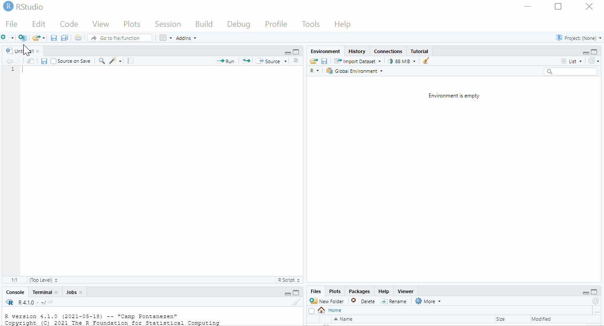
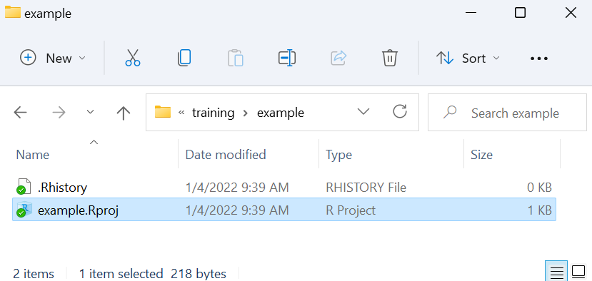
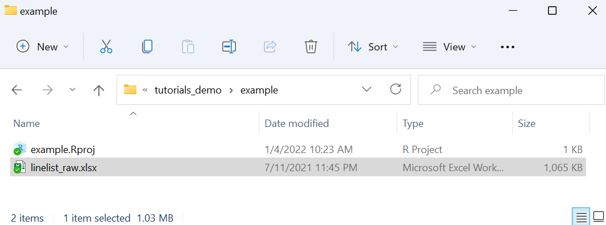

<!-- Add JavaScript code for making the exercise code larger -->
<script language="JavaScript" src="js/exercise-font-size.js"></script>

```{r setup, include=FALSE}
# load packages ----------------------------------------------------------------
library(learnr)
library(gradethis)
library(tidyverse)
library(here)
library(rio)
library(basket) # not sure if we need this
library(etude) # helper functions for gradethis

# set options for exercises and checking ---------------------------------------
gradethis_setup()

learnr::tutorial_options(exercise.timelimit = 60) 
  #exercise.checker = gradethis::grade_learnr) 
    # alternatively, submitr::null_code_checker


# event recorder ---------------------------------------------------------------
# see https://github.com/dtkaplan/submitr/blob/master/R/make_a_recorder.R
tutorial_options(exercise.eval = FALSE)  # pre-evaluate exercises

vfun <- submitr::make_basic_validator(NULL, "hello") #basket::check_valid

new_recorder <- function(tutorial_id, tutorial_version, user_id, event, data) {
    cat(
      tutorial_id, 
      " (v", tutorial_version, "); ",
      format(Sys.time(), "%Y-%M%-%D %H:%M:%S %Z"), "; ",
      user_id, "; ",
      event, "; ",
      data$label, "; ",
      data$answers, "; ",
      data$code, "; ",
      data$correct, "\n", sep = "",
      
      file = here::here("event_records", "learnr_basics.txt"),
      append = TRUE)
}

options(tutorial.event_recorder = new_recorder)


# hide non-exercise code chunks ------------------------------------------------
knitr::opts_chunk$set(echo = FALSE)


# data prep --------------------------------------------------------------------
linelist_raw <- rio::import(here::here("data", "linelist_raw.xlsx"))
linelist <- rio::import(here::here("data", "linelist_cleaned.rds"))
malaria_counts <- rio::import(here::here("data", "malaria_facility_count_data.rds"))
```


```{r}
submitr::login_controls() # show login and password with "Submit" button.
```


```{r context = "server", echo = FALSE}
# see https://rdrr.io/github/dtkaplan/submitr/f/vignettes/using.Rmd
options(tutorial.storage = "none")
vfun <- submitr::make_basic_validator(NULL, "hello")       #basket::check_valid
storage_actions <- submitr::record_local("./minimal_submissions.csv")
submitr::shiny_logic(input, output, session, vfun,
                     storage_actions)
```


## Introduction to R for Applied Epidemiology and Public Health


```{r appliedepi-banner, fig.margin = TRUE, echo = FALSE, fig.width = 3, out.width = "100%", fig.cap = ""}
knitr::include_graphics("images/moz-banner.png")
```

#### Welcome


Welcome to the course "Introduction to R for applied epidemiologists", offered for free by [Applied Epi](www.appliedepi.org) - a non-profit organisation that offers open-source tools, training, and support to frontline public health practitioners.  

This interactive tutorial focuses on **setting up R for the first time, an introduction to basic R coding, and how to import your dataset into R**.

If you are already comfortable with the above skills, consider taking instead our tutorials for R in applied epidemiology, on [data cleaning], [data visualisation], or [tidy data best practices].

This tutorial draws from chapters of our free [Epidemiologist R handbook](https://epirhandbook.com/en/) such as [R Basics ](https://epirhandbook.com/en/r-basics.html) and [Import and Export](https://www.epirhandbook.com/en/import-and-export.html). The Epi R Handbook has over 50 chapters, has helped over 110,000 people learn R, and is also available for offline use. 


#### Target Audience  

This course is designed with the following objectives: 

* To be friendly to people who have never used a programming language before
* To teach R emphasizing examples, datasets, and challenges commonly faced by applied epidemiologists
* To be modular - so that you can skip to section most relevant to you


We expect that you know how to do ... TO DO


#### Other languages
This course is available...


#### Offline / Online

You can access this tutorial offline by downloading our R package ... 
If viewing offline, you can view the videos by doing ...


#### Learning goals

In this tutorial you will:  

* Become familiar with typing code "commands"
* "Importing" (loading) a dataset into R to conduct cleaning and other modifications
* View a dataset in R
* Review and access columns in a dataset
* Key operators and functions
* Piping and pipe operators
* Errors and warnings


#### Data consent

This tutorial is anonymously collecting your entries, for purposes of improvement... by continuing you consent to this collection and use. 


#### Who made this course  

This course is designed by Applied Epi ... epidemiologists with decades of ground-level experience in outbreak response and local public health work. 


```{r appliedepi-hexes, fig.margin = TRUE, echo = FALSE, fig.width = 3, out.width = "50%", fig.cap = ""}
knitr::include_graphics("images/hex-sidebyside.png")
```


## Data used in this tutorial

In this tutorial we will use the following datasets. Please take a few minutes to review the structure and content of each dataset before continuing.

Use the arrows on the right to scroll through hidden columns. Note that these are "raw" (messy) datasets that mimic problems commonly found in real-life epidemiological datasets.  


### **A "linelist" of cases in a fictional (not real) Ebola outbreak***

A "linelist" is a term used in applied epidemiology to refer to a table that contains key information about each case or suspect case in an outbreak. Each row represents one case, and the columns contain variables such as age, sex, date of symptom onset, outcomes, etc.

This dataset contains `r nrow(linelist_raw)` rows and `r ncol(linelist_raw)` columns. Below are the first 5 rows:  

```{r}
head(linelist_raw)
```


### **Aggregated data from malaria surveillance in a fictional country**  

Aggregated data in epidemiology usually means a table of counts for each facility, or district, etc. Sometimes, the counts can also be per day, week, or month.  

In this dataset, each facility reported *daily* case counts of rapid-test (RDT)-confirmed malaria. Thus, each row represents the number of cases for a specific facility on a specific day.  

This dataset contains `r nrow(malaria_counts)` rows and `r ncol(malaria_counts)` columns. Below are the first 5 rows:  

```{r}
head(malaria_counts)
```

### Tidy Data

We highly recommend doing our tutorial on Tidy Data in Applied Epidemiology. Collecting, formatting, and preparing your dataset *before* importing it into R is a critical step!

LINK

VIDEO TEASER


## Setup R and RStudio


### Install R

#### R on a USB drive

### Install RStudio

### Considerations for Shared Drives


## Working in an R project
https://www.epirhandbook.com/en/r-projects.html
Talk about R projects here...

SHORT VIDEO SUMMARISING TRIAD OF RPROJECTS/HERE/IMPORT


### Create an R project

```{r rproject-gif, fig.margin = TRUE, echo = FALSE, fig.width = 3, out.width = "100%", fig.cap = ""}

```


### Review your R project

Now, we can see the new folder that we created (/example), and within this folder is a new "R project" file (example.Rproj).  

```{r rproject-folder-empty, fig.margin = TRUE, echo = FALSE, fig.width = 3, out.width = "50%", fig.cap = ""}

```

**It is important that you conduct all your work and changes within the R project. When you sit down to begin working, remember to open the R project by opening the .Rproj file. This will open an RStudio window.  

### Opening your R project

**It is important that you conduct all your work and changes within the R project. When you sit down to begin working, remember to open the R project by opening the .Rproj file. This will open an RStudio window. 


### Considerations for Shared Drives

Reference Epi R Handbook page on shared drives
Permissions to install, admin rights
Storing R projects in shared drive folders


## What is programming?

### What does it mean that R is a statistical programming language?

### Commands as instructions

### Scripts are a list of instructions

#### Design of a typical script in public health

Header with objective, authors, contact info, date, etc.
Load packages
Load data
Clean data
Perform analyses
Display results as plots, tables, maps, etc.

All of the above can be done all in R, and can be transformed into a report via R Markdown.

### Reproducibility

(get quote or video from someone about how reproducibility helped them in collaboration)

### Collaboration

(get quote or video from someone about how reproducibility helped them in collaboration)

### Compare to Excel analysis

### R has become more easy to learn

Tidyverse, Epi R Handbook, other materials


## R functions

About R functions at very basic level.

import()
or
pload()

### Install and Load R packages {#packages}

PERHAPS WE JUST HAVE THEM RUN THIS CODE AND EXPLAIN IT LATER? NEED TO INTRODUCE FUNCTIONS FIRST, AND IMPORT() IS A GREAT FUNCTION TO TEACH THAT (BETTER THAN LIBRARY()). OR WE HAVE A FIRST SECTION THAT INTRODUCES FUNCTION LIKE sqrt() or age_pyramid() like in the handbook.


In order to practice basic R functions, we will use the `linelist` fictional ebola outbreak data set you met in the EpiRHandbook.

To use basic functions with public health data, the tidyverse metapackage is very useful. Tidyverse loads the dplyr, ggplot2, and other packages that are useful in epi data analysis. 

We've preloaded the below packages for now. Installation and loading of these packages is described on the EpiRHandbook [Suggested Packages](https://epirhandbook.com/en/suggested-packages-1.html) page. 


In this assignment we'll work with 3 R packages, let's load them!

```{r load-package, exercise = TRUE}
___() # load the rio package
___() # load the here package
___() # load the tidyverse megapackage
```

```{r load-package-solution}
library(rio)
library(here)
library(tidyverse)
```

```{r load-package-check}
grade_this_code("You are correct, the packages you need for this lesson are now loaded!")
```


```{r eval= FALSE}
pacman::p_load(learnr, here, rio, tidyverse)           # install and load R packages
```

## R packages

Recommended packages

See epirhandbook LINK for recommended packages

Masking and use of the `::` operator


## Importing data {#import} 


### Save your data in the R project {#import-root} 

In order to import data into R, you must tell R where to access the dataset file on your computer (e.g. a specific folder, or on a shared drive). 

This can be surprisingly difficult (e.g. data are stored on shared drives). However, by saving the data *within our R project* the whole process becomes much easier. 

Below is a screenshot of our R project's files, as viewed in a typical file explorer. See the dataset *linelist_raw.xlsx* that is saved in the same folder as the *example.Rproj* file. This is the "root" folder of the R project, meaning to access this folder from the R project file you do not need to click into any sub-directories (sub-folders).


```{r import-folder-raw-root, fig.margin = TRUE, echo = FALSE, fig.width = 3, out.width = "50%", fig.cap = ""}

```


### 2) Import data from the R project's "root" folder

To import a dataset into R, we run a command. This command will use the function `import()`. 

```{r import-demo-root, eval=F, echo=T}
import("linelist_raw.xlsx")
```

If you run this command from RStudio (either in the R console, or from an R script), R will search in the root folder of the R project for the file *linelist_raw.xlsx*, and will print the dataset into your R console.

In the next step, we show a slight adjustment to this command that will *save* the dataset as an object in R, so that you can actually modify and analyse it.

IMAGE OF DATA IMPORTED BUT NOT SAVED


### Saving an imported dataset as an R object

Most times, you import a dataset into R in order to modify, transform, and analyse it. To achieve this, we must modify the `import()` command slightly so that the dataset is saved as an R *"object"*. 

```{r import-demo-named, eval=F, echo=T}
linelist_raw <- import("linelist_raw.xlsx")
```


IMAGE OF DATASET SAVED AS R OBJECT  

As described in the EpiRHandbook, an object exists when you have assigned it a value (see the assignment section below). When it is assigned a value, the object appears in the Environment (see the upper right pane of RStudio). It can then be operated upon, manipulated, changed, and re-defined.

In applied epidemiology), you will most often encounter objects that are data frames and vectors. The data we are using is classified as a data frame.

The cleaned linelist data object would have the name of the file `linelist_cleaned.xlsx` unless assigned a different name.

We want to give the data a simpler name for easier recall, so we will use the `<-` operator to assign the object name `linelist`. 

See below how the name `linelist` is assigned to the data brought in following the standard order:

**object_name <- value** (or process/calculation that produce a value)


### Import data from a subfolder

Best practices suggest that you organise your R project with sub-folders. Typically, you will create a folder for "data", in which you will store your datasets. 

To import data from a sub-folder, the `import()` command should be modified so that it correctly tells R where to search for this file. This is done using the here() function. 

```{r import-demo-subfolder, echo=T, eval=F}
linelist_raw <- import(here("data", "linelist_raw.xlsx"))   # import data and save as named object
```


A more efficient approach for a quick check is to use the `head()` function to produce the first few rows of the data instead of the entire dataset.

```{r headview}
head(linelist)
```

### Exercise 1

*Now it's your turn. Here's a simple exercise with an empty code chunk provided for entering the answer.*

Write the R code required to read in the original data object `linelist_cleaned.rds` and call it `linelist`. 

```{r import-data, exercise = TRUE}

```

```{r import-data-solution}
linelist <- rio::import("data", "linelist_cleaned.rds")
```

```{r import-data-check}
grade_this({
  # if object is data frame
  if (is.data.frame(.result)){
    pass("linelist is a data frame")
  }
  
  # default
  fail()
})
```

```{r exercise1, exercise=TRUE}

```

```{r exercise1-solution}
linelist <- import("linelist_cleaned.rds")
```

```{r exercise1-hint}
"Use the function import() from the rio package, and put the full name of the file (including extension) in quotation marks"
```

 Now type code that will print the first 10 lines of data in the `linelist` data frame.  

```{r exercise2-head, exercise = TRUE}

```

```{r exercise2-head-solution}
head(linelist)
```


## Object Classes

All the objects stored in R have a class which tells R how to handle the object. There are many possible classes. While working with epidemiology data sets, object classes will most likely vary the most within columns (or variables).

You can test the class of an object by providing its name to the function `class()`.

### Exercise 2

Enter and run the code to check the class of `linelist`.

```{r exercise2a, exercise=TRUE}

```

```{r exercise2a-solution}
class(linelist)
```

Note: you can reference a specific column within a dataset using the `$` notation to separate the name of the dataset and the name of the column.
It's good practice to do this while getting to know key columns in your data. 

Now, enter the code to check the class of the outcome column in `linelist`.

```{r exercise2b, exercise=TRUE}

```

```{r exercise2b-solution}
class(linelist$outcome)
```

While we're at it, why don't we check the class of the temp column?

```{r exercise2c, exercise=TRUE}

```

```{r exercise2c-solution}
class(linelist$temp)
```

It's likely at some point you will need to change the class of a column in your dataset, but we will go over that in a later lesson. 


## Indexing 

You may need to view parts of objects, also called “indexing”, which is often done using the square brackets `[ ]`. Using `$` on a dataframe to access a column is also a type of indexing, which you used in the previous exercise.

Using square brackets with the `summary()` function is one helpful way to use indexing. See below for examples from the handbook. 

Let's say we want a summary of ebola case temperatures from our data `linelist`:

```{r summary1}
summary(linelist$temp)      # All of the summary
```

If we just want to know what the **maximum** temperature of an ebola case from our data is:

```{r summary2}
summary(linelist$temp)[6]   # The 6th element of the summary of the linelist temperature column 
```

It can also be done by the element title using double brackets:
```{r summary3}
summary(linelist$temp)[["Max."]]   # renders only the value of the maximum temp
```

Note: Character elements need to be entered with quotations

### Exercise 3

You try. Enter the code to index the median case temperature from `linelist`.

```{r exercise3a, exercise=TRUE}

```

```{r exercise3a-solution}
summary(linelist$temp)[3]
```

<div id="exercise3a-hint">
**Hint:** the median is the third element in the `summary()` output.
</div>


Once you've indexed the median ebola case temperature, enter the same line again below. Except this time use double brackets `[[ ]]` to index. Let's see what changes in the output.

```{r exercise3b, exercise=TRUE}

```

```{r exercise3b-solution}
summary(linelist$temp)[[3]]
```


Brackets also work on data frames to view specific rows and columns. You can do this using the syntax `dataframe[rows, columns]`.

Below are some examples from the handbook:
```{r indexing}
# View values from row 2 and columns 5 through 10 and 18
linelist[2, c(5:10, 18)] 

# View rows 2 through 20, and specific columns
linelist[2:20, c("date_onset", "outcome", "age")]

# View rows and columns based on criteria
# *** Note the dataframe must still be named in the criteria!
linelist[linelist$age > 25 , c("date_onset", "outcome", "age")]
```

```{r, eval=F}
# Use View() to see the outputs in the RStudio Viewer pane (easier to read) 
# *** Note the capital "V" in View() function
View(linelist[2:20, "date_onset"])
```

How would you index `linelist` to show the age, gender, and hospital columns of cases  below the age of 18? Enter the code based on this criteria.

```{r exercise3c, exercise=TRUE}

```

```{r exercise3c-solution}
linelist[linelist$age < 18 , c("age", "gender", "hospital")]


```


## Piping

There are different ways of writing code. 
One popular methods of writing R code is using "pipes"... 
Epi R Handbook explanation.


### Index with **dplyr**

In the handbook you saw dataframe indexing using the package `dplyr` and its functions:
* `filter()` with the logical statement `row_number()`for rows,
* `select()` for columns, and
* `head()`.

Fill in the blank with the correct code for filtering and indexing your data in the next exercises.


View the **first two rows** of linelist using `head()`
```{r blank1, exercise=TRUE, exercise.blanks=TRUE}
linelist ____ head(2)
```

```{r blank1-solution}
linelist %>% head(2)
```


Show only row 100 of linelist
```{r blank2, exercise=TRUE, exercise.blanks=TRUE}
linelist ____ filter(____)
```

```{r blank2-solution}
linelist %>% filter(row_number == 100)
```


View only the date_onset, outcome, and age columns of rows 15 to 25.
```{r blank3, exercise=TRUE, exercise.blanks=TRUE}
linelist ____ filter(_____ %in% _____) %>% _____(date_onset, outcome, age)
```

```{r blank3-solution}
linelist %>% filter(row_number() %in% 15:25) %>% select(date_onset, outcome, age)
```

Note: For indexing lists, refer back to the handbook for examples and resources. Remember that the linelist data you are working with is classified as a dataframe. 

## Transition to R

From another statistical language
https://www.epirhandbook.com/en/transition-to-r.html


##  TEMPLATE Exercises

### Exercise with Code

*Here's an exercise with some prepopulated code as well as `exercise.lines = 5` to provide a bit more initial room to work.*

Now write a function that adds any two numbers and then call it:

```{r add-function, exercise=TRUE, exercise.lines = 5}
add <- function() {
  
}
```

### Exercise with Hint

*Here's an exercise where the chunk is pre-evaulated via the `exercise.eval` option (so the user can see the default output we'd like them to customize). We also add a "hint" to the correct solution via the chunk immediate below labeled `print-limit-hint`.*

Modify the following code to limit the number of rows printed to 5:

```{r print-limit, exercise=TRUE, exercise.eval=TRUE}
mtcars
```

```{r print-limit-hint}
head(mtcars)
```

### Quiz

*You can include any number of single or multiple choice questions as a quiz. Use the `question` function to define a question and the `quiz` function for grouping multiple questions together.*

Some questions to verify that you understand the purposes of various base and recommended R packages:

```{r quiz}
quiz(
  question("Which package contains functions for installing other R packages?",
    answer("base"),
    answer("tools"),
    answer("utils", correct = TRUE),
    answer("codetools")
  ),
  question("Which of the R packages listed below are used to create plots?",
    answer("lattice", correct = TRUE),
    answer("tools"),
    answer("stats"),
    answer("grid", correct = TRUE)
  )
)
```

