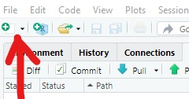

<!-- Add JavaScript code for making the exercise code larger -->
<script language="JavaScript" src="js/exercise-font-size.js"></script>

```{r setup, include=FALSE}
# load packages ----------------------------------------------------------------
library(learnr)
library(gradethis)
library(tidyverse)
library(here)
library(rio)
library(basket) # not sure if we need this
library(etude) # helper functions for gradethis

# set options for exercises and checking ---------------------------------------
gradethis_setup()

learnr::tutorial_options(exercise.timelimit = 60) 
  #exercise.checker = gradethis::grade_learnr) 
    # alternatively, submitr::null_code_checker


# event recorder ---------------------------------------------------------------
# see https://github.com/dtkaplan/submitr/blob/master/R/make_a_recorder.R
tutorial_options(exercise.eval = FALSE)  # pre-evaluate exercises

vfun <- submitr::make_basic_validator(NULL, "hello") #basket::check_valid

new_recorder <- function(tutorial_id, tutorial_version, user_id, event, data) {
    cat(
      tutorial_id, 
      " (v", tutorial_version, "); ",
      format(Sys.time(), "%Y-%M%-%D %H:%M:%S %Z"), "; ",
      user_id, "; ",
      event, "; ",
      data$label, "; ",
      data$answers, "; ",
      data$code, "; ",
      data$correct, "\n", sep = "",
      
      file = here::here("event_records", "learnr_basics.txt"),
      append = TRUE)
}

options(tutorial.event_recorder = new_recorder)


# hide non-exercise code chunks ------------------------------------------------
knitr::opts_chunk$set(echo = FALSE)


# data prep --------------------------------------------------------------------
linelist_raw <- rio::import(here::here("data", "linelist_raw.xlsx"))
linelist <- rio::import(here::here("data", "linelist_cleaned.rds"))
malaria_counts <- rio::import(here::here("data", "malaria_facility_count_data.rds"))
```


```{r}
submitr::login_controls() # show login and password with "Submit" button.
```


```{r context = "server", echo = FALSE}
# see https://rdrr.io/github/dtkaplan/submitr/f/vignettes/using.Rmd
options(tutorial.storage = "none")
vfun <- submitr::make_basic_validator(NULL, "hello")       #basket::check_valid
storage_actions <- submitr::record_local("./minimal_submissions.csv")
submitr::shiny_logic(input, output, session, vfun,
                     storage_actions)
```


## 1) Introduction to R for Applied Epidemiology and Public Health


```{r appliedepi-banner, fig.margin = TRUE, echo = FALSE, fig.width = 3, out.width = "100%", fig.cap = ""}
knitr::include_graphics("images/moz-banner.png")
```

#### Welcome


Welcome to the course "Introduction to R for applied epidemiologists", offered for free by [Applied Epi](www.appliedepi.org) - a non-profit organisation that offers open-source tools, training, and support to frontline public health practitioners.  

This interactive tutorial focuses on **setting up R for the first time, an introduction to basic R coding, and how to import your dataset into R**.

If you are already comfortable with the above skills, consider taking instead our tutorials for R in applied epidemiology, on [data cleaning], [data visualisation], or [tidy data best practices].

This tutorial draws from chapters of our free [Epidemiologist R handbook](https://epirhandbook.com/en/) such as [R Basics ](https://epirhandbook.com/en/r-basics.html) and [Import and Export](https://www.epirhandbook.com/en/import-and-export.html). The Epi R Handbook has over 50 chapters, has helped over 110,000 people learn R, and is also available for offline use. 


#### Target Audience  

This course is designed with the following objectives: 

* To be friendly to people who have never used a programming language before
* To teach R emphasizing examples, datasets, and challenges commonly faced by applied epidemiologists
* To be modular - so that you can skip to section most relevant to you


We expect that you know how to do ... TO DO


#### Other languages
This course is available...


#### Offline / Online

You can access this tutorial offline by downloading our R package ... 
If viewing offline, you can view the videos by doing ...


#### Learning goals

In this tutorial you will:  

* Learn core components of using R
* Become familiar with typing code "commands"
* "Importing" (loading) a dataset into R to conduct cleaning and other modifications
* View a dataset in R
* Review and access columns in a dataset
* Key operators and functions
* Piping and pipe operators

You will be quizzed on content throughout the tutorial and will also type some commands yourself.


#### Data consent

This tutorial is anonymously collecting your entries, for purposes of improvement... by continuing you consent to this collection and use. 


#### Who made this course  

This course is designed by Applied Epi ... epidemiologists with decades of ground-level experience in outbreak response and local public health work. 


```{r appliedepi-hexes, fig.margin = TRUE, echo = FALSE, fig.width = 3, out.width = "50%", fig.cap = ""}
knitr::include_graphics("images/hex-sidebyside.png")
```


## 2) Data used in this tutorial

In this tutorial we will use the following datasets. Please take a few minutes to review the structure and content of each dataset before continuing.

Use the arrows on the right to scroll through hidden columns. Note that these are "raw" (messy) datasets that mimic problems commonly found in real-life epidemiological datasets.  


### **A "linelist" of cases in a fictional (not real) Ebola outbreak***

A "linelist" is a term used in applied epidemiology to refer to a table that contains key information about each case or suspect case in an outbreak. Each row represents one case, and the columns contain variables such as age, sex, date of symptom onset, outcomes, etc.

This dataset contains `r nrow(linelist_raw)` rows and `r ncol(linelist_raw)` columns. Below are the first 5 rows:  

```{r}
head(linelist_raw)
```


### **Aggregated data from malaria surveillance in a fictional country**  

Aggregated data in epidemiology usually means a table of counts for each facility, or district, etc. Sometimes, the counts can also be per day, week, or month.  

In this dataset, each facility reported *daily* case counts of rapid-test (RDT)-confirmed malaria. Thus, each row represents the number of cases for a specific facility on a specific day.  

This dataset contains `r nrow(malaria_counts)` rows and `r ncol(malaria_counts)` columns. Below are the first 5 rows:  

```{r}
head(malaria_counts)
```

### Tidy Data

We highly recommend doing our tutorial on Tidy Data in Applied Epidemiology. Collecting, formatting, and preparing your dataset *before* importing it into R is a critical step!

LINK

VIDEO TEASER


## 3) Why R?
R is a free, open-source analytical tool, used by many disciplines, that has existed for over 25 years! Although Applied Epi did not invent R, we do believe that R is a perfect vehicle to transform epidemiology to be more more advanced, efficient, standardised, accessible, and equitable.

Widespread adoption of R can transform epidemiology.

"A one-stop shop... the epidemiologist greatest companion." 
- Epidemiologist, Nigeria CDC

"It is not easy to weave together so much, so succinctly, and so incredibly clearly." 
- Epidemiologist, US CDC (this one might be interpreted to say that R is not easy?)

"Holy smokes! Boom! I can't get enough of it!" 
- WHO African Region Epidemiologist, Brazzaville

*What makes you feel excited or compelled to learn R?*
```{r excited-r, exercise=TRUE, exercise.lines = 5}
I want to...

}
```


#### IT'S FREE!

R is free to use! There is a strong ethic in the community of free and open-source material.

The accessibility of R is unmatched, open for use to anyone with access to a computer, a bit of wifi (for installation), and motivation to learn.  Most analytic software comparable to R are not free. In fact, they can be quite expensive over time if one has to renew and purchase a license annually. Without cost as a barrier, you can now focus on learning how to use R. You have found the right tutorial. 


#### Popularity

The below graph shows the number of publications citing R, SPSS, SAS, and STATA from 2015 to 2019. As the only free software tool shown here, R is the future of analytic software. 

```{r appliedepi-popularity, fig.margin = TRUE, echo = FALSE, fig.width = 3, out.width = "50%", fig.cap = ""}

```


#### Data visualization

One thing R is known for is data visualization. It is capable of producing detailed tables, maps, and epi-curves. With a bit more advanced knowledge you can visualize contact tracing, phylogenetics, and publication-ready plots. 

```{r appliedepi-viz, fig.margin = TRUE, echo = FALSE, fig.width = 3, out.width = "50%", fig.cap = ""}
knitr::include_graphics("images/whyR/visualization.png")
```


#### Efficiency

‘With R I can do anything. What took 10 hours in Excel, I do in less than 1 hour. Also it is easier to detect if there is a mistake.’ For this Haitian epidemiologist, using our free Epi R Handbook to transition routine analyses to R meant more flexibility, confidence, and time for systemic change.

Implementing R skills into your daily workflow as an epidemiologist will allow you to increase your work capacity and reduce response time to rapidly evolving public health scenarios.  

#### Flexibility

R can interact with many common data collection tools, websites, and software. You can also automate R in integration with other tools, for example, to produce surveillance reports and email them out. 

```{r appliedepi-flexibility, fig.margin = TRUE, echo = FALSE, fig.width = 3, out.width = "50%", fig.cap = ""}
knitr::include_graphics("images/whyR/interoperability.png")
```


#### User community

*R is not just a new tool, but a new culture advancing equity*

As an open-source language, R gives end-users creative agency and decentralizes innovation. An R user in any part of the world can write code to produce a tool, share it, have it be verified by the community, and watch it be adopted widely. This empowerment of end-users is paramount to a more equitable epidemiological community.

Likewise, there is robust user support online such as question and answer forums on StackOverflow or R-Bloggers, events facilitated by groups like R-Ladies, and widely used learning resources on Coursera and Youtube.

```{r appliedepi-community, fig.margin = TRUE, echo = FALSE, fig.width = 3, out.width = "50%", fig.cap = ""}

```


```{r quiz}
quiz(
  question("What is your level of experience with R?",
    answer("zero"),
    answer("some courses or schooling"),
    answer("regular use for work"),
    answer("data scientist")
  ),
question("What software or program do you use the most?",
    answer("R and Rstudio"),
    answer("Microsoft excel"),
    answer("SAS, SPSS, STATA, or similar"),
    answer("other")
  ),
)
```


## 4) Setup R and RStudio
There are two main steps to acquiring R: Install R and install R Studio. We will walk you through ways to do this below. You will need internet for the installation. 

For RStudio to work, you must also have R installed on your computer. 

### Install R
Visit this website https://www.r-project.org/ and download the latest version of R suitable for your computer.

### Install RStudio
Visit this website https://rstudio.com/products/rstudio/download/ and download the latest free Desktop version of RStudio suitable for your computer.

#### R on a USB drive
Move the installed R and RStudio application you downloaded onto your USB disc while it is plugged into the computer you downloaded from. You should be able to use R on the devices you plug your USB into in the future.


### Considerations for Shared Drives
Using shared drives can make data import and saving data prone to error, especially when using R with collaborators. You will learn more about this in the 9) Importing data section.


## 5) Working in an R project
An R project is a self-contained working environment where you can easily make folders for data, scripts, outputs, and more. Learning about R Projects will make your work flow portable and efficient.

Read more about R Projects [Here](https://epirhandbook.com/en/r-projects.html).

SHORT VIDEO SUMMARISING TRIAD OF RPROJECTS/HERE/IMPORT - IZZY?


### Create an R project

To create an R project, select “New Project” from the File menu.

* If you want to create a new folder for the project, select “New directory” and indicate where you want it to be created (shown in the example below)
* If you want to create the project within an existing folder, click “Existing directory” and indicate the folder.
* If you want to clone a Github repository, select the third option “Version Control” and then “Git”. See the page on [Version control and collaboration with Git and Github ](https://epirhandbook.com/en/version-control-and-collaboration-with-git-and-github.html) for further details.

```{r rproject-gif, fig.margin = TRUE, echo = FALSE, fig.width = 3, out.width = "100%", fig.cap = ""}
knitr::include_graphics("images/rprojects/rproject_create1.gif")
```


### Review your R project

Now, we can see the new folder that we created (/example), and within this folder is a new "R project" file (example.Rproj). Best practice for naming a project is using all lowercase letters with no spaces.


```{r rproject-folder-empty, fig.margin = TRUE, echo = FALSE, fig.width = 3, out.width = "50%", fig.cap = ""}

```


### Opening your R project

**It is important that you conduct all your work and changes within the R project. When you sit down to begin working, remember to open the R project by opening the .Rproj file. This will open an RStudio window. 


```{r quiz}
quiz(
  question("Which is NOT a reason that R Projects are so useful?",
    answer("a self-contained work environment"),
    answer("easy to collaborate"),
    answer("cleans your data for you", correct = TRUE),
    answer("makes version control easier")
  ),
)
```


## 6) What is programming?
Programming is often talked about as being a "language". We instruct, or communicate, with R through specified commands and input that will elicit R to complete the specified task. 

#### What does it mean that R is a statistical programming language?
Some commands that you, as an epidemiologist, will be most interested in will be the statistics commands that will quickly calculate population level metrics. R is powerful for calculating statistics, significance, and confidence levels without the user having to type out involved equations. R will also display the associated graphs and figures with a single command, as opposed to typing values in cells one by on in excel. 
 
### Scripts are a list of instructions for R
Scripts are a fundamental part of programming. They are documents that hold your commands (e.g. functions to create and modify datasets, print visualizations, etc). You can save a script and run it again later. There are many advantages to storing and running your commands from a script (vs. typing commands one-by-one into the R console “command line”):

* Portability - you can share your work with others by sending them your scripts
* Reproducibility - so that you and others know exactly what you did
* Version control - so you can track changes made by yourself or colleagues
* Commenting/annotation - to explain to your colleagues what you have done

#### Open a new script
With RStudio open, you can click on the icon under File to open a blank script (below). An untitled script should appear in your RStudio pane that is ready for you to enter commands. Be sure to save this script early and often with a short, descriptive, lowercase name and date (if applicable) without spaces. It is also good practice to save into a scripts folder so as not to clutter your root project folder.


```{r script-new, fig.margin = TRUE, echo = FALSE, fig.width = 3, out.width = "50%", fig.cap = ""}

```

#### Design of a typical script in public health will include...
* Header with objective, authors, contact info, date, etc.
* Load packages
* Load data
* Clean data
* Perform analyses
* Display results as plots, tables, maps, etc.
```{r script-example, fig.margin = TRUE, echo = FALSE, fig.width = 3, out.width = "50%", fig.cap = ""}
knitr::include_graphics("images/scripts/example_script.png")
```

All of the above can be created all in R, and can be transformed into a report via R Markdown.

#### R Scripts can make your workflow...
### * Reproducible

(get quote or video from someone about how reproducibility helped them in collaboration)

### * Collaboritive

(get quote or video from someone about how reproducibility helped them in collaboration)

### * Version controlled

### * Portable


```{r quiz}
quiz(
  question("Which of these file names belongs to an R script?",
    answer("example.Rproj"),
    answer(".Rhistory"),
    answer("linelist_plots.Rmd"),
    answer("linelist_tables.R", correct = TRUE)
  ),
)
```


## 7) R functions
* Functions are at the core of using R. Functions are how you perform tasks and operations. Many functions come installed with R, many more are available for download in packages (explained in the packages section).

#### Simple functions
* A function is like a machine that receives inputs, does some action with those inputs, and produces an output. What the output is depends on the function.

Functions typically operate upon some object placed within the function’s parentheses. For example, the function `sqrt()` calculates the square root of a number:

```{r function-sqrt}
sqrt(64)
```

The object provided to a function also can be a column in a dataset (see the Objects section for detail on all the kinds of objects). Because R can store multiple datasets, you will need to specify both the dataset and the column. One way to do this is using the `$` notation to link the name of the dataset and the name of the column (`dataset$column`). In the example below, the function `summary()` is applied to the numeric column `age` in the dataset `linelist`, and the output is a summary of the column’s numeric and missing values.

```{r function-summary}
# Print summary statistics of column 'age' in the dataset 'linelist'
summary(linelist$age)
```

#### Functions with multiple arguments
* Functions often ask for several inputs, called arguments, located within the parentheses of the function, usually separated by commas.

* Some arguments are required for the function to work correctly, others are optional
* Optional arguments have default settings
* Arguments can take character, numeric, logical (TRUE/FALSE), and other inputs

*to find out what a function's arguments are and its default settings, type `?` before a function in the RStudio "Console" panel, press enter on your keyboard, and the full description and details of the function will appear in the "Help" panel. It will look something like this:*

```{r function-example, fig.margin = TRUE, echo = FALSE, fig.width = 3, out.width = "50%", fig.cap = ""}
knitr::include_graphics("images/functions/r-help.png")
```


The example given in the EpiRHandbook section on [Functions](https://epirhandbook.com/en/r-basics.html#functions-with-multiple-arguments) is with the multi-argument function `age_pyramid()`. The command produces an age pyramid plot based on defined age groups and a binary split column, such as `gender`. The function is given three arguments within the parentheses, separated by commas. The values supplied to the arguments establish `linelist` as the dataframe to use, `age_cat5` as the column to count, and `gender` as the binary column to use for splitting the pyramid by color. 

There are several ways to write the function. Here is how to write it with arguments `data`, `age_group`, and `split_by` typed out and specified by `=` symbols. When the arguments are named like below, the order they are entered does not affect the output.

```{r function-pyramid1}
# Create an age pyramid
age_pyramid(data = linelist, age_group = "age_cat5", split_by = "gender")
```


The above command can be equivalently written as below, in a longer style with a new line for each argument. This style can be easier to read, and easier to write “comments” with `#` to explain each part (commenting extensively is good practice!). To run this longer command you can highlight the entire command and click “Run”, or just place your cursor in the first line and then press the Ctrl and Enter keys simultaneously.

```{r function-pyramid2}
# Create an age pyramid
age_pyramid(
  data = linelist,        # use case linelist
  age_group = "age_cat5", # provide age group column
  split_by = "gender"     # use gender column for two sides of pyramid
  )
```


The first half of an argument assignment (e.g. `data =`) does not need to be specified if the arguments are written in a specific order (specified in the function’s documentation). The below code produces the exact same pyramid as above, because the function expects the argument order: data frame,  `age_group` variable, `split_by` variable.

```{r function-pyramid3}
# This command will produce the exact same graphic as above
age_pyramid(linelist, "age_cat5", "gender")
```

A more complex `age_pyramid()` command might include the optional arguments to:

* Show proportions instead of counts (set proportional = TRUE when the default is FALSE)
* Specify the two colors to use (pal = is short for “palette” and is supplied with a vector of two color names. See the objects page for how the function c() makes a vector)

```{r function-pyramid4}
# This command includes optional arguments for pyramid proportion and color pallette
age_pyramid(
  linelist,                    # use case linelist
  "age_cat5",                  # age group column
  "gender",                    # split by gender
  proportional = TRUE,         # percents instead of counts
  pal = c("orange", "purple")  # colors
  )
```


```{r quiz}
quiz(
  question("All R functions have multiple arguments that need input",
    answer("True"),
    answer("False", correct = TRUE)
  )
)
```


## 8) R packages {#packages}
* An R *package* is a shareable bundle of code and documentation that contains pre-defined functions.

On installation, R contains *“base”* packages and functions that perform common elementary tasks. But many R users create specialized functions, which are verified by the R community and which you can download as a *package* for your own use. 

Functions are contained within *packages* which can be downloaded (“installed”) to your computer from the internet. Once a package is downloaded, it is stored in your “library”. You can then access the functions it contains during your current R session by “loading” the package.

Think of R as your personal library: When you download a package, your library gains a new book of functions, but each time you want to use a function in that book, you must borrow (“load”) that book from your library.

In summary: to use the functions available in an R package, 2 steps must be implemented:

1. The package must be installed (once), and
2. The package must be loaded (each R session)


#### Packages from CRAN
Most often, R users download packages from CRAN. CRAN (Comprehensive R Archive Network) is an online public warehouse of R packages that have been published by R community members.

#### Install and load packages

* Pacman functions
We suggest using the pacman package (short for “package manager”). It offers a convenient function p_load() which will install a package if necessary and load it for use in the current R session.

The syntax quite simple. Just list the names of the packages within the p_load() parentheses, separated by commas. This command will install the rio, tidyverse, and here packages if they are not yet installed, and will load them for use. This makes the p_load() approach convenient and concise if sharing scripts with others. Note that package names are case-sensitive.

```{r packages-pacman}
# Install (if necessary) and load packages for use
pacman::p_load(rio, tidyverse, here)
```

The syntax `pacman::p_load()` explicitly writes the package name (*pacman*) prior to the function name (`p_load()`), connected by two colons `::`. This syntax is useful because it also loads the *pacman* package (assuming it is already installed).


* Base R functions
A common method is using the base R function for installing a package with install.packages(). The name of the package to install must be provided in the parentheses in quotes. If you want to install multiple packages in one command, they must be listed within a character vector c().

Note: this command installs a package, but does not load it for use in the current session.

```{r packages-base}
# install a single package with base R
install.packages("tidyverse")

# install multiple packages with base R
install.packages(c("tidyverse", "rio", "here"))
```


* Point and Click
Another way to manage packages is in the *Packages* pane of RStudio. You will find the *"Packages"* tab located next to the "Files" and "Plots" tab in the same pane. Once you click on the tab, you will see your USer Library where the packages you have installed are stored. 

Load a package by search for its name and checking the box next to it.

If a package you search is not found, click "Install" in the upper left corner of the pane. A pop-up window will appear where you can type one or multiple packages into the designated field to manually install. If you plan to use it in your R session, you will still need to load it. 

You can also click the green “Update” button in your RStudio Packages pane to see which packages have new versions to install. Be aware that your old code may need to be updated if there is a major revision to how a function works!


### Practice with package installation
To use basic functions with public health data, the *tidyverse* metapackage is very useful. Tidyverse loads the *dplyr*, *ggplot2*, and other packages that are useful in epi data analysis. 

We've preloaded the below packages for now, but we still want you to practice the code. Installation and loading of these packages is described further on the EpiRHandbook [Suggested Packages](https://epirhandbook.com/en/suggested-packages-1.html) page. 


In this assignment we'll work with 3 R packages, let's load them with base R!

```{r load-package, exercise = TRUE}
___() # load the rio package
___() # load the here package
___() # load the tidyverse megapackage
```

```{r load-package-solution}
library(rio)
library(here)
library(tidyverse)
```

```{r load-package-check}
grade_this_code("You are correct, the packages you need for this lesson are now loaded!")
```


```{r eval= FALSE}
pacman::p_load(learnr, here, rio, tidyverse)           # install and load R packages
```


## 9) Importing data {#import} 

#### 1) Designate space in your script for importing data
The example script you saw earlier in this tutorial is shown here again. This time we want to point out lines 24 through 26 where `#` symbols notate the code to "load linelist data". 

```{r import-script, fig.margin = TRUE, echo = FALSE, fig.width = 3, out.width = "50%", fig.cap = ""}
knitr::include_graphics("images/importing_data/import_script.png")
```

This organizational step is important for reproducibility and will makes collaboration easier. 

### 2) Save your data in the R project {#import-root} 

In order to import data into R, you must tell R where to access the dataset file on your computer (e.g. a specific folder, or on a shared drive). 

This can be surprisingly difficult (e.g. data are stored on shared drives). However, by saving the data *within our R project* the whole process becomes much easier. 

Below is a screenshot of our R project's files, as viewed in a typical file explorer. See the dataset *linelist_raw.xlsx* that is saved in the same folder as the *example.Rproj* file. This is the "root" folder of the R project, meaning to access this folder from the R project file you do not need to click into any sub-directories (sub-folders).


```{r import-folder-raw-root, fig.margin = TRUE, echo = FALSE, fig.width = 3, out.width = "50%", fig.cap = ""}
knitr::include_graphics("images/importing_data/import_folder_raw_root.png")
```


### 3) Import data from the R project

* From "root" folder

To import a dataset into R, we run a command. This command will use the function `import()`. 

```{r import-demo-root, eval=F, echo=T}
import("linelist_raw.xlsx")
```

If you run this command from RStudio (either in the R console, or from an R script), R will search in the root folder of the R project for the file *linelist_raw.xlsx*, and will print the dataset into your R console.

In the next step, we show a slight adjustment to this command that will *save* the dataset as an object in R, so that you can actually modify and analyse it.

IMAGE OF DATA IMPORTED BUT NOT SAVED


* Saving an imported dataset as an R object

Most times, you import a dataset into R in order to modify, transform, and analyse it. To achieve this, we must modify the `import()` command slightly so that the dataset is saved as an R *"object"*. 

```{r import-demo-named, eval=F, echo=T}
linelist_raw <- import("linelist_raw.xlsx")
```


IMAGE OF DATASET SAVED AS R OBJECT  

As described in the EpiRHandbook, an object exists when you have assigned it a value (see the assignment section below). When it is assigned a value, the object appears in the Environment (see the upper right pane of RStudio). It can then be operated upon, manipulated, changed, and re-defined.

In applied epidemiology), you will most often encounter objects that are data frames and vectors. The data we are using is classified as a data frame.

The raw linelist data object would have the name of the file `linelist_raw.xlsx` unless assigned a different name.

We want to give the data a simpler name for easier recall, so we used the `<-` operator to assign the object name `linelist_raw`. 

See above how the name `linelist_raw` is assigned to the imported data following the standard order:

**object_name <- value** (or process/calculation that produce a value)


* Import from a subfolder

Best practices suggest that you organise your R project with sub-folders. Typically, you will create a folder for "data", in which you will store your datasets. 

To import data from a sub-folder, the `import()` command should be modified so that it correctly tells R where to search for this file. This is done using the `here()` function. 

```{r import-demo-subfolder, echo=T, eval=F}
linelist_raw <- import(here("data", "linelist_raw.xlsx"))   # import data and save as named object
```


## 10) Review Data
At this point, you have learned to import and name data files. This is a good time to have a look at your data. 

#### View data in base R

To view your entire data set, use the `View()` command with the data object name inside the parentheses. The data will appear in the Viewer window of RStudio. Another simple way to do this is to click on the data set you want to view in the "Environment" pane.

However, instead of viewing the entire data set which could take time to load, we suggest some more efficient approaches:

For a quick check, the following few commands are useful: 
* `head()` produces the first six rows of the data instead of the entire dataset.
* `names()` produces only the names of the columns.
* `str()` shows a detailed display of the internal structure of the object or data set input in the parentheses, including the class of the object and all of its variables.

```{r headview}
str(linelist_raw)
```

#### View data with *skimr* package
By using the *skimr* package, you can get a detailed and aesthetically pleasing overview of each of the variables in your dataset. Read more about skimr at its [github page](https://github.com/ropensci/skimr).

Below, the function `skim()` is applied to the entire `linelist_raw` data frame. An overview of the data frame and a summary of every column (by class) is produced.

```{r skimr}
skim(linelist_raw)
```


### Exercise 1

*Now it's your turn. Here's a simple exercise with an empty code chunk provided for entering the answer.*

Write the R code required to read in the original data object `linelist_cleaned.rds` and call it `linelist`. 

```{r import-data, exercise = TRUE}

```

```{r import-data-solution}
linelist <- rio::import("data", "linelist_cleaned.rds")
```

```{r import-data-check}
grade_this({
  # if object is data frame
  if (is.data.frame(.result)){
    pass("linelist is a data frame")
  }
  
  # default
  fail()
})
```

```{r exercise1, exercise=TRUE}

```

```{r exercise1-solution}
linelist <- import("linelist_cleaned.rds")
```

```{r exercise1-hint}
"Use the function import() from the rio package, and put the full name of the file (including extension) in quotation marks"
```

 Now type code that will print the first 6 lines of data in the `linelist` data frame.  

```{r exercise2-head, exercise = TRUE}

```

```{r exercise2-head-solution}
head(linelist)
```


## 11) Object Classes

All the objects stored in R have a class which tells R how to handle the object. There are many possible classes. While working with epidemiology data sets, object classes will most likely vary the most within columns (or variables).

You can test the class of an object by providing its name to the function `class()`.

### Exercise 2

Enter and run the code to check the class of `linelist`.

```{r exercise2a, exercise=TRUE}

```

```{r exercise2a-solution}
class(linelist)
```

Note: you can reference a specific column within a dataset using the `$` notation to separate the name of the dataset and the name of the column.
It's good practice to do this while getting to know key columns in your data. 

Now, enter the code to check the class of the `outcome` column in `linelist`.

```{r exercise2b, exercise=TRUE}

```

```{r exercise2b-solution}
class(linelist$outcome)
```

While we're at it, why don't we check the class of the temp column?

```{r exercise2c, exercise=TRUE}

```

```{r exercise2c-solution}
class(linelist$temp)
```

It's likely at some point you will need to change the class of a column in your dataset, but we will go over that in a later lesson. 


## 12) Indexing 

You may need to view parts of objects, also called “indexing”, which is often done using the square brackets `[ ]`. Using `$` on a dataframe to access a column is also a type of indexing, which you used in the previous exercise.

Using square brackets with the `summary()` function is one helpful way to use indexing. See below for examples from the handbook. 

Let's say we want a summary of ebola case temperatures from our data `linelist`:

```{r summary1}
summary(linelist$temp)      # All of the summary
```

If we just want to know what the **maximum** temperature of an ebola case from our data is:

```{r summary2}
summary(linelist$temp)[6]   # The 6th element of the summary of the linelist temperature column 
```

It can also be done by the element title using double brackets:
```{r summary3}
summary(linelist$temp)[["Max."]]   # renders only the value of the maximum temp
```

Note: Character elements need to be entered with quotations

### Exercise 3

You try. Enter the code to index the median case temperature from `linelist`.

```{r exercise3a, exercise=TRUE}

```

```{r exercise3a-solution}
summary(linelist$temp)[3]
```

<div id="exercise3a-hint">
**Hint:** the median is the third element in the `summary()` output.
</div>


Once you've indexed the median ebola case temperature, enter the same line again below. Except this time use double brackets `[[ ]]` to index. Let's see what changes in the output.

```{r exercise3b, exercise=TRUE}

```

```{r exercise3b-solution}
summary(linelist$temp)[[3]]
```


Brackets also work on data frames to view specific rows and columns. You can do this using the syntax `dataframe[rows, columns]`.

Below are some examples from the handbook:
```{r indexing}
# View values from row 2 and columns 5 through 10 and 18
linelist[2, c(5:10, 18)] 

# View rows 2 through 20, and specific columns
linelist[2:20, c("date_onset", "outcome", "age")]

# View rows and columns based on criteria
# *** Note the dataframe must still be named in the criteria!
linelist[linelist$age > 25 , c("date_onset", "outcome", "age")]
```

```{r, eval=F}
# Use View() to see the outputs in the RStudio Viewer pane (easier to read) 
# *** Note the capital "V" in View() function
View(linelist[2:20, "date_onset"])
```

How would you index `linelist` to show the age, gender, and hospital columns of cases  below the age of 18? Enter the code based on this criteria.

```{r exercise3c, exercise=TRUE}

```

```{r exercise3c-solution}
linelist[linelist$age < 18 , c("age", "gender", "hospital")]


```

### Index with **dplyr**

In the handbook you saw dataframe indexing using the package `dplyr` and its functions:
* `filter()` with the logical statement `row_number()`for rows,
* `select()` for columns, and
* `head()`.

Fill in the blank with the correct code for filtering and indexing your data in the next exercises.


View the **first two rows** of linelist using `head()`
```{r blank1, exercise=TRUE, exercise.blanks=TRUE}
linelist ____ head(2)
```

```{r blank1-solution}
linelist %>% head(2)
```


Show only row 100 of linelist
```{r blank2, exercise=TRUE, exercise.blanks=TRUE}
linelist ____ filter(____)
```

```{r blank2-solution}
linelist %>% filter(row_number == 100)
```


View only the date_onset, outcome, and age columns of rows 15 to 25.
```{r blank3, exercise=TRUE, exercise.blanks=TRUE}
linelist ____ filter(_____ %in% _____) %>% _____(date_onset, outcome, age)
```

```{r blank3-solution}
linelist %>% filter(row_number() %in% 15:25) %>% select(date_onset, outcome, age)
```

Note: For indexing lists, refer back to the handbook for examples and resources. Remember that the linelist data you are working with is classified as a dataframe. 

## 13) Piping

There are different ways of writing code. 
One popular methods of writing R code is using "pipes"... 
Epi R Handbook explanation.


##  TEMPLATE Exercises

### Exercise with Code

*Here's an exercise with some prepopulated code as well as `exercise.lines = 5` to provide a bit more initial room to work.*

Now write a function that adds any two numbers and then call it:

```{r add-function, exercise=TRUE, exercise.lines = 5}
add <- function() {
  
}
```

### Exercise with Hint

*Here's an exercise where the chunk is pre-evaulated via the `exercise.eval` option (so the user can see the default output we'd like them to customize). We also add a "hint" to the correct solution via the chunk immediate below labeled `print-limit-hint`.*

Modify the following code to limit the number of rows printed to 5:

```{r print-limit, exercise=TRUE, exercise.eval=TRUE}
mtcars
```

```{r print-limit-hint}
head(mtcars)
```

### Quiz

*You can include any number of single or multiple choice questions as a quiz. Use the `question` function to define a question and the `quiz` function for grouping multiple questions together.*

Some questions to verify that you understand the purposes of various base and recommended R packages:

```{r quiz}
quiz(
  question("Which package contains functions for installing other R packages?",
    answer("base"),
    answer("tools"),
    answer("utils", correct = TRUE),
    answer("codetools")
  ),
  question("Which of the R packages listed below are used to create plots?",
    answer("lattice", correct = TRUE),
    answer("tools"),
    answer("stats"),
    answer("grid", correct = TRUE)
  )
)
```

