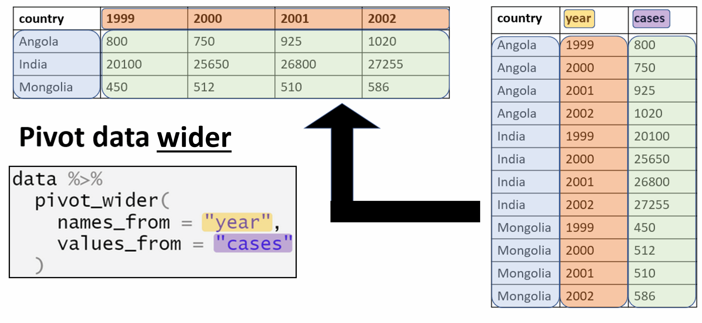

<!-- Add JavaScript code for making the exercise code larger -->
<script language="JavaScript" src="js/exercise-font-size.js"></script>

```{r setup, include=FALSE}
# load packages ----------------------------------------------------------------
library(learnr)
library(gradethis)
library(tidyverse)
library(here)
library(rio)
library(basket) # not sure if we need this
library(etude) # helper functions for gradethis

# set options for exercises and checking ---------------------------------------
gradethis_setup()

learnr::tutorial_options(exercise.timelimit = 60) 
  #exercise.checker = gradethis::grade_learnr) 
    # alternatively, submitr::null_code_checker


# event recorder ---------------------------------------------------------------
# see https://github.com/dtkaplan/submitr/blob/master/R/make_a_recorder.R
tutorial_options(exercise.eval = FALSE)  # pre-evaluate exercises

vfun <- submitr::make_basic_validator(NULL, "hello") #basket::check_valid

new_recorder <- function(tutorial_id, tutorial_version, user_id, event, data) {
    cat(
      tutorial_id, 
      " (v", tutorial_version, "); ",
      format(Sys.time(), "%Y-%M%-%D %H:%M:%S %Z"), "; ",
      user_id, "; ",
      event, "; ",
      data$label, "; ",
      data$answers, "; ",
      data$code, "; ",
      data$correct, "\n", sep = "",
      
      file = here::here("event_records", "learnr_basics.txt"),
      append = TRUE)
}

options(tutorial.event_recorder = new_recorder)


# hide non-exercise code chunks ------------------------------------------------
knitr::opts_chunk$set(echo = FALSE,warning = F, message = F)


# data prep --------------------------------------------------------------------
linelist_raw <- rio::import(here::here("data", "linelist_raw.xlsx"))
linelist <- rio::import(here::here("data", "linelist_cleaned.rds"))
malaria_counts <- rio::import(here::here("data", "malaria_facility_count_data.rds"))
linelist_tidy <- linelist %>% 
  filter(!is.na(fever))
```


```{r}
submitr::login_controls() # show login and password with "Submit" button.
```


```{r context = "server", echo = FALSE}
# see https://rdrr.io/github/dtkaplan/submitr/f/vignettes/using.Rmd
options(tutorial.storage = "none")
vfun <- submitr::make_basic_validator(NULL, "hello")       #basket::check_valid
storage_actions <- submitr::record_local("./minimal_submissions.csv")
submitr::shiny_logic(input, output, session, vfun,
                     storage_actions)
```


## Introduction to R for Applied Epidemiology and Public Health
### Tidy data

```{r appliedepi-banner, fig.margin = TRUE, echo = FALSE, fig.width = 3, out.width = "100%", fig.cap = ""}
knitr::include_graphics("images/moz-banner.png")
```


### Welcome

Welcome to the course "Introduction to R for applied epidemiologists", offered for free by [Applied Epi](www.appliedepi.org) - a non-profit organisation that offers open-source tools, training, and support to frontline public health practitioners.

This interactive tutorial focuses on **tidy data in applied epidemiology**, in data collection and cleaning. It aims to get you to think about how best to collect and input data for easy analysis in R, as well as teach you best practices.  


#### Target Audience  

This course is designed with the following objectives: TO DO


#### Other languages
This course is available in English.


#### Offline / Online

You can access this tutorial offline by downloading our R package ... TO DO

#### Learning goals

In this tutorial you will learn and practice:  

* Different data types and how to collect and record them
* What format is easiest for analysis in R  
* How to name files, columns and values appropriately  
* What is a data dictionary and why is it useful  


This tutorial adapts parts of the [Transition to R](https://www.epirhandbook.com/en/transition-to-r.html#transition-to-r) and [Data cleaning and core functions](https://epirhandbook.com/en/cleaning-data-and-core-functions.html) section of our free [ Epidemiologist R Handbook](https://epirhandbook.com/en/), which is available for use offline as well. 


#### Data consent

We continually improve these tutorials by collecting your entries and submitted answers to the quiz questions. By continuing, you consent to this collection and use.

To continue anonymously... do XYZ. TO DO


#### Who made this course  

This course is designed by epidemiologists with decades of ground-level experience in outbreak response and local public health work. 


```{r appliedepi-hexes, fig.margin = TRUE, echo = FALSE, fig.width = 3, out.width = "50%", fig.cap = ""}
knitr::include_graphics("images/hex-sidebyside.png")
```


## Example datasets

In this tutorial we will use the following datasets. Please take a few minutes to review the structure and content of each dataset before continuing.

Use the arrows on the right to scroll through hidden columns. Note that these are "raw" (messy) datasets that mimic problems commonly found in real-life epidemiological datasets.  


### **A "linelist" of cases in a fictional (not real) Ebola outbreak**

A "linelist" is a term used in applied epidemiology to refer to a table that contains key information about each case or suspect case in an outbreak. Each row represents one case, and the columns contain variables such as age, sex, date of symptom onset, outcomes, etc.

This dataset contains `r nrow(linelist_raw)` rows and `r ncol(linelist_raw)` columns. Below are the first 5 rows:  

```{r linelist}
head(linelist_raw,5)
```

Click to [download the **raw** dataset](https://github.com/appliedepi/epirhandbook_eng/raw/master/data/case_linelists/linelist_raw.xlsx) for your own practice.

Click to [download the **clean** dataset as an **.rds file**](https://github.com/appliedepi/epirhandbook_eng/raw/master/data/case_linelists/linelist_cleaned.rds) for your own practice. A *.rds file* is an R-specific file type that preserves column classes. This ensures you will have only minimal cleaning to do after importing the data into R.

### **Routine surveillance: Aggregated data from malaria surveillance in a fictional country**  

Aggregated data in epidemiology usually means a table of counts for each facility, or district, etc. Sometimes, the counts can also be per day, week, or month.  

In this fictional dataset, each facility reported *daily* case counts of rapid-test (RDT)-confirmed malaria. Thus, each row represents the number of cases for a specific facility on a specific day.  

This dataset contains `r nrow(malaria_counts)` rows and `r ncol(malaria_counts)` columns. Below are the first 5 rows:  

```{r malaria_counts}
head(malaria_counts,5)
```


Click to [download the **clean** malaria counts dataset as an **.rds file**](https://github.com/appliedepi/epirhandbook_eng/raw/master/data/malaria_facility_count_data.rds) for your own practice. A *.rds file* is an R-specific file type that preserves column classes. This ensures you will have only minimal cleaning to do after importing the data into R.


### **Hand-collected data in Excel**
Here we provide 2 Excel datasets which we hand-collected. TO DO (Neale to send)
These datasets contain .... TO DO

The first dataset contains xx rows and xx columns. Below are the first 5 rows:

```{r excelsheet1}
# excelsheet1 <- readxl::read_xlsx(excelsheet1)
# head(excelsheet1,5)
```

The first dataset contains xx rows and xx columns. Below are the first 5 rows:

```{r excelsheet2}
# excelsheet2 <- readxl::read_xlsx(excelsheet2)
# head(excelsheet2,5)
```

Click to download .... TO DO


## Principles of tidy data

Tidying data refers to the process of structuring your datasets for analysis. Most datasets will require some level of cleaning, a process which can make up the majority of the time you spend on your analysis depending on how "messy" your dataset is.

```{r open_text_qu}
question_text(
  "How long does it typically take you to clean your dataset for analysis?",
  answer("lemons", correct = TRUE),
  incorrect="Thank you for your feedback!",
  correct="Thank you for your feedback!",
  allow_retry = TRUE
)
```

Whilst the process of tidying your dataset will vary depending on the data and analysis type, in this tutorial we will go through different principles of tidy data and their value in getting your dataset analysis-ready, i.e. *machine*-readable “tidy” data instead of messy “*human*-readable” data. 

These are the three main requirements for “tidy” data:

*    Each variable must have its own column
*    Each observation must have its own row
*    Each value must have its own cell

Why is it important to make sure your data is tidy?

*   In making sure the data you collect or analyse is tidy, you follow a **consistent** data structure. This consistency will make it easier to learn and apply tools to different datasets. It will also make your analyses more efficient.
*   When working with R, placing variables in columns allows for easy manipulation of data that feels natural. Most of the packages from the **tidyverse** are designed to work with tidy data.

### What a "tidy" dataset looks like
Here is a subset of the [malaria routine surveillance dataset](https://github.com/appliedepi/epirhandbook_eng/raw/master/data/malaria_facility_count_data.rds), presented in 3 ways.
```{r table-format,echo=FALSE}
table1 <- malaria_counts[c(1:5),] %>% 
  reshape2::melt(id.vars=c(1:5))
table2 <- malaria_counts[c(1:5),]
table3 <- malaria_counts[c(1:5),] %>% 
  mutate("malaria_rate_0-4"=paste0(`malaria_rdt_0-4`,"/",malaria_tot)) %>% 
  dplyr::select(location_name, Province, District,`malaria_rate_0-4`)
```

```{r table-format2, echo=T}
table1
table2
table3
```

```{r quiz-table-format}
quiz(
  question("Out of the 3 datasets presented above, which one is considered tidy as specified in the requirements specified previously?",
    answer("table1", correct = TRUE,
           message="Correct! Each variable (`cases` and `population`) have their own column, each value has its own cell and each observation has its own row."),
    answer("table2", 
           message="Variables `cases` and `population` are both in one column and each observation is spread over two rows."),
    answer("table3", 
           message="The cells in column 'rate' contain multiple values."),
  allow_retry = TRUE
  )
)
```

### *Answer*
Only `table1` is tidy as it is the only one where each column is a variable and each cell has its own value and each observation has its own row.

```{r open_text_qu}
question_text(
  "Reflecting on tidy data practices, what proportion of the datasets you use are tidy?",
  answer("lemons", correct = TRUE),
  incorrect="Thank you for your feedback!",
  correct="Thank you for your feedback!",
  allow_retry = TRUE
)
```

### **Tidy data for analysis**
An example of “tidy” data would be the case linelist used throughout this handbook - each variable has its own column, each observation (one case) has its own row, and every value is in just one cell. Below you can view the first 50 rows of the linelist:

```{r}
head(linelist,50)
```

Here is a subset of the linelist presented in 3 ways. Take your time to go through each dataset to see in what ways the data is presented differently.

```{r linelist_edit}
linelist1 <- linelist %>% 
  mutate(fever=ifelse(fever=="yes",
                      paste0("yes: ",temp), fever)) %>% 
  dplyr::select(case_id,generation,fever)
linelist2 <- linelist %>% 
  dplyr::select(c(1,2,c(22:26))) %>% 
  reshape2::melt(id.vars=c(1,2),
                 variable.name="symptom")
linelist3 <- linelist %>% 
  dplyr::select(case_id,generation,fever)

# figure out which rows to show as e.g. below
rowsub0 <- linelist1[match(unique(linelist1$generation),linelist1$generation),] %>% 
  pull(case_id)
rowsub <- rowsub0[c(1:3,35:38)]

```

`linelist1`
```{r}
linelist1 %>% filter(case_id%in%rowsub)
```
`linelist2`
```{r}
linelist2 %>% filter(case_id%in%rowsub)
```
`linelist3`
```{r}
linelist3 %>% filter(case_id%in%rowsub)
```


For each case generation, compute the number of patients with fever. To do so, you will need to:

*   Make sure the values recorded are clean.
*   Extract the cases for each generation (using `group_by()`).
*   Compute the sum of cases with fever in each of these group (using `summarize()` and `sum`).
*   Store back in the appropriate place.

```{r exercise2, exercise=TRUE, exercise.eval=TRUE,exercise.lines=5}

```

```{r exercise2-hint}
# Checking that recorded values are 'clean'
unique(linelist$fever)

#remove rows where there is no input value
linelist_tidy <- linelist %>% 
  filter(!is.na(fever))

```

```{r exercise2-solution}
# Compute the number of fever cases by generation
linelist_nfever <- linelist_tidy %>% 
  group_by(generation) %>% 
  summarise(n_fever=sum(fever=="yes"))
linelist_nfever  
```


```{r letter-a, echo=FALSE}
question("Which of these data representations is the easiest to work with? Why?",
  answer("`linelist1`",message = "Are you sure? Multiple values are contained in one cell!"),
  answer("`linelist2`",message = "Are you sure? Different variables are grouped in one column!"),
  answer("`linelist3`", correct = TRUE),
  allow_retry = T
)
```

### *Answer*

Dataset `linelist3` is easiest to work with in R because:

*   Each variable has its own column
*   Each observation has its own row
*   Each value has its own cell

In a dataset where one cell contains more than one value, such as `linelist1`, extracting the relevant value may be overly complicated: you might have to resort to using pattern recognition functions (such as `grep()` or `separate()`) or, in this case, filter away the "no" (using the `!` operator, so that the summarise function becomes: `summarise(n_fever=sum(!fever=="no"))`), but this might not always be applicable.

In a dataset where different variables are contained in the same column, such as shown in `linelist2`, you will have to filter for your variable of interest, which requires one extra line of code. Whilst this dataset does not follow tidy data principles, we will see later how such formats may be easier for data analysis.

## Excel-to-R resources

Here are some links to tutorials to help you transition to R from Excel:

*   [R vs. Excel](https://www.northeastern.edu/graduate/blog/r-vs-excel/)
*   [RStudio course in R for Excel users](https://rstudio-conf-2020.github.io/r-for-excel/)


### **R-Excel interaction**

R has robust ways to import Excel workbooks, work with the data, export/save Excel files, and work with the nuances of Excel sheets.

It is true that some of the more aesthetic Excel formatting can get lost in translation (e.g. italics, sideways text, etc.). If your work flow requires passing documents back-and-forth between R and Excel while retaining the original Excel formatting, try packages such as **openxlsx**.

### **Non-tidy data**

*The main reason one encounters non-tidy data is because many Excel spreadsheets are designed to prioritize easy reading by humans, not easy reading by machines/software.*

To help you see the difference, below are some fictional examples of **non-tidy data** that prioritize *human*-readability over *machine*-readability:

### Quiz: representing the data in different formats
Here is the same data, represented in 4 different ways. TO DO
Which do you think will be the most useful format to see in Excel?
Which do you think will be the most useful format to read in R?

#### Collecting data
Ways and tips for collecting data

#### Storing data
Ways and tips for storing data

### **Merged cells**
*Problems*: In the spreadsheet above, there are *merged* cells which are not easily digested by R. Which row should be considered the “header” is not clear. TO DO

Photo or GIF of directory structure. TO DO

### **Empty rows**
*Problems*: In the spreadsheet above, there are numerous extra empty rows and columns within the dataset - this will cause cleaning headaches in R. TO DO

### **Colour dictionaries**
A color-based dictionary is to the right side and cell values are represented by colors - which is also not easily interpreted by R (nor by humans with color-blindness!). Furthermore, different pieces of information are combined into one cell (multiple partner organizations working in one area, or the status “TBC” in the same cell as “Partner D”). TO DO

```{r}
# add a new column with information on what the colour represents
```


## Data dictionaries

#### ** Variable definition**

A data dictionary describes what each column header represents. For example, when we look at the `linelist` dataset, what each of the column names represent may not be clear to someone not familiar with the data.

```{r}
head(linelist,5)
```

 
```{r quiz-colname}
quiz(
  question("For example, what do you think the column named `age_cat5` represents?",
    answer("The 5th age category"),
    answer("The age of the five cats"),
    answer("The age category, as categorised by 5 years age ranges", correct = TRUE),
    answer("The age category, as categorised in 5 groups"),
  allow_retry = TRUE
  )
)
```

### *Answer*

Even if you are familiar with the dataset, the meaning of the column names may not be obvious! That's when data dictionaries become useful, as they will provide information on the column name meaning. 

#### **Listing possible values and levels**

Data dictionaries can also be helpful to specify which of the different values one variable can have. This is similar to what a cell with a drop-down list of values would provide in Excel.

```{r quiz}
quiz(
  question("Which of these would be helpful to add in a data dictionary to specify the value levels or format?",
    answer("Date, YYYY-MM-DD", correct = TRUE, message = "Adding the date format is helpful as a date can be written in many different ways (e.g. years in 2 or 4 digits, putting the day/month first, etc.) and specifying what input format the date should have will help save time when it comes to cleaning your dataset"),
    answer("Gender, 'M' or 'F' or 'other' or 'unknown'", correct= TRUE, message = "Specifying the input format is helpful as you can input gender as words or initials, which may differ depending on the language or your input data. This can also be helpful to decide where you are only recording 'males' and 'females' or if you are recording other genders too."),
    answer("Age, years", correct = TRUE, message = "Specifying the unit of one value is important especially if that unit is not evident. In this case, age could be recorded in days, months or years for example."),
    answer("Name of hospital, 'A' or 'B' or 'C'", message = "Adding a level to the definition of this value in your data dictionary is probably not helpful. In the case that your data originates from 3 hospitals (in this case, A, B or C), it is evident that the name of the hospital will have to be listed if your dataset contains a hospital asking for 'Hospital Name'. In the case that you have many values (for example, more than 10), listing all of the possible values in the data dictionary will just make the definition overly long and unhelpful. In the case that you do not know all of the locations where the data is generated (for example, you are creating a template collection sheet), listing only some specific hospitals may lead to some locations not recording their data or incorrect input data."),
    answer("Age category, '0-4' or '5-14' or '15-44' or '45+'", correct=TRUE, message="When asking for data to be categorised, it is very important to specify the categories that you are expecting as these may not be obvious and can differ depending on the research question and data type."),
    answer("Presence of fever on admission, 'yes' or 'no'", correct = TRUE, message = "If you are expecting a binary data input, it is important to specify that you are as well as the format you are expecting. In this example, rather than 'yes' and 'no', the data collector could have asked for '1' and '0', where 1 = 'yes' and 0 = 'no'. If asking for numerical inputs to binary data, it is important to specify what these numbers represent.")
  )
)
```

Below is the data dictionary for this dataset:

```{r data-dict,echo=F}
# datadict <- readxl::read_excel('data/linelist_datadict.xlsx')
# datadict

datadict <- read.csv('data/linelist_datadict.csv')
knitr::kable(datadict)
```
This data dictionary allows to understand what each column value means, as well as what units the values were recorded in. These help keep dataframes tidy, so that the loaded dataframe can be understood by computers but the epidemiologist still has a clear understanding of what each column represents.

It is good practice to create data dictionaries when you collect data and create new templates. In R, here is a (non-exhaustive) list of some best practices for naming columns:

*   Keep column name concise
*   Do not use spaces, but rather underscores (`_`)
*   Avoid the use of special characters, such as hyphen (`-`), commas (`,`), percentage signs (`%`), or currency signs (for example`$` or `£`). These will either not be read by R or the column names will then have to be called on using backticks (` `)
*   Avoid recording unit values in column name unless the unit is shown in multiple units (it might be worth considering creating a new column for the value unit in this case)
*   Bold or italics will not be read by R
*   Stay consistent in how you name columns (for example, avoid mixing upper- and lower-case and if possible, keep column names all in lower-case)

### **Data dictionary variable descriptions**
```{r quiz}
quiz(
  question("What would be the best description for a column named `Date`?",
    answer("Date, YY-MM-JJ", message = "This description may not be explicit (what occurence is this date recording?) and the format is inconsistent: YY refers to 'years' (i.e. in English) whereas JJ refers to 'jour' (i.e. in French)."),
    answer("Date, YY-MM-DD", message = "This description may not be explicit (what occurence is this date recording?)."),
    answer("Date of diagnosis, YYYY/DD/MM", correct = TRUE, message = "This description explicitly specifies what event the date is recording and the format clear and consistent."),
    answer("Date of collection, AA-MM-JJ", correct = TRUE, message = "This description explicitly specifies what event the date is recording and the format clear and consistent."),
    answer("Date, YYYY.MM.DD", message = "This description may not be explicit (what occurence is this date recording?)."),
    allow_retry = TRUE
  ),
  question("What would be the best description for a column named `x`?",
    answer("lattice", correct = TRUE),
    answer("tools"),
    answer("stats"),
    answer("grid", correct = TRUE),
    allow_retry = TRUE
  )
)
```

### **Answer**
xx

Add something about package **labelled** TO DO
Add something about package **matchmaker** TO DO

## Recording data

When recording data, the most important aspect is to stay **consistent**. This will help minimise the time it takes to clean the data as well as re-use the same code on new data.

### **Recording dates**


### **Recording gender**
### **Recording location**
Furthermore, the GPS coordinates are spread across two rows for a given treatment center. As a side note - the GPS coordinates are in two different formats! TO DO

“Tidy” datasets may not be as readable to a human eye, but they make data cleaning and analysis much easier!

## Pivoting data for analysis
### **"Wide" and "long" data**
{width=70%}

#### *"Wide" data*

A "wide" dataset is a dataset in which each variable is a column and its respective value is listed in that column. Each row of data will therefore contain many values, each of which represents a different variable. In wide datasets, filtering the data might not be necessary as all the reader would need to do is take the information from specific columns.

While this may be useful for presentation, it is not ideal for some types of analysis. Wide datasets are quite voluminous and take longer to read in R. It is also harder to manipulate a wide dataset for analysis.

The R functions `pivot_wider()` (from package **tidyr**) or `cast()` (from package **reshape2**) transforms data to wide formats. 

#### *"Long" data*

In "long" datasets, the different variables are listed in one column and their respective values listed in another column. A long dataset would therefore have at minimum 2 columns, but could also have more columns than that (for example, if we are listing malaria cases by country and year, we could have 3 columns as shown in the Figure above).

Long datasets are much easier to read in R (even if they contain many rows) and are required for many types of analyses, including plotting with `ggplot2` or most modelling functions. However, these types of datasets may not be the most intuitive for the human eye.

The R functions `pivot_longer()`(from package **tidyr**) or `melt()` (from package **reshape2**) transforms data to long formats. 

### Impact of pivoting for plotting

### Impact of pivoting for data analysis

## Exercise: functions
The R word “function” might be new, but the concept exists in Excel too as formulas. Formulas in Excel also require precise syntax (e.g. placement of semicolons and parentheses). All you need to do is learn a few new functions and how they work together in R. TO DO

## Exercise: Scripts
Instead of clicking buttons and dragging cells you will be writing every step and procedure into a “script”. Excel users may be familiar with “VBA macros” which also employ a scripting approach.

The R script consists of step-by-step instructions. This allows any colleague to read the script and easily see the steps you took. This also helps de-bug errors or inaccurate calculations. See the R basics section on scripts for examples.

Here is an example of an R script:

Photo or GIF of directory structure. TO DO

